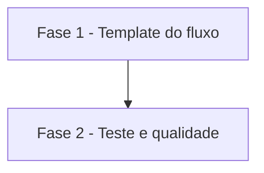

# Tarefas cockpit - auditoria de merge vermelho sem falsos achados

Escopo: backlog da feature `audit-merge-vermelho` (codificação do nome da branch base na rota de regras e checagem de duplicada sem índice de busca em `templates/.github/workflows/audit-merge-vermelho.yml.tmpl`, mais o cenário 24 de `scripts/testar-configurar.sh`), conforme `spec.md`, `plan.md` e `decisoes-do-owner.md` (D1 e D2, normativas).

**Legenda de status:**
- `[ ]` Pendente
- `[~]` Em andamento
- `[x]` Concluido
- `[!]` Bloqueado

**Legenda de criticidade:**
- `[C]` Critico - Impacto financeiro direto ou bloqueante
- `[A]` Alto - Funcionalidade essencial
- `[M]` Medio - Necessario mas sem urgencia imediata

---

## FASE 1 - Template do fluxo

### 1.1 Codificação da branch base (D1) `[A]`

Ref: docs/specs/audit-merge-vermelho/spec.md FR-001 a FR-003; plan.md §Mudanças no passo 2 e 4; research.md Decision 1

- [x] 1.1.1 Criar no `run:` do passo a função bash `codificar` (percent-encoding RFC 3986: bytes fora de `A-Z a-z 0-9 - . _ ~` viram `%XX` maiúsculo, sem dependência nova)
- [x] 1.1.2 Calcular `base_rota="$(codificar "$BASE")"` e usá-lo em `repos/$REPO/rules/branches/$base_rota`, mantendo o `--jq`, o `2>/dev/null || true` e a nota de fallback
- [x] 1.1.3 Conferir que branch sem caracteres especiais (ex.: `main`) gera a mesma rota de hoje (FR-003)

### 1.2 Checagem de duplicada sem índice (D2) `[A]`

Ref: docs/specs/audit-merge-vermelho/spec.md FR-004 a FR-006, FR-010; plan.md §Mudanças no passo 6; research.md Decisions 2 e 3; contracts/github-rest.md

- [x] 1.2.1 Remover a busca `gh issue list --search` do começo do passo
- [x] 1.2.2 Inserir, logo antes do `gh issue create`, a listagem `gh api "repos/$REPO/issues?state=all&per_page=100" --paginate` com `--jq` descartando PRs (chave `pull_request`) e comparando o título exato com `$TITULO`
- [x] 1.2.3 Se a listagem devolver algum número, imprimir "Já existe issue de auditoria para o PR #$PR." e sair 0; falha da listagem derruba o passo pelo `set -e`, sem criar issue
- [x] 1.2.4 Acrescentar o comentário `ponytail:` em português com acentuação, nomeando o teto (varre todas as páginas a cada merge vermelho) e o caminho de evolução (Decision 3)
- [x] 1.2.5 Conferir que o conteúdo da issue, gatilhos, permissões e critério de vermelho ficaram inalterados (FR-007)

---

## FASE 2 - Teste e qualidade

### 2.1 Cenário 24 "merge vermelho" `[A]`

Ref: docs/specs/audit-merge-vermelho/spec.md FR-009, SC-001, SC-002; quickstart.md casos 1 a 4; decisoes-do-owner.md §Restrições

- [x] 2.1.1 Inserir o cenário 24 em `scripts/testar-configurar.sh` logo antes do cenário 11, no padrão do cenário 16: renderizar, extrair o `run:` do passo "Registrar merge com check vermelho" por `awk` e executar com `gh` falso à frente do `PATH`
- [x] 2.1.2 Implementar o `gh` falso: registra `$*` em log; `gh api` escolhe a fixture pela rota e aplica o `--jq` recebido com `jq -r` (emulando `--paginate` por página); `gh issue create` copia o `--body-file`; qualquer outro subcomando (inclusive `gh issue list`) sai 64; variável para simular falha da listagem
- [x] 2.1.3 Caso 1: `BASE=release/2026` consulta `rules/branches/release%2F2026`, título parecido e PR de mesmo título não impedem a criação, corpo lista só `ci` com a nota de filtro por obrigatórios
- [x] 2.1.4 Caso 2: issue fechada de título idêntico na página 2 gera "Já existe issue…", nenhum `issue create`, nenhuma chamada a `issue list`, rota `rules/branches/main`
- [x] 2.1.5 Caso 3: `BASE='feat/ação+1#x'` gera `rules/branches/feat%2Fa%C3%A7%C3%A3o%2B1%23x`
- [x] 2.1.6 Caso 4: falha da listagem termina com exit diferente de zero e sem `issue create`

### 2.2 Verificação final `[M]`

Ref: docs/specs/audit-merge-vermelho/spec.md FR-008, SC-003; quickstart.md §Qualidade estática

- [x] 2.2.1 Rodar `./scripts/testar-configurar.sh` inteiro (inclui actionlint/shellcheck do cenário 16 e shellcheck do cenário 11 quando disponíveis) e conferir "OK: todos os cenários passaram."
- [x] 2.2.2 Rodar `verificar-agnostico.sh` e conferir ausência de nome de projeto real e prosa em português com acentuação nos arquivos alterados

---

## Matriz de Dependencias

## Resumo Quantitativo

| Fase | Tarefas | Subtarefas | Criticidade |
|------|---------|------------|-------------|
| 1 - Template do fluxo | 2 | 8 | A |
| 2 - Teste e qualidade | 2 | 8 | A/M |
| **Total** | **4** | **16** | - |

## Escopo Coberto

| Item | Descricao | Fase |
|------|-----------|------|
| FR-001 a FR-003 | Codificar a branch base na rota de regras | 1 |
| FR-004 a FR-006, FR-010 | Duplicada por listagem direta, todos os estados, todas as páginas, falha visível | 1 |
| FR-007, FR-008 | Escopo inalterado e sem dependência nova | 1 e 2 |
| FR-009 | Cenário 24 antes do cenário 11 | 2 |

Tier de entrega usado na geração deste backlog: não informado; backlog completo (template de CI e teste local, sem infraestrutura de produção).

## Escopo Excluido

| Item | Descricao | Motivo |
|------|-----------|--------|
| EX-001 | Rotas com nome de branch em outros templates (`promotion-pr`, rito) | Sem defeito medido (plan.md §Fora de escopo) |
| EX-002 | Critério de vermelho, conteúdo da issue, gatilhos e permissões | FR-007 / decisoes-do-owner.md §Fora de escopo |
