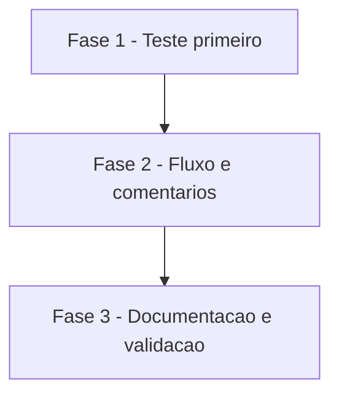

# Tarefas cockpit - codeowner-aprovacao-atual

Escopo: o passo "Conferir aprovação de dono" de `require-codeowner-approval.yml.tmpl` passa a contar só reviews feitas sobre o commit head atual do PR (D1); cabeçalhos do fluxo e do `CODEOWNERS.tmpl` citam a opção nativa de descartar aprovações antigas (D2); cenário 22 em `scripts/testar-configurar.sh`. Ref: [spec.md](./spec.md), [plan.md](./plan.md), [decisoes-do-owner.md](./decisoes-do-owner.md), [quickstart.md](./quickstart.md), [contracts/require-codeowner-approval.md](./contracts/require-codeowner-approval.md).

**Legenda de status:**
- `[ ]` Pendente
- `[~]` Em andamento
- `[x]` Concluido
- `[!]` Bloqueado

**Legenda de criticidade:**
- `[C]` Critico - Impacto financeiro direto ou bloqueante
- `[A]` Alto - Funcionalidade essencial
- `[M]` Medio - Necessario mas sem urgencia imediata

---

## FASE 1 - Teste primeiro (cenário 22)

### 1.1 Cenário 22 em `scripts/testar-configurar.sh` `[A]`

Ref: spec.md FR-009, FR-010, SC-001; plan.md §scripts/testar-configurar.sh; quickstart casos 1 a 4 e 6; decisoes-do-owner.md §Restrições

- [x] 1.1.1 Ler o cenário 16 e reusar o `awk` que extrai o `run:` do passo do YAML renderizado; criar o cenário 22 "aprovação de dono no commit atual" logo antes do cenário 11 (depois do 20), sem renumerar os existentes
- [x] 1.1.2 Montar o `gh` falso em `$TMP` que serve CODEOWNERS (`* @maria-exemplo @jose-exemplo`), `head.sha` (variável `HEAD_ATUAL`) e reviews pelo `jq -r` com o programa recebido em `--jq`; fixtures com SHAs fictícios `A` e `H` e nomes `-exemplo`
- [x] 1.1.3 Casos: aprovação no head conta (exit 0, `Aprovado por um dono.`); aprovação em commit anterior não conta (exit 1, `Aprovação pendente`); aprovação seguida de pedido de mudança no head não conta; head vazio falha com `::error::`
- [x] 1.1.4 Caso de comentários: o YAML e o `CODEOWNERS` renderizados contêm `Require review from Code Owners` e `Dismiss stale pull request approvals when new commits are pushed`
- [x] 1.1.5 Sem `jq`: pular com aviso; com `COCKPIT_EXIGIR_FERRAMENTAS=1`, falhar
- [x] 1.1.6 Rodar o script e confirmar que o cenário 22 falha contra o template atual (aprovação em commit anterior sai 0)

---

## FASE 2 - Fluxo e comentários

### 2.1 Filtro por commit head no fluxo `[C]`

Ref: spec.md FR-001 a FR-006, FR-008; plan.md §Design item 2 e 3; contracts/require-codeowner-approval.md; research.md Decision 2 e 3

- [x] 2.1.1 Em `templates/.github/workflows/require-codeowner-approval.yml.tmpl`, depois das checagens de CODEOWNERS, ler `head` com `gh api "repos/$REPO/pulls/$PR" --jq .head.sha`; falha da chamada ou valor vazio → `::error::` acionável e `exit 1`
- [x] 2.1.2 Mudar a projeção do `--jq` das reviews para `[.user.login, .state, (.commit_id // "")] | @tsv` e passar `-v head="$head"` ao `awk`, atualizando `u[...]` só quando `$3 == head`
- [x] 2.1.3 Manter `on:`, `permissions:`, `env:`, mensagens existentes, exit codes e o número de `${{ }}` inalterados
- [x] 2.1.4 Atualizar o cabeçalho (FR-007, FR-008): manter "verificação EXTRA", "forjável" e "garantia real é a regra nativa"; citar "Require review from Code Owners" e "Dismiss stale pull request approvals when new commits are pushed"; dizer que só conta aprovação sobre o commit atual do PR

### 2.2 Comentário do `CODEOWNERS.tmpl` `[A]`

Ref: spec.md FR-007, SC-003; plan.md §CODEOWNERS.tmpl; research.md F1

- [x] 2.2.1 Na linha da regra da branch de `templates/.github/CODEOWNERS.tmpl`, citar as duas opções nativas, sem alterar as demais linhas nem a regra `*`

---

## FASE 3 - Documentação e validação

### 3.1 Delta no contrato de `templates-automacao` `[M]`

Ref: plan.md §Documentação

- [x] 3.1.1 Em `docs/specs/templates-automacao/contracts/automacao.md` §require-codeowner-approval, acrescentar uma linha de delta apontando para o contrato desta feature

### 3.2 Validação completa `[A]`

Ref: spec.md SC-001 a SC-004, FR-010; quickstart casos 5 e 7

- [x] 3.2.1 Rodar `./scripts/testar-configurar.sh` completo: cenário 22 passa; cenários 16 (actionlint, `${{ }}` intactos) e 11 (shellcheck, `verificar-agnostico.sh`) seguem verdes
- [x] 3.2.2 Reverter só o template do fluxo para `main` e confirmar que o cenário 22 falha (quickstart caso 5); restaurar
- [x] 3.2.3 Conferir prosa em português do Brasil com acentuação e ausência de nomes de projeto real

---

## Matriz de Dependencias

## Resumo Quantitativo

| Fase | Tarefas | Subtarefas | Criticidade |
|------|---------|------------|-------------|
| 1 - Teste primeiro | 1 | 6 | A |
| 2 - Fluxo e comentarios | 2 | 5 | C |
| 3 - Documentacao e validacao | 2 | 4 | A |
| **Total** | **5** | **15** | - |

## Escopo Coberto

| Item | Descricao | Fase |
|------|-----------|------|
| FR-001 a FR-006 | Filtro por commit head, head não lido falha, comportamento existente preservado | 2 |
| FR-007, FR-008 | Comentários de cabeçalho (fluxo e CODEOWNERS), verificação extra preservada | 2 |
| FR-009, FR-010 | Cenário 22 antes do 11, bash sem dependência nova, CI verde | 1, 3 |
| SC-001 a SC-004 | Veredito dos casos, push novo invalida, opção nativa visível, CI existente | 1, 3 |

## Escopo Excluido

| Item | Descricao | Motivo |
|------|-----------|--------|
| Garantia de aprovação | Tornar o fluxo a garantia | Fora de escopo (dec-025 de `templates-automacao`); a garantia é a regra nativa |
| `on:` e `permissions:` | Mudar gatilhos ou permissões | Fora de escopo; `pull-requests: read` já basta |
