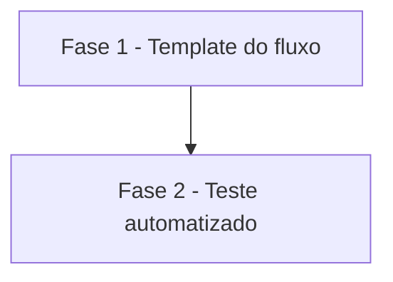

# Tarefas cockpit - commitlint sem limite de linha no corpo

Escopo: desligar `body-max-line-length` na configuração do commitlint gerada pelo fluxo
`commitlint.yml` e cobrir a mudança com o cenário 25 em `scripts/testar-configurar.sh`.

**Legenda de status:**
- `[ ]` Pendente
- `[~]` Em andamento
- `[x]` Concluido
- `[!]` Bloqueado

**Legenda de criticidade:**
- `[C]` Critico - Impacto financeiro direto ou bloqueante
- `[A]` Alto - Funcionalidade essencial
- `[M]` Medio - Necessario mas sem urgencia imediata

---

## FASE 1 - Template do fluxo

### 1.1 Desligar a regra do corpo na configuração gerada `[A]`

Ref: docs/specs/commitlint-corpo-longo/spec.md FR-001 a FR-004; plan.md Mudança 1; research.md Decision 1

- [x] 1.1.1 Em `templates/.github/workflows/commitlint.yml.tmpl`, alterar só a linha `printf` que escreve `commitlint.config.cjs` para gerar `module.exports = { extends: ['@commitlint/config-conventional'], rules: { 'body-max-line-length': [0, 'always', Infinity] } };`
- [x] 1.1.2 Conferir com `git diff` que só essa linha mudou (versões do `npm install`, gatilhos e mensagens intactos; nenhuma expressão `${{ }}` nova)
- [x] 1.1.3 Conferir que a string de formato do `printf` não ganhou `%` nem `$` (sem expansão nova de shell)
- [x] 1.1.4 Validar o fluxo renderizado com actionlint (cenário 16 da suíte) sem findings

---

## FASE 2 - Teste automatizado

### 2.1 Cenário 25 em `scripts/testar-configurar.sh` `[A]`

Ref: docs/specs/commitlint-corpo-longo/spec.md FR-005; plan.md Mudança 2; decisoes-do-owner.md (Restrições); checklists/requirements.md CHK013

- [x] 2.1.1 Inserir o bloco `cenario "25: commitlint sem limite de linha no corpo"` logo antes do bloco do cenário 11, com o separador de comentário no padrão dos demais
- [x] 2.1.2 Renderizar com `novo_repo` e `rodar "$CONF" --projeto "$T" --respostas "$EXEMPLO"` e extrair do `commitlint.yml` a única linha `printf` que contém `commitlint.config.cjs` (falhar se não houver exatamente uma)
- [x] 2.1.3 Executar essa linha com `bash -c`, com `pasta` apontando para um diretório novo sob `$TMP`, e conferir que `commitlint.config.cjs` foi criado
- [x] 2.1.4 Conferir com `grep -F` o `extends: ['@commitlint/config-conventional']` e o `'body-max-line-length': [0, 'always', Infinity]`, com mensagem de falha que cita a regra
- [x] 2.1.5 Rodar a suíte inteira: cenários 25, 16 e 11 passam (shellcheck e `verificar-agnostico.sh` sem findings) e a saída termina em `OK: todos os cenários passaram.`
- [x] 2.1.6 Teste negativo local: remover o trecho `rules` da linha `printf` numa cópia e confirmar que o cenário 25 falha

---

## Matriz de Dependencias

## Resumo Quantitativo

| Fase | Tarefas | Subtarefas | Criticidade |
|------|---------|------------|-------------|
| 1 - Template do fluxo | 1 | 4 | A |
| 2 - Teste automatizado | 1 | 6 | A |
| **Total** | **2** | **10** | - |

## Escopo Coberto

| Item | Descricao | Fase |
|------|-----------|------|
| FR-001, FR-002, FR-003, FR-004 | Linha do `printf` com a regra do corpo desligada, `extends` mantido, sem dependência nova | 1 |
| FR-005 | Cenário 25 antes do cenário 11 | 2 |
| SC-002, SC-003 | Regras do cabeçalho intactas; actionlint e shellcheck sem findings | 1, 2 |

## Escopo Excluido

| Item | Descricao | Motivo |
|------|-----------|--------|
| Bots | Tratar autores bot de forma diferente | Fora de escopo (decisoes-do-owner.md) |
| Outras regras | Rodapé, versões fixadas do commitlint, gatilhos | Fora de escopo (decisoes-do-owner.md) |
| commitlint real | Rodar o commitlint contra commit com corpo longo | Exige rede e instalação (Princípio IV); fica para o CI do PR |
