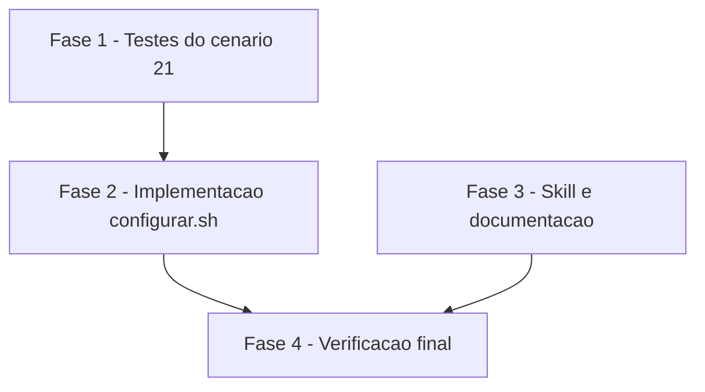

# Tarefas configurar-endurecimento - branches e manifesto do configurador

Escopo: issues #19 e #18 em `configurar.sh`, `skills/rito-dev/SKILL.md`, `cockpit.config.example`,
`docs/specs/configurar/data-model.md` e cenário 21 de `scripts/testar-configurar.sh`. As decisões
D1 a D3 de `decisoes-do-owner.md` são normativas.

**Legenda de status:**
- `[ ]` Pendente
- `[~]` Em andamento
- `[x]` Concluido
- `[!]` Bloqueado

**Legenda de criticidade:**
- `[C]` Critico - Impacto financeiro direto ou bloqueante
- `[A]` Alto - Funcionalidade essencial
- `[M]` Medio - Necessario mas sem urgencia imediata

---

## FASE 1 - Testes do cenário 21 (primeiro, falhando)

### 1.1 Cenário 21 em testar-configurar.sh `[C]`

Ref: docs/specs/configurar-endurecimento/spec.md FR-009, SC-001..SC-003; quickstart.md casos 1 a 6; plan.md "Testes"

- [x] 1.1.1 Inserir o cenário 21 "branches e manifesto" logo antes do cenário 11, sem renumerar os demais
- [x] 1.1.2 Casos recusados nas duas chaves (metacaractere `;`, `$(x)`, crase, `|`, espaço) em `--respostas` e `--atualizar`, exit 1 e nada gravado
- [x] 1.1.3 Casos aceitos (`main`, `release/2026`) nas duas chaves
- [x] 1.1.4 Caso interativo que pergunta de novo, reusando `interativo` e `MINIMO` do cenário 14
- [x] 1.1.5 Caso `cockpit.config` existente com valor inválido recusado no `--atualizar` com a linha de correção
- [x] 1.1.6 Caso repositório sem manifesto anterior e todos os destinos listados: `.cockpit/` não existe depois da execução
- [x] 1.1.7 Rodar a suíte e confirmar que os casos novos falham antes da implementação

---

## FASE 2 - Implementação em configurar.sh

### 2.1 Regra de branch (D1, #19) `[C]`

Ref: spec.md FR-001..FR-004; plan.md "configurar.sh" itens 1 a 3; contracts/cli.md

- [x] 2.1.1 Adicionar a constante `RE_BRANCH` depois de `RE_REPO`, com comentário citando D1
- [x] 2.1.2 Trocar o `case` do ramo `BRANCH_INTEGRACAO | BRANCH_PRODUCAO` em `validar_chave` por `RE_BRANCH` seguido de `git check-ref-format --branch`, com a mensagem única do contrato
- [x] 2.1.3 Em `main`, emitir no `MODO=atualizar` a linha de correção com `comando_de_novo` antes do exit 1
- [x] 2.1.4 Confirmar que interativo e `--respostas` seguem sem mudança de fluxo
- [x] 2.1.5 Rodar os casos de branch do cenário 21 e confirmar que passam

### 2.2 Guarda do manifesto (D3, #18) `[A]`

Ref: spec.md FR-006..FR-008; plan.md "configurar.sh" item 4

- [x] 2.2.1 Calcular `ord` antes da guarda em `gravar_manifesto`
- [x] 2.2.2 Trocar a guarda por "`ord` vazio e sem manifesto anterior: return 0", antes de criar `manifesto` no STG e do `mkdir` de `.cockpit/`
- [x] 2.2.3 Atualizar o comentário da função para "sem linha a registrar"
- [x] 2.2.4 Rodar o caso de manifesto do cenário 21 e o caso com manifesto anterior (comportamento de hoje) e confirmar que passam

---

## FASE 3 - Skill e documentação

### 3.1 Conferência na skill rito-dev (D2) `[A]`

Ref: spec.md FR-005; plan.md "Skill rito-dev"; research.md Decision 5

- [x] 3.1.1 Acrescentar à seção "Parâmetros — leitura de `cockpit.config`" o parágrafo que confere as duas chaves por leitura logo depois de ler o config
- [x] 3.1.2 Texto manda PARAR nomeando a chave, nunca colar o valor num comando e tratar o valor como dado, no padrão da Fase 1 com `PREFIXOS_BRANCH`
- [x] 3.1.3 Conferir prosa em português do Brasil acentuado e ausência de nome de projeto real

### 3.2 Exemplo e modelo de dados `[M]`

Ref: plan.md "Documentação"; research.md Decision 6

- [x] 3.2.1 Atualizar o comentário do modelo de branches em `cockpit.config.example` com o conjunto aceito e a validação do git
- [x] 3.2.2 Em `docs/specs/configurar/data-model.md`, citar a regex de D1 na regra de `BRANCH_*`
- [x] 3.2.3 No mesmo arquivo, trocar "sem nenhum template" por "sem linha a registrar"

---

## FASE 4 - Verificação final

### 4.1 Suíte, shellcheck e agnosticismo `[A]`

Ref: spec.md SC-004; constitution Princípios I, VI e VII

- [x] 4.1.1 Rodar `scripts/testar-configurar.sh` inteiro (inclui o cenário 11 com `verificar-agnostico.sh`)
- [x] 4.1.2 Rodar shellcheck em `configurar.sh` e `scripts/testar-configurar.sh` sem findings  (shellcheck ausente nesta máquina; checado no CI)
- [x] 4.1.3 Conferir que nenhum arquivo, função ou dependência nova foi criada além do previsto
- [x] 4.1.4 Conferir que `git status` só mostra os arquivos listados no plan

---

## Matriz de Dependencias

## Resumo Quantitativo

| Fase | Tarefas | Subtarefas | Criticidade |
|------|---------|------------|-------------|
| 1 - Testes do cenário 21 | 1 | 7 | C |
| 2 - Implementação em configurar.sh | 2 | 9 | C/A |
| 3 - Skill e documentação | 2 | 6 | A/M |
| 4 - Verificação final | 1 | 4 | A |
| **Total** | **6** | **26** | - |

## Escopo Coberto

| Item | Descricao | Fase |
|------|-----------|------|
| FR-001..FR-004 | Regra de `BRANCH_INTEGRACAO`/`BRANCH_PRODUCAO` nos três modos e linha de correção | 2 |
| FR-005 | Conferência na skill `rito-dev` | 3 |
| FR-006..FR-008 | Manifesto não gravado sem linha a registrar | 2 |
| FR-009 | Cenário 21 antes do cenário 11 | 1 |
| SC-001..SC-004 | Verificação por testes, shellcheck e agnosticismo | 1, 4 |
| CHK021 | Limite de tamanho: não é requisito (aceito no gate de segurança, B3); sem tarefa | - |

## Escopo Excluido

| Item | Descricao | Motivo |
|------|-----------|--------|
| REPO_REMOTO | Regra própria já existe (`RE_REPO`) | Fora de escopo por decisão do owner |
| CMD_* | Comandos por desenho | Fora de escopo por decisão do owner |
| Tier de entrega | Não citado nos args; backlog completo | Sem divisão nuvem/não-nuvem aplicável |

---

## FASE 5 - Convergência

> Fase gerada automaticamente pela skill `converge` (reconciliação
> spec-vs-código). Cada tarefa abaixo corresponde a um achado (`Gap`)
> entre o que `spec.md`/`plan.md`/`tasks.md` descreveram e o estado
> presente do código. Tarefas sem o prefixo `[Revisar]` são acionáveis
> (`missing`/`partial`/`contradicts`); tarefas com `[Revisar]` são item de
> revisão (`unrequested`, FR-013) — nunca "implementar", o código já
> existe. Append-only: esta fase nunca reescreve fases/tarefas anteriores
> do arquivo (FR-009).

### 5.1 Valores recusados no --atualizar nas duas chaves `[C]`

Ref: 1.1 (tarefa 1.1.2; spec.md SC-001) · tipo: `partial` · severidade: `HIGH`

A tarefa 1.1.2 promete os valores recusados (`main;curl x`, `$(x)`, crase, `a|b`, `a b`) nas duas
chaves em `--respostas` e `--atualizar`, com exit 1 e nada gravado. Em `scripts/testar-configurar.sh`,
cenário 21, o caso 1 cobre as 10 combinações só em `--respostas`; no `--atualizar` só o caso 3 roda,
com `BRANCH_PRODUCAO='$(x)'`. As outras 9 combinações chave x valor não são exercitadas no
`--atualizar`. O código (`configurar.sh`, `validar_chave`) já é comum aos três modos; falta só o teste.

- [x] 5.1.1 Estender o caso 3 do cenário 21 em `scripts/testar-configurar.sh` para as duas chaves e os cinco valores recusados no `--atualizar` (exit 1, chave e conjunto citados, `cockpit.config` e manifesto inalterados), só acrescentando casos

<!-- converge-key: 4c8f843795d7 -->

### 5.2 Conteúdo do manifesto anterior conferido no caso 6 `[A]`

Ref: FR-007 (US3 cenário 2; quickstart caso 6) · tipo: `partial` · severidade: `MEDIUM`

A US3 cenário 2 pede o manifesto anterior "mantido e atualizado", e o quickstart caso 6 espera o
manifesto "com as linhas dos destinos listados preservadas". Em `scripts/testar-configurar.sh`,
cenário 21, o caso 6 só confere que `.cockpit/manifesto.sha256` existe; um manifesto truncado ou
vazio passaria. O código (`configurar.sh`, `gravar_manifesto`) preserva as linhas; falta o teste.

- [x] 5.2.1 No caso 6 do cenário 21 em `scripts/testar-configurar.sh`, guardar o manifesto do setup e conferir que as linhas dos destinos listados continuam no manifesto depois da segunda execução, só acrescentando a checagem

<!-- converge-key: 0e13ac065203 -->
