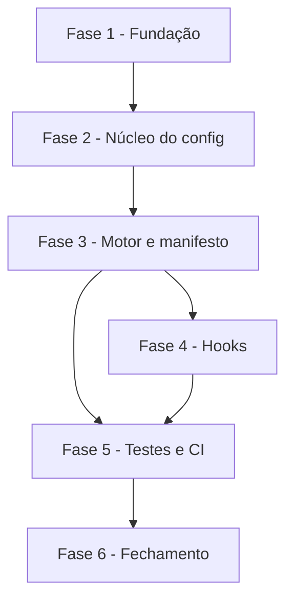

# Tarefas Configurar - Configurador do projeto-alvo

Escopo: entregar `configurar.sh` (perguntas ou arquivo de respostas,
gravação de `cockpit.config`, motor de templates com manifesto de hashes,
provisionamento de guard hooks via `cstk`), a lib `scripts/lib/versao.sh`, o
template de prova, o script de teste, o job de CI e o registro das 3 chaves
novas. Decomposição de [plan.md](./plan.md) + [research.md](./research.md) +
[data-model.md](./data-model.md) + [contracts/cli.md](./contracts/cli.md) +
[quickstart.md](./quickstart.md) + [spec.md](./spec.md) FR-001..FR-021, com os
gaps de [checklists/requirements.md](./checklists/requirements.md): CHK023
vira a tarefa 4.2 (Princípio V); CHK024, CHK025 e CHK018 (`{humano}`) viram a
tarefa 6.1 (itens de decisão do owner, levados na descrição da PR).

**Legenda de status:**
- `[ ]` Pendente
- `[~]` Em andamento
- `[x]` Concluído
- `[!]` Bloqueado

**Legenda de criticidade:**
- `[C]` Crítico - Impacto financeiro direto ou bloqueante
- `[A]` Alto - Funcionalidade essencial
- `[M]` Médio - Necessário mas sem urgência imediata

---

## FASE 1 - Fundação: lib de versão e formato do config

### 1.1 Extrair `scripts/lib/versao.sh` de `instalar.sh` `[A]`

Ref: plan.md §Structure Decision, research.md Decision 10, spec.md FR-014

- [x] 1.1.1 Criar `scripts/lib/versao.sh` com `versao_ge` e `ler_cstk_min` movidas de `instalar.sh`, sem alterar comportamento
- [x] 1.1.2 Alterar `instalar.sh` para carregar a lib (`source` por caminho relativo ao próprio script)
- [~] 1.1.3 Teste: `instalar.sh` continua passando nos cenários existentes e no shellcheck — shellcheck verificado no CI

### 1.2 Registrar as 3 chaves novas no formato `[A]`

Ref: spec.md FR-002/FR-003, research.md Decision 4, data-model.md

- [x] 1.2.1 Acrescentar `IDENTIDADES`, `BOARD` e `PRINCIPIO_III` a `cockpit.config.example`, com valores entre aspas simples e nomes fictícios
- [x] 1.2.2 Registrar as 3 chaves em `docs/specs/skills-do-cockpit/data-model.md` como extensão retrocompatível
- [x] 1.2.3 Ajustar `skills/rito-dev/SKILL.md` (nota de valores entre aspas; remover a afirmação de que não há tabela de identidades)
- [x] 1.2.4 Teste: `source cockpit.config.example` em bash puro com `set -u` sem erro; `verificar-agnostico.sh` sem ocorrências

---

## FASE 2 - Núcleo: leitura, validação e gravação do config (US1, US5)

### 2.1 Esqueleto de `configurar.sh` e parsing de opções `[C]`

Ref: contracts/cli.md, spec.md FR-008/FR-016/FR-019/FR-021

- [x] 2.1.1 Criar `configurar.sh` com `set -euo pipefail`, `uso` e opções `--projeto`, `--respostas`, `--atualizar`, `--forcar`
- [x] 2.1.2 Implementar `resolver_raiz`: exige raiz de repositório git, usa `pwd -P`, recusa subdiretório e diretório sem git (exit 1)
- [x] 2.1.3 Implementar `ler_config` sem `source`/`eval` (research Decision 2), aceitando aspas simples e duplas

### 2.2 Validação de chaves `[C]`

Ref: data-model.md §Validação, spec.md FR-004/FR-005/FR-018

- [x] 2.2.1 Implementar `validar_chave` (`org/repo`, nomes de branch, comandos não vazios, URL opcional, recusa de quebra de linha e caractere de controle)
- [x] 2.2.2 Aceitar `BRANCH_PRODUCAO` igual a `BRANCH_INTEGRACAO` sem aviso
- [x] 2.2.3 Validar `IDENTIDADES` (ao menos uma; converter `nome <email>` em `nome:email`; avisar, sem recusar, e-mail não `noreply`)

### 2.3 Perguntas interativas e modo não interativo `[C]`

Ref: spec.md FR-001/FR-004/FR-006/FR-016, research.md Decision 5

- [x] 2.3.1 Implementar `perguntar`, repetindo a pergunta em valor inválido e oferecendo o valor atual como padrão quando o config já existe
- [x] 2.3.2 Implementar `perguntar_identidades` isolada em uma função (FR-018 é proposta pendente; a troca por nome e e-mail separados deve ficar restrita a ela)
- [x] 2.3.3 Implementar `--respostas`: mesmo formato do config, falha citando a chave faltante, variáveis de ambiente não são fonte
- [x] 2.3.4 Implementar `--atualizar`: sem perguntas, exit 1 com mensagem clara se não houver config

### 2.4 Gravação atômica do `cockpit.config` `[C]`

Ref: research.md Decisions 3 e 7, spec.md FR-002/FR-017

- [x] 2.4.1 Implementar `gravar_config` com aspas simples, ordem fixa e sem data, em temporário no mesmo diretório + `mv`; `trap` limpa temporários
- [x] 2.4.2 Recusar `cockpit.config` de destino que seja link simbólico
- [x] 2.4.3 Teste: cenários 1, 3 e 9 do quickstart (config do zero, `--atualizar`, validação)

---

## FASE 3 - Motor de templates, manifesto e contenção (US2, US3)

### 3.1 Motor de render `[C]`

Ref: research.md Decisions 1 e 9, spec.md FR-009/FR-010/FR-011

- [x] 3.1.1 Implementar `renderizar` em awk (`index()`/`substr()`, valor via `ENVIRON`), placeholder `{{[A-Z][A-Z0-9_]*}}` somente
- [x] 3.1.2 Descobrir templates com `find -type f` sob `templates/`; destino = mesmo caminho relativo sem o sufixo `.tmpl`
- [x] 3.1.3 Recusar placeholder residual: listar arquivo e placeholder, exit 2, sem deixar arquivo nem temporário no projeto
- [x] 3.1.4 Criar template de prova `templates/.cockpit/LEIAME.md.tmpl`, genérico e sem conteúdo de projeto real (FR-012)

### 3.2 Contenção, manifesto e edição local `[C]`

Ref: research.md Decisions 6, 7 e 8, spec.md FR-007/FR-015

- [x] 3.2.1 Implementar `destino_contido` (`pwd -P` + prefixo; checagem refeita imediatamente antes de cada `mv`; recusa de destino link simbólico)
- [x] 3.2.2 Implementar manifesto `.cockpit/manifesto.sha256` (`sha256sum` ou `shasum -a 256`), gravado a cada renderização
- [x] 3.2.3 Implementar `aplicar_render`: arquivo com hash diferente do manifesto é edição local, preservado com exit 2 e aviso citando `--forcar`; `--forcar` sobrescreve e atualiza o manifesto
- [x] 3.2.4 Renderizar tudo em temporários e só então mover, para nenhuma interrupção deixar estado parcial
- [x] 3.2.5 Teste: cenários 2, 4, 5, 6, 7 e 8 do quickstart

---

## FASE 4 - Provisionamento de hooks (US4)

### 4.1 `provisionar_hooks` `[A]`

Ref: research.md Decision 10, spec.md FR-013/FR-014, plan.md §Constitution Check (IV)

- [x] 4.1.1 Como último passo, checar `cstk --version` contra `CSTK_MIN` lido de `versoes.env` via `scripts/lib/versao.sh`
- [x] 4.1.2 Com `cstk` presente e no piso, executar `cstk hooks install --project-path <raiz>`; nunca copiar hooks
- [x] 4.1.3 Com `cstk` ausente ou abaixo do piso: manter config e templates, imprimir `Execute:` e o comando oficial, exit 3; nenhuma instalação, atualização ou bootstrap de terceiro
- [x] 4.1.4 Teste: cenário 10 do quickstart, com `cstk` falso no `PATH`

### 4.2 Registrar a fonte oficial de `cstk hooks install` (CHK023) `[A]`

Ref: checklists/requirements.md CHK023, plan.md §Constitution Check (V), research.md Decision 10, constitution Princípio V

- [x] 4.2.1 Ler a documentação oficial do `cstk hooks install` via `context-mode` e registrar o link e a data em `research.md` Decision 10
- [x] 4.2.2 Conferir o comportamento observado em `--help` contra a documentação; se divergir, ajustar `provisionar_hooks` e o contrato
- [x] 4.2.3 Marcar CHK023 como atendido em `checklists/requirements.md` com a referência à fonte <!-- 2026-09-29: README.pt-BR oficial, commit 561552a -->

---

## FASE 5 - Testes, CI e qualidade estática

### 5.1 `scripts/testar-configurar.sh` `[A]`

Ref: research.md Decision 11, quickstart.md, spec.md SC-001..SC-007

- [x] 5.1.1 Criar o script (bash, sem framework), cada cenário em repositório git temporário limpo ao final
- [x] 5.1.2 Reunir os 11 cenários do quickstart e sair diferente de zero na primeira falha, dizendo qual cenário falhou
- [x] 5.1.3 Teste: rodar limpo em máquina sem `cstk` real (o `cstk` é sempre o falso do teste)

### 5.2 Job de CI e gates estáticos `[A]`

Ref: plan.md §Source Code, spec.md SC-006/FR-019/FR-020

- [x] 5.2.1 Acrescentar o job `configurar` em `.github/workflows/ci.yml`, sem `pull_request_target` e com actions fixadas por SHA conforme o padrão existente
- [~] 5.2.2 Rodar shellcheck em `configurar.sh`, `scripts/lib/versao.sh`, `scripts/testar-configurar.sh` e `instalar.sh` com 0 findings — verificado no CI (shellcheck ausente localmente; Princípio IV)
- [x] 5.2.3 Rodar `scripts/verificar-agnostico.sh` sobre todos os artefatos novos com 0 ocorrências
- [x] 5.2.4 Executar `bmad-code-review` sobre o diff antes da PR (Princípio II) — revisão adversarial manual do diff (configurar.sh, versao.sh, instalar.sh, templates): 0 findings acionáveis; testes e gate agnóstico verdes

---

## FASE 6 - Fechamento e decisões do owner

### 6.1 Itens de decisão do owner na descrição da PR `[M]`

Ref: checklists/requirements.md CHK018/CHK024/CHK025, research.md Decision 5, spec.md FR-018/SC-001

- [x] 6.1.1 Pedir ao owner a ratificação de FR-018 (`nome <email>` na pergunta versus nome e e-mail separados) na descrição da PR (CHK024, dec-020)
- [x] 6.1.2 Pedir ao owner a confirmação do apetite de risco: aviso versus recusa para e-mail não `noreply` (CHK025)
- [x] 6.1.3 Pedir ao owner o método de medição de SC-001 ("menos de 5 minutos") (CHK018)
- [x] 6.1.4 Atualizar o histórico/briefing do projeto se a feature alterar algum item registrado

---

## Matriz de Dependências

## Resumo Quantitativo

| Fase | Tarefas | Subtarefas | Criticidade |
|------|---------|------------|-------------|
| 1 - Fundação | 2 | 7 | A |
| 2 - Núcleo do config | 4 | 13 | C |
| 3 - Motor e manifesto | 2 | 9 | C |
| 4 - Hooks | 2 | 7 | A |
| 5 - Testes e CI | 2 | 7 | A |
| 6 - Fechamento | 1 | 4 | M |
| **Total** | **13** | **47** | - |

## Escopo Coberto

| Item | Descrição | Fase |
|------|-----------|------|
| FR-002/FR-003 | Formato do `cockpit.config` e 3 chaves novas | 1, 2 |
| FR-001/FR-004/FR-005/FR-016/FR-018 | Perguntas, validação e modo não interativo | 2 |
| FR-006/FR-007/FR-008/FR-017 | Idempotência, edição local, `--atualizar` e atomicidade | 2, 3 |
| FR-009..FR-012/FR-015 | Motor de templates, template de prova e contenção | 3 |
| FR-013/FR-014 | Provisionamento de hooks e piso do `cstk` | 4 |
| FR-019/FR-020/FR-021 | Portabilidade, agnosticismo e pt-BR | 5 |
| CHK018/CHK023/CHK024/CHK025 | Gaps do checklist | 4, 6 |

## Escopo Excluído

| Item | Descrição | Motivo |
|------|-----------|--------|
| Templates de governança e automação | Templates dos itens 4 e 5 do MVP | Frentes seguintes; esta feature entrega só o motor e um template de prova (FR-012) |
| Instalação de terceiros | Instalar ou atualizar `cstk` ou outra ferramenta | Princípio IV: só se imprime o comando oficial |

## FASE 7 - Convergência

> Fase gerada automaticamente pela skill `converge` (reconciliação
> spec-vs-código). Cada tarefa abaixo corresponde a um achado (`Gap`)
> entre o que `spec.md`/`plan.md`/`tasks.md` descreveram e o estado
> presente do código. Tarefas sem o prefixo `[Revisar]` são acionáveis
> (`missing`/`partial`/`contradicts`); tarefas com `[Revisar]` são item de
> revisão (`unrequested`, FR-013) — nunca "implementar", o código já
> existe. Append-only: esta fase nunca reescreve fases/tarefas anteriores
> do arquivo (FR-009).

### 7.1 URL opcional vazia resolve placeholder no render mas some do config `[C]`

Ref: FR-006 · tipo: `contradicts` · severidade: `HIGH`

`data-model.md` §Template define "placeholder resolvido = chave presente no
config". Em `configurar.sh`, uma URL opcional vazia (resposta `-` no modo
interativo ou `URL_AMBIENTE_*=''` no arquivo de respostas) fica definida com
valor vazio e resolve `{{URL_AMBIENTE_*}}` no render, mas `gravar_config` a
omite do `cockpit.config`. A execução seguinte (`--atualizar`, ou interativa
sobre o config gravado) não a tem definida e falha com placeholder residual.
Reproduzido: 1ª execução renderiza `url=`; `--atualizar` sai com
"Placeholder sem valor: {{URL_AMBIENTE_INTEGRACAO}}". Quebra a idempotência
(FR-006/FR-008) assim que um template usar uma URL.

- [x] 7.1.1 Corrigir `configurar.sh`: URL opcional vazia é tratada como ausente também no render (desdefinir antes de renderizar), mantendo o config e o render coerentes
- [x] 7.1.2 Teste em `scripts/testar-configurar.sh`: template com `{{URL_AMBIENTE_INTEGRACAO}}` e URL vazia dá o mesmo resultado na 1ª execução e no `--atualizar`

<!-- converge-key: e6643858662b -->

### 7.2 Dica da pergunta de board diz "vazio = sem board", mas vazio mantém o atual `[C]`

Ref: FR-001 · tipo: `contradicts` · severidade: `HIGH`

Em `configurar.sh` (`perguntar`), a dica de `BOARD` é "(vazio = sem board)",
mas resposta vazia devolve o valor atual (padrão do config existente); só `-`
limpa o board. Com board já configurado, seguir a dica não remove o board.

- [x] 7.2.1 Corrigir `configurar.sh`: a dica de `BOARD` informa que `-` deixa sem board quando há valor atual (mesma dica das opcionais)

<!-- converge-key: 562ae9e785b8 -->

### Review Findings

Code review adversarial (bmad-code-review, 2026-09-29) — camadas Blind Hunter, Edge Case Hunter e Acceptance Auditor sobre `git diff main...HEAD` (código; artefatos da spec só como referência).

- [x] [Review][Patch] (decidido: falhar; ajustar data-model) PRINCIPIO_III ausente no modo `--respostas` — hoje presume `ligado`; FR-016 manda falhar apontando a chave, mas o data-model diz "padrão `ligado`".
- [x] [Review][Patch] (decidido: preservar chaves desconhecidas no fim, sob comentário; avisar perda de comentários) Chaves desconhecidas e comentários do `cockpit.config` são apagados na regravação — a mensagem diz "ignorada(s)", mas a chave some; em `--respostas` nem há aviso. Preservar ou só corrigir a mensagem?
- [x] [Review][Patch] (decidido: exigir --projeto explícito quando o alvo é o próprio cockpit) `./configurar.sh` sem `--projeto`, na raiz do cockpit, configura o próprio cockpit (deixa `cockpit.config` e `.cockpit/` não ignorados) — recusar, exigir `--projeto` ou aceitar (Princípio II)?
- [x] [Review][Patch] (decidido: alinhar a spec às aspas simples) Aspas de IDENTIDADES/BOARD — Clarification Q3 mostra aspas duplas; código e exemplo gravam aspas simples (research Decision 3). Alinhar a spec ou o código?
- [x] [Review][Patch] (decidido: reverter o uso novo no rito-dev) `skills/rito-dev/SKILL.md` passou a usar IDENTIDADES como identidade de quem aprova PR — fora do escopo pedido. Manter ou reverter?
- [x] [Review][Patch] (decidido: reportar e perguntar só as chaves ausentes) Config existente incompleto no modo interativo — hoje pergunta tudo (com os valores atuais como padrão); o edge case da spec pede "reportar a chave e perguntar somente o que falta".
- [x] [Review][Patch] (decidido: avisar e manter, nunca apagar) Arquivo gerado fica órfão quando o template sai do cockpit (sai do manifesto e nunca mais é tratado; se o template voltar, vira "editado à mão") — comportamento não especificado.
- [x] [Review][Patch] `set -e` suspenso em `aplicar_templates`/`provisionar_hooks` por `|| rc=$?`: falha de awk/mkdir/mv grava arquivo vazio ou truncado, conta como "gravado", registra hash no manifesto e sai 0 [configurar.sh:584]
- [x] [Review][Patch] `awk -v resfile=` interpreta barras invertidas do caminho: residual vai para outro arquivo e o placeholder residual passa (fail-open) — passar por ENVIRON [configurar.sh:389]
- [x] [Review][Patch] `desaspar` não apara espaços antes de reconhecer aspas nem trata `# comentário` depois da aspa final: valor fica com aspas literais [configurar.sh:98]
- [x] [Review][Patch] Versão do cstk lida de stdout+stderr pela primeira sequência numérica (aviso "node 18.20.1" burla o piso; `cstk v11` rejeitado; `-rc1` aceito) [configurar.sh:496]
- [x] [Review][Patch] Template executável perde o bit de execução ao ser renderizado; `mv` também troca o modo do destino existente [configurar.sh:400]
- [x] [Review][Patch] `CSTK_INSTALL_URL` sem uso no próprio arquivo — SC2034 provável no shellcheck do CI; comentário "só define funções" impreciso [scripts/lib/versao.sh:7]
- [x] [Review][Patch] Dois templates com o mesmo destino (`x` e `x.tmpl`) aceitos em silêncio; manifesto com linha duplicada; destinos sob `.git/` não reservados [configurar.sh:372]
- [x] [Review][Patch] Validação de valores: REPO_REMOTO aceita `..` e hífen inicial; C1 (0x9B) e bidi (U+202E) passam pelo filtro `[[:cntrl:]]` com LC_ALL=C; BOARD aceita só espaços [configurar.sh:140]
- [x] [Review][Patch] `|` em comando quebra a tabela do LEIAME (pipe separa célula mesmo em código) [templates/.cockpit/LEIAME.md.tmpl:8]
- [x] [Review][Patch] Cenário 9 (caracteres de controle) não testa o que diz: uma linha não gera controle real e o grep casa com a mensagem genérica [scripts/testar-configurar.sh:182]
- [x] [Review][Patch] Lacunas de teste: sobrescrita de arquivo não editado sem `--forcar`, exit 4, `--atualizar`+`--respostas`; leitura do piso não aceita `export` [scripts/testar-configurar.sh]
- [x] [Review][Patch] `PATH_SEM_CSTK` remove o diretório inteiro do cstk real e pode levar git/awk junto [scripts/testar-configurar.sh:44]
- [x] [Review][Patch] BOM UTF-8 no config/respostas quebra a linha 1; `export CHAVE=` recusado (incoerente com `ler_cstk_min`) [configurar.sh:117]
- [x] [Review][Patch] IDENTIDADES com espaço em volta do `;` recusada com mensagem enganosa; entrada inválida em `perguntar_identidades` faz perder "vazio mantém as atuais" [configurar.sh:165]
- [x] [Review][Patch] Sem templates (ou `templates/` ausente): sem a mensagem "nada havia a renderizar" e com manifesto vazio criado [configurar.sh:368]
- [x] [Review][Patch] Resumo final não lista os arquivos mantidos por edição local (contrato, seção Saída) [configurar.sh:461]
- [x] [Review][Patch] `CSTK_MIN` inválido sai 3 sem o comando oficial [configurar.sh:497]
- [x] [Review][Patch] Mensagens: `.cockpit` como arquivo vira "fora do projeto ou link simbólico"; config ilegível dá erro cru do bash; "rode de novo" sem caminho do cockpit e sem quoting seguro [configurar.sh:307]
- [x] [Review][Patch] `destino_contido` recusa tudo com RAIZ=/ [configurar.sh:312]
- [x] [Review][Patch] `instalar.sh` carrega `scripts/lib/versao.sh` sem checar falha (rodado fora do clone vira "abaixo do piso") [instalar.sh:52]

#### Rodada 2 (revisão só das correções: `9fedfb4..7c80a4a`)

Blind Hunter + Edge Case Hunter sobre o diff das correções, mais o shellcheck do CI da PR #3.

- [x] [Review][Patch] shellcheck do CI: SC2317 em `limpar` (trap), SC2015 no loop de órfãos, SC2016 na suíte (literais de propósito) [configurar.sh:77]
- [x] [Review][Patch] Regressão: versão do cstk com CRLF, `+build`, parênteses, ponto final ou número espúrio não reconhecida; linhas que citam `cstk` têm precedência [configurar.sh:versao_cstk]
- [x] [Review][Patch] Regressão: `--respostas` abortava com `cockpit.config` antigo malformado; a leitura de extras agora avisa e ignora a linha [configurar.sh:ler_kv]
- [x] [Review][Patch] Chave desconhecida com valor malformado era copiada e quebrava o `source`; agora não é mantida (aviso); `export` preservado; nomes repetidos deduplicados no aviso [configurar.sh:ler_kv]
- [x] [Review][Patch] `desaspar`: `'a'#c` e `'a'b` recusados; aspa dentro do comentário aceita; sem aspas recusa `$`, `` ` ``, `\`, aspas (espaços seguem aceitos: formato legado do exemplo antigo) [configurar.sh:desaspar]
- [x] [Review][Patch] UTF-8 inválido checado em bash puro (sem depender de iconv); U+061C e U+2028/2029 recusados [configurar.sh:tem_controle]
- [x] [Review][Patch] `cockpit.config` link/diretório recusado antes das perguntas; destino FIFO ou não regular recusado sem travar [configurar.sh:main, destino_contido]
- [x] [Review][Patch] Permissão restritiva do destino (template e `cockpit.config`) mantida na regravação; falha de `chmod` em `sincronizar_exec` não passa em silêncio [configurar.sh:herdar_modo]
- [x] [Review][Patch] Destinos reservados e duplicados comparados sem diferenciar maiúsculas; `.git` aninhado reservado [configurar.sh:preparar_templates]
- [x] [Review][Patch] Modo interativo: IDENTIDADES normalizada antes de validar o config lido; com config incompleto, URLs opcionais ausentes também são oferecidas [configurar.sh:main]
- [x] [Review][Patch] `gravar_config` sem `||` no bloco de escrita (set -e pega falha de qualquer printf); aviso de `export`/comentário perdidos; mensagem dupla sem `templates/` [configurar.sh]
- [x] [Review][Patch] Suíte: formatos de versão reais, formas de aspas recusadas/aceitas, config antigo malformado com `--respostas`, sincronização do bit de execução, permissão 600, reservados sem diferenciar maiúsculas, FIFO, LRM/U+2028/U+061C/UTF-8 inválido, acentos e emoji aceitos, falha de escrita sem "gravado:" [scripts/testar-configurar.sh]

Descartados na rodada 2 (verificado): `--atualizar` não regrava o config (nada se perde); `pipefail` e `LC_ALL=C` já ativos no topo; fence de crases não fecha no meio da linha; `PRINCIPIO_III` obrigatório é decisão do owner (D1); exit 1 com config gravado está documentado no contrato; aviso de órfão a cada execução é o comportamento decidido (D7); bit de execução em drvfs/WSL `/mnt` (todo arquivo 0777) fica como limitação conhecida.
