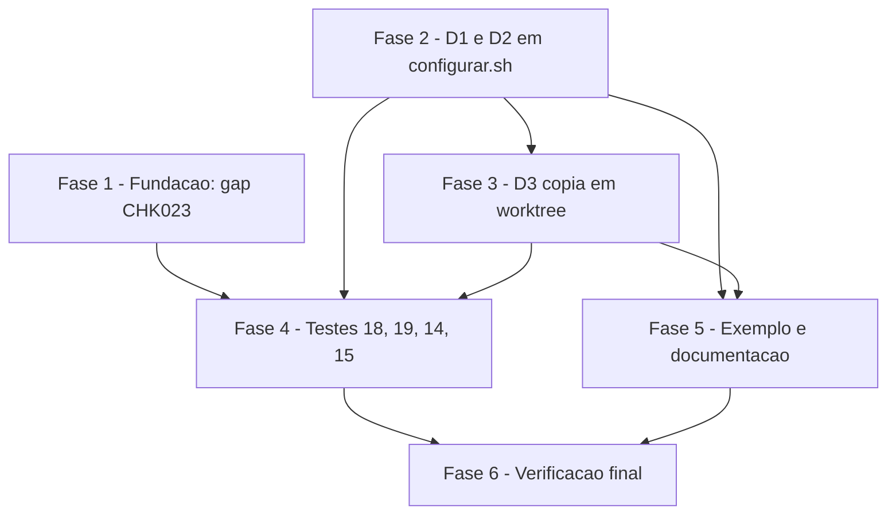

# Tarefas destinos-do-projeto - chave DESTINOS_DO_PROJETO e cópia de destinos ignorados em worktree

Escopo: implementar em `configurar.sh` a chave opcional `DESTINOS_DO_PROJETO` (D1), a mensagem de conflito com a sugestão (D2) e a cópia, a partir da árvore principal, de destinos ausentes e ignorados pelo git numa worktree vinculada (D3), com cenários em `scripts/testar-configurar.sh` e documentação. Fontes: `spec.md`, `plan.md`, `research.md`, `data-model.md`, `quickstart.md`, `contracts/cli.md`, `checklists/requirements.md` e `decisoes-do-owner.md` (D1, D2, D3, "Fora de escopo" e "Restrições" normativas e fechadas).

**Legenda de status:**
- `[ ]` Pendente
- `[~]` Em andamento
- `[x]` Concluido
- `[!]` Bloqueado

**Legenda de criticidade:**
- `[C]` Critico - Impacto financeiro direto ou bloqueante
- `[A]` Alto - Funcionalidade essencial
- `[M]` Medio - Necessario mas sem urgencia imediata

Critério de pronto transversal a toda tarefa que toca shell: `shellcheck` sem findings nos arquivos alterados e `scripts/testar-configurar.sh` sem regressão nos cenários já existentes.

---

## FASE 1 - Fundação: gap CHK023 e registro SDD dos testes

### 1.1 Ajustar a construção do repositório bare do cenário 19 (gap CHK023) `[A]`

Ref: checklists/requirements.md CHK023; dec-016; research.md Decision 10; quickstart.md §14

- [x] 1.1.1 Em `research.md` Decision 10, trocar `cp -R <repo>/.git <bare>.git` + `core.bare true` por `git clone --bare` de caminho local (sem rede), seguido de `git -C <bare>.git worktree add`, e registrar o porquê (dependência da estrutura interna do git e o bash-guard não inspecionar comandos dentro do script)
- [x] 1.1.2 Em `quickstart.md` §14, reescrever o passo 1 com a mesma construção (`git clone --bare <M> <B>.git`; `git -C <B>.git worktree add <WB> -b wb`), mantendo os resultados esperados do caso
- [x] 1.1.3 Conferir por sonda, num diretório temporário, que a construção resulta em `git -C <B>.git rev-parse --is-bare-repository` igual a `true` e que `git worktree list --porcelain` na worktree traz a linha `bare` na primeira entrada; citar a saída na research
- [x] 1.1.4 Registrar no `checklists/requirements.md` o CHK023 como resolvido (`[x]`) com referência à tarefa e ao ajuste

### 1.2 Registrar o ajuste do cenário 14 (18 para 19 respostas) no quickstart `[M]`

Ref: dec-012; plan.md §Riscos; quickstart.md §16; spec.md FR-007

- [x] 1.2.1 Conferir que research Decision 4 e quickstart §16 declaram que a configuração mínima do modo interativo passa de 18 para 19 respostas, por exigência da FR-007
- [x] 1.2.2 Se faltar, acrescentar a nota de mudança intencional e a lista das entradas que ganham a resposta nova

---

## FASE 2 - D1 e D2: destinos mantidos pelo projeto em `configurar.sh`

### 2.1 Chave nova, estado e validação na fronteira de confiança `[C]`

Ref: spec.md FR-001, FR-006; data-model.md §Validação; research.md Decisions 2 e 3

- [x] 2.1.1 Em `configurar.sh`, acrescentar `DESTINOS_DO_PROJETO` ao fim de `CHAVES_ORDEM` e a `CHAVES_OPCIONAIS`, atualizando o comentário "URLs são as únicas opcionais"
- [x] 2.1.2 Fazer `PULAR=()` guardar o motivo (vazio, `semente`, `projeto`, `copia`, `ignorado`) e declarar `ORIGEM=()`, `VINCULADA` e `PRINCIPAL`
- [x] 2.1.3 Em `validar_chave`, criar o ramo `DESTINOS_DO_PROJETO)` com `read -ra`: recusar item só de aspas, absoluto ou com componente `..`, com as mensagens do data-model (exit 1 citando a chave); controle segue recusado por `tem_controle`
- [x] 2.1.4 Em `validar_todos`, tratar valor só com espaços como chave não declarada (`desetar`), sem erro
- [x] 2.1.5 Conferir por execução manual que valores com `/etc/x`, `docs/../x`, `ci.yml "" b` e TAB terminam em exit 1 sem criar `cockpit.config`
- [x] 2.1.6 Rodar `shellcheck configurar.sh` e registrar saída vazia <!-- shellcheck: não verificado localmente, coberto pelo CI; bash -n limpo -->

### 2.2 Pergunta interativa e gravação da chave `[A]`

Ref: spec.md FR-007, US3; research.md Decision 4

- [x] 2.2.1 Em `perguntar_chave`, criar o ramo `DESTINOS_DO_PROJETO)` com o texto `Destinos mantidos pelo projeto (caminhos separados por espaço) (- para vazio)`
- [x] 2.2.2 Confirmar que `gravar_config` grava `DESTINOS_DO_PROJETO='…'` sem mudança e não grava a chave quando não declarada
- [x] 2.2.3 Confirmar que o laço `unset "CFG_$_k"` cobre a chave nova sem alteração
- [x] 2.2.4 `shellcheck configurar.sh` limpo <!-- shellcheck: não verificado localmente, coberto pelo CI; bash -n limpo -->

### 2.3 `classificar_destinos` (D1 e D3, decisão única por execução) `[C]`

Ref: spec.md FR-002, FR-003, FR-005; data-model.md §Regra de classificação; research.md Decision 5

- [x] 2.3.1 Renomear `marcar_sementes` para `classificar_destinos` e atualizar a chamada em `main`
- [x] 2.3.2 Ler os itens da chave, emitir `Aviso: DESTINOS_DO_PROJETO: '<item>' não é destino de nenhum template; ignorado.` (stderr) para os que não casam com `DEST_REL`, sem mudar o exit
- [x] 2.3.3 Preencher `PULAR`/`ORIGEM` pela tabela: listado = `projeto`; semente existente (`-e` ou `-L`) = `semente`; demais vazio; a regra de worktree sobrepõe (`copia`/`ignorado`) quando ausente, vinculada e `check-ignore` com exit 0
- [x] 2.3.4 Chamar `arvore_principal` uma única vez por execução e só quando houver destino candidato

### 2.4 `aplicar_templates`, manifesto e mensagens (D1 e D2) `[C]`

Ref: spec.md FR-002, FR-003, FR-004, FR-008, FR-011; contracts/cli.md §Saída; plan.md §Design itens 8 a 11

- [x] 2.4.1 Fazer os laços de render e de conflito pularem todo `PULAR` não vazio, de modo que listado nunca é conflito, nem com `--forcar` nem no interativo
- [x] 2.4.2 Alterar a mensagem de conflito para `Arquivo editado localmente, mantido: <rel>. Use --forcar para sobrescrever ou declare o destino em DESTINOS_DO_PROJETO no cockpit.`, mantendo o exit 2 e a recusa do lote
- [x] 2.4.3 No laço de gravação, acumular por motivo e imprimir `  mantido (semente): <rel>`, `  mantido (projeto): <rel>` e `  mantido (ignorado pelo git): <rel> (esperado em <caminho>)`
- [x] 2.4.4 Ajustar o relatório de contagem com sufixos condicionais na ordem do contrato, de modo que sem a chave e fora de worktree a saída seja byte a byte a de hoje
- [x] 2.4.5 Em `gravar_manifesto`, reemitir a linha anterior para todo `PULAR` não vazio
- [x] 2.4.6 Atualizar a linha do `--forcar` em `uso()` e o parágrafo do cabeçalho do script
- [x] 2.4.7 `shellcheck configurar.sh` limpo e cenários 1 a 17 passando <!-- shellcheck: não verificado localmente, coberto pelo CI; bash -n limpo -->

---

## FASE 3 - D3: cópia da árvore principal numa worktree vinculada

### 3.1 `arvore_principal` e `origem_valida` `[C]`

Ref: spec.md FR-009, FR-010, FR-012; research.md Decisions 6, 7 e 9; data-model.md §Árvore principal

- [x] 3.1.1 Implementar `arvore_principal`: `VINCULADA` por `git rev-parse --git-dir` contra `--git-common-dir`, ambos resolvidos com `pwd -P`
- [x] 3.1.2 Se vinculada, obter `PRINCIPAL` do primeiro registro de `git worktree list --porcelain`, recusando `bare`, caminho relativo ou com controle, e confirmando pelo `git-dir` da candidata igual ao `git-common-dir` da worktree
- [x] 3.1.3 Emitir uma vez por execução `Aviso: árvore principal indisponível (<repositório bare | não confirmada>); destinos ignorados pelo git não serão copiados.` quando aplicável
- [x] 3.1.4 Implementar `origem_valida REL`: arquivo regular, não link, com pai físico igual ao lógico; só leitura; origem recusada emite `Aviso: origem recusada (link simbólico): <caminho>`
- [x] 3.1.5 `shellcheck configurar.sh` limpo <!-- shellcheck: não verificado localmente, coberto pelo CI; bash -n limpo -->

### 3.2 Cópia no laço de gravação com guardas de contenção `[C]`

Ref: spec.md FR-009, FR-011, FR-012; plan.md §Riscos; research.md §Riscos aceitos

- [x] 3.2.1 Em `main`, estender o laço de `exigir_contido` antes de `STG` para destinos com `PULAR` vazio ou `copia`
- [x] 3.2.2 No laço de gravação, para `copia`: `exigir_contido`, `mkdir -p` do pai, `exigir_contido` de novo, `cp` para `$STG/c$i` e `mv -f` ao destino, como arquivo regular e sem entrada nova no manifesto
- [x] 3.2.3 Garantir que a cópia só ocorra depois das checagens de residual e de conflito, para que lote recusado (exit 2) não deixe cópia feita
- [x] 3.2.4 Comentar no código o limite de corrida aceito (troca da origem por link entre a checagem e o `cp`), conforme a research
- [x] 3.2.5 Imprimir `  copiado da árvore principal: <rel>` e a contagem `, C copiado(s) da árvore principal`
- [x] 3.2.6 Falha ao copiar encerra com exit 1 pela linha "falha de escrita" do contrato base
- [x] 3.2.7 `shellcheck configurar.sh` limpo <!-- shellcheck: não verificado localmente, coberto pelo CI; bash -n limpo -->

---

## FASE 4 - Testes em `scripts/testar-configurar.sh`

### 4.1 Cenário 18: destinos do projeto (D1 e D2) `[A]`

Ref: quickstart.md §1 a §8; spec.md US1, US2, US3-1; SC-001, SC-002

- [x] 4.1.1 Criar `cenario "18: destinos do projeto"` depois do 17 e antes do 11, com os helpers existentes (`novo_repo`, `cockpit_copia`, `codigo`, `rodar`)
- [x] 4.1.2 Casos 1 e 2: destino editado e listado fica byte a byte intacto, com `--forcar` e `--atualizar`, exit 0, `mantido (projeto)` e `1 mantido(s) (projeto)` no stdout e linha do manifesto preservada
- [x] 4.1.3 Caso 3: semente listada e ausente não é gerada
- [x] 4.1.4 Caso 4: conflito fora da lista recusa o lote (exit 2), cita `--forcar` e `DESTINOS_DO_PROJETO` e não cita o destino listado
- [x] 4.1.5 Caso 5: itens `'/etc/x'`, `'docs/../x'`, `'ci.yml "" b'` e valor com TAB dão exit 1 citando a chave, sem criar `cockpit.config`
- [x] 4.1.6 Casos 6, 7 e 8: item sem template dá aviso e exit 0; chave ausente ou em branco gera árvore idêntica (`diff -r --exclude=.git`); duas passagens seguidas não alteram nada
- [x] 4.1.7 Rodar só o cenário 18 e registrar que passa; `shellcheck scripts/testar-configurar.sh` limpo <!-- shellcheck: não verificado localmente, coberto pelo CI; bash -n limpo -->

### 4.2 Cenário 19: worktree e destino ignorado (D3), com bare por `git clone --bare` `[A]`

Ref: quickstart.md §9 a §15; spec.md US4; checklists CHK023 e CHK024; SC-001

- [x] 4.2.1 Criar `cenario "19: worktree e destino ignorado"` com repositório principal `M` com `.gitignore` cobrindo `CLAUDE.md` commitado, usando `git -c user.name=… -c user.email=… -c commit.gpgsign=false` e nenhuma identidade da máquina
- [x] 4.2.2 Casos 9 e 10: worktree real recebe `CLAUDE.md` como arquivo regular (`-f`, `! -L`, `cmp` igual), fora do manifesto, com stdout `copiado da árvore principal`; `M` e `git status --porcelain --ignored` inalterados; 2ª passagem imprime `mantido (semente)`
- [x] 4.2.3 Caso 11: sem o arquivo na árvore principal, o destino não é criado e sai `mantido (ignorado pelo git)` com `esperado em <M físico>/CLAUDE.md`
- [x] 4.2.4 Caso 12: origem que é link, e variação com componente `sub` link, são recusadas com aviso `link simbólico` e destino não criado
- [x] 4.2.5 Caso 13: destino listado e ignorado (`docs/rito-dev.md`) é copiado, com criação do pai
- [x] 4.2.6 Caso 14 (gap CHK023): construir o bare com `git clone --bare` de caminho local dentro do script, ou `git init --bare` mais `git worktree add`, sem `cp -R .git` e sem `core.bare true`; esperar aviso `repositório bare`, destino não criado e `(árvore principal indisponível)`
- [x] 4.2.7 Caso 15: checkout comum (a própria árvore principal) renderiza a semente e a inclui no manifesto
- [x] 4.2.8 Rodar só o cenário 19, confirmar que passa e que a construção do bare não aparece no `grep` como `cp -R` nem `core.bare`; `shellcheck` limpo <!-- shellcheck: não verificado localmente, coberto pelo CI; bash -n limpo -->

### 4.3 Ajuste do cenário 14 (18 para 19 respostas, dec-012) `[A]`

Ref: dec-012; quickstart.md §16; spec.md FR-007, US3-2; plan.md §Riscos

- [x] 4.3.1 No cenário 14 (`scripts/testar-configurar.sh`), acrescentar uma resposta a cada entrada do pty, de modo que a configuração mínima passe de 18 para 19 respostas
- [x] 4.3.2 Fazer a entrada de config incompleto responder também a chave nova
- [x] 4.3.3 Acrescentar rodada que responde `CLAUDE.md` e confere o texto `Destinos mantidos pelo projeto`, `(- para vazio)` e a linha `DESTINOS_DO_PROJETO='CLAUDE.md'` no `cockpit.config`; com `-`, a linha não existe
- [x] 4.3.4 Rodar o cenário 14 e confirmar que passa

### 4.4 Ajuste do cenário 15 e regressão geral `[A]`

Ref: plan.md §Testes; spec.md SC-001, SC-003

- [x] 4.4.1 No cenário 15, incluir `DESTINOS_DO_PROJETO` na checagem de que nenhum template usa chave opcional
- [x] 4.4.2 Rodar `scripts/testar-configurar.sh` inteiro e registrar que todos os cenários (1 a 19) passam, incluindo o 11 (agnosticismo)
- [x] 4.4.3 `shellcheck` limpo em `configurar.sh` e `scripts/testar-configurar.sh` <!-- shellcheck: não verificado localmente, coberto pelo CI; bash -n limpo -->

---

## FASE 5 - Configuração de exemplo e documentação de uso

### 5.1 `cockpit.config.example` `[M]`

Ref: spec.md FR-007; research.md Decision 11

- [x] 5.1.1 Acrescentar seção opcional com `DESTINOS_DO_PROJETO=''` e o exemplo de D1 em comentário (`.github/workflows/ci.yml docs/rito-dev.md`)
- [x] 5.1.2 Conferir que o valor fica vazio, para os cenários 1 a 17 não mudarem o que geram
- [x] 5.1.3 Rodar o cenário 11 e confirmar que o gate de agnosticismo passa

### 5.2 Documentação de uso e contratos da feature `configurar` `[M]`

Ref: spec.md FR-007, FR-008; plan.md §Configuração e documentação; research.md Decision 11

- [x] 5.2.1 Conferir que `uso()` e o cabeçalho de `configurar.sh` descrevem a chave e a cópia em worktree (tarefa 2.4.6)
- [x] 5.2.2 Incorporar o delta de `contracts/cli.md` desta feature em `docs/specs/configurar/contracts/cli.md` (opção `--forcar`, regra dos destinos, mensagens)
- [x] 5.2.3 Acrescentar a linha da chave na tabela do `cockpit.config` e a regra de validação em `docs/specs/configurar/data-model.md`
- [x] 5.2.4 Se o `README.md` tratar das chaves do `cockpit.config`, acrescentar uma menção curta à chave; caso contrário, registrar que não há o que atualizar
- [x] 5.2.5 Conferir prosa em português do Brasil acentuado e ausência de nomes de projeto real nos arquivos alterados

---

## FASE 6 - Verificação final

### 6.1 Conferência de requisitos e restrições `[A]`

Ref: spec.md SC-001 a SC-003; decisoes-do-owner.md §Restrições

- [x] 6.1.1 Passar FR-001 a FR-012 contra os cenários 18, 19 e 14, anotando qual caso cobre cada um
- [x] 6.1.2 Confirmar `set -euo pipefail`, `LC_ALL=C` e nenhuma dependência nova (`git diff` sem novo comando externo)
- [x] 6.1.3 Confirmar que nada fora de escopo entrou (prefixos de branch, conflito por arquivo) e que D1, D2 e D3 não foram reabertas
- [x] 6.1.4 Rodar `scripts/testar-configurar.sh` e `shellcheck` finais e registrar a saída <!-- shellcheck: não verificado localmente, coberto pelo CI; bash -n limpo --> <!-- scripts/testar-configurar.sh: "OK: todos os cenários passaram." (1 a 19) -->

---

## Matriz de Dependencias

## Resumo Quantitativo

| Fase | Tarefas | Subtarefas | Criticidade |
|------|---------|------------|-------------|
| 1 - Fundacao: gap CHK023 | 2 | 6 | A |
| 2 - D1 e D2 em configurar.sh | 4 | 21 | C |
| 3 - D3 copia em worktree | 2 | 12 | C |
| 4 - Testes | 4 | 22 | A |
| 5 - Exemplo e documentacao | 2 | 8 | M |
| 6 - Verificacao final | 1 | 4 | A |
| **Total** | **15** | **73** | - |

## Escopo Coberto

| Item | Descricao | Fase |
|------|-----------|------|
| D1 | Chave `DESTINOS_DO_PROJETO`: validacao, pergunta, classificacao, relatorio, manifesto | 2 |
| D2 | Recusa do lote mantida; mensagem sugere a chave | 2 |
| D3 | Copia da arvore principal para destino ausente e ignorado em worktree vinculada | 3 |
| CHK023 | Bare do cenario 19 por `git clone --bare`; ajuste de research Decision 10 e quickstart §14 | 1, 4 |
| dec-012 | Cenario 14 de 18 para 19 respostas | 1, 4 |
| SC-001 a SC-003 | Cenarios 18 e 19, shellcheck limpo, sem dependencia nova | 4, 6 |
| Documentacao | `cockpit.config.example`, `uso()`, contrato e data-model da feature `configurar` | 5 |

## Escopo Excluido

| Item | Descricao | Motivo |
|------|-----------|--------|
| Prefixos de branch | `feature/<slug>` e similares | Fora de escopo por decisao do owner (issue #16) |
| Conflito por arquivo | Tratar conflito por arquivo em vez de por lote | Recusado em D2 |
| CHK025 | Reconfirmar item sem template como aviso | Julgamento do dono, ja fixado em D1 |
| Fases de infraestrutura de producao | Deploy, escala, observabilidade | Script local sem producao; tier de entrega nao informado nos args, sem omissao aplicada alem desta |
