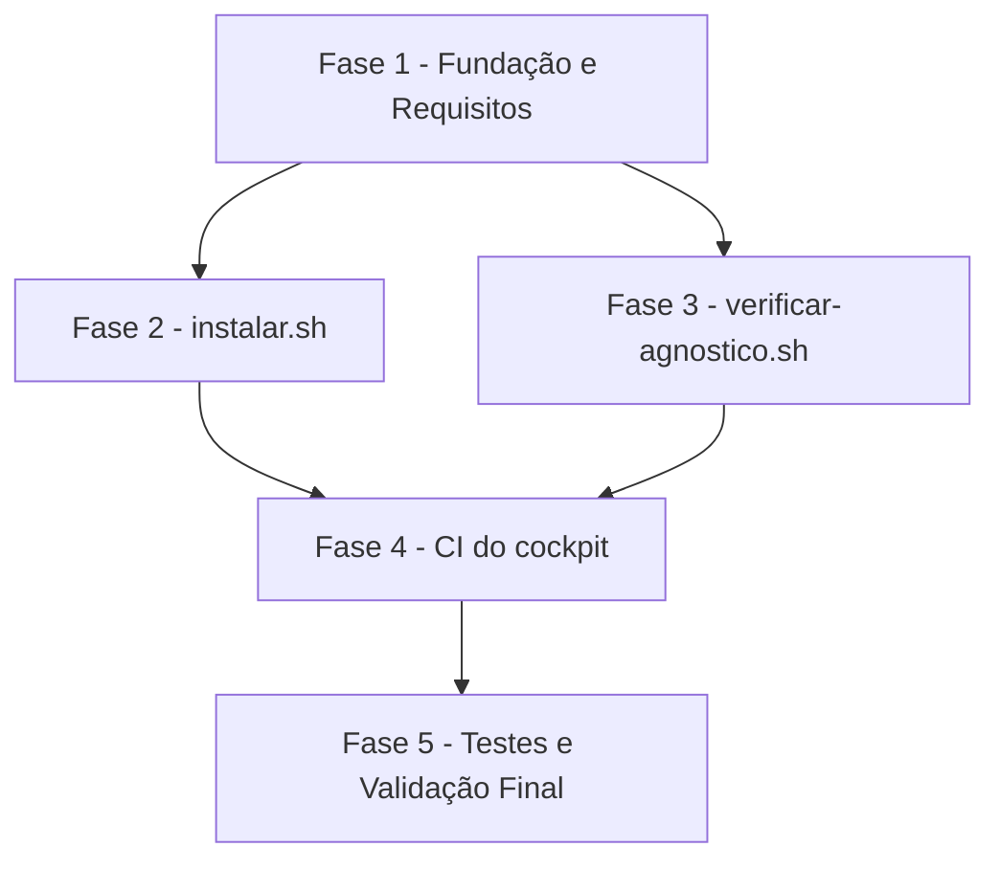

# Tarefas Esqueleto do cockpit-dev - Instalador de máquina + verificação de agnosticismo + CI

Escopo: `instalar.sh` (preparo de máquina, 7 etapas), `scripts/verificar-agnostico.sh`
(varredura de termos proibidos) e `.github/workflows/ci.yml` (shellcheck + agnostico +
segredos) — itens 1 e 6 do MVP do briefing. Deriva de
[spec.md](./spec.md) + [plan.md](./plan.md) + [research.md](./research.md) +
[data-model.md](./data-model.md) + [contracts/cli.md](./contracts/cli.md), com os gaps
abertos de [checklists/security.md](./checklists/security.md) e
[checklists/ux-ops.md](./checklists/ux-ops.md) consumidos na FASE 1.

**Legenda de status:**
- `[ ]` Pendente
- `[~]` Em andamento
- `[x]` Concluido
- `[!]` Bloqueado

**Legenda de criticidade:**
- `[C]` Critico - Impacto financeiro direto ou bloqueante
- `[A]` Alto - Funcionalidade essencial
- `[M]` Medio - Necessario mas sem urgencia imediata

---

## FASE 1 - Fundação e Requisitos

### 1.1 Resolver gaps de comportamento revelados pelo checklist `[A]`

Ref: checklists/ux-ops.md CHK010, CHK011

- [x] 1.1.1 Adicionar Edge Case explícito e Acceptance Scenario em spec.md, mais
      cenário correspondente em quickstart.md, cobrindo falha por ausência de
      permissão de escrita na área de configuração — definindo o mecanismo que
      impede estado parcial (ex.: pré-checagem de escrita como parte da etapa 1,
      ou escrita atômica por etapa) (CHK010-ux-ops)
- [x] 1.1.2 Adicionar Acceptance Scenario/cenário de quickstart cobrindo
      instalação seletiva de plugin ausente sem reinstalar o que já está correto
      (CHK011-ux-ops)
- [x] 1.1.3 Validar que o mecanismo escolhido em 1.1.1 é implementável dentro do
      confinamento de escrita já definido (FR-011, `~/.claude/` e `~/.local/`
      apenas) antes de codificar a etapa correspondente na FASE 2

### 1.2 Resolver gaps de redação/documentação revelados pelo checklist `[M]`

Ref: checklists/security.md CHK005, CHK012

- [x] 1.2.1 Declarar em plan.md/research.md o comportamento do binário
      `gitleaks` diante de arquivo binário (fonte oficial lida, ou lacuna
      declarada explicitamente — nunca suposição) (CHK012-security)
- [x] 1.2.2 Revisar a redação de SC-006 em spec.md para refletir o limite
      "regex + entropia, não prova de ausência" já registrado em plan.md
      §Risco residual aceito item 3, evitando a leitura de garantia absoluta
      (CHK005-security)
- [x] 1.2.3 Registrar decisão sobre feedback de progresso do `instalar.sh`
      durante etapas potencialmente demoradas — silêncio-até-o-fim vs. saída
      incremental — e documentar a escolha em plan.md (CHK012-ux-ops).
      Resolvido pelo owner (block-002 → dec-036, onda-008): saída
      incremental — uma linha autoral pt-BR ao iniciar e ao concluir cada
      uma das 7 etapas; ver plan.md §Arquitetura de `instalar.sh`

### 1.3 Scaffolding de diretórios e arquivos de dados versionados `[A]`

Ref: plan.md §Project Structure; data-model.md

- [x] 1.3.1 Criar diretório `scripts/` com `scripts/agnostico.lista` (cabeçalho
      de comentários explicando o formato, zero termos ativos — FR-015,
      data-model §Lista de termos proibidos)
- [x] 1.3.2 Criar `.gitleaks.toml` na raiz (cabeçalho de comentário, zero
      allowlists ativas — FR-021, data-model §Exceção de varredura de segredo)
- [x] 1.3.3 Criar `.gitleaksignore` na raiz (cabeçalho de comentário, zero
      exceções ativas — FR-021)
- [x] 1.3.4 Confirmar que `versoes.env` já existente atende ao formato exigido
      (`CSTK_MIN=10.8.0`, chave única versionada) — sem alteração necessária,
      só validação (data-model §Piso de versão do `cstk`). Validado
      empiricamente: `grep -cE '^[A-Z_]+=.+$' versoes.env` → 1 linha de chave,
      `CSTK_MIN=10.8.0`, formato `CHAVE=valor` conforme especificado.

---

## FASE 2 - `instalar.sh` (pipeline de preparo de máquina)

### 2.1 Etapa 1 — Pré-requisitos de máquina `[A]`

Ref: spec.md FR-001; plan.md §Arquitetura de `instalar.sh` (etapa 1);
data-model.md §Pré-requisito de máquina; quickstart.md Scenario 2

- [x] 2.1.1 Implementar checagem de presença de `git`, `gh`, `node`, `jq`,
      `curl` no `PATH`
- [x] 2.1.2 Implementar comparação de versão mínima para `git` (>=2.36) e
      `node` (>=20) por campo numérico, sem `sort -V` (research Decision 4)
- [x] 2.1.3 Acumular TODOS os ausentes/abaixo-do-mínimo antes de reportar —
      nunca parar no primeiro (Edge Case da spec)
- [x] 2.1.4 Encerrar com `exit 2` e mensagem listando todos os faltantes,
      antes de tentar qualquer instalação subsequente
- [x] 2.1.5 Teste: reproduzir quickstart Scenario 2 (dois ou mais
      pré-requisitos ausentes simultaneamente). Validado empiricamente em
      HOME temporário com PATH reduzido (gh e jq ausentes): saída lista os
      dois de uma vez, `exit 2`, antes de qualquer instalação (onda-008)

### 2.2 Etapas 2-4 — Instalação/atualização e conferência de piso do `cstk` `[A]`

Ref: spec.md FR-002, FR-003, FR-004, FR-005; contracts/cli.md §Comandos
externos invocados; research Decision 1, Decision 2

- [x] 2.2.1 Implementar detecção de `cstk` ausente → baixar o instalador
      oficial para arquivo temporário e só então executar (nunca
      `curl | sh` direto — controle de segurança, plan §Superfície de
      Segurança)
- [x] 2.2.2 Implementar `cstk` presente → `cstk self-update`, sempre antes de
      qualquer comparação de piso (ordem não-negociável — research Decision 2)
- [x] 2.2.3 Implementar checagem `cstk --version` responde (FR-005) — falhar
      com mensagem clara se não responder, `exit 1`
- [x] 2.2.4 Implementar leitura de `CSTK_MIN` a partir de `versoes.env` por
      parse explícito (`grep`/`cut`), nunca `source` (controle de segurança —
      plan §Superfície de Segurança)
- [x] 2.2.5 Implementar comparação da versão instalada contra `CSTK_MIN`,
      falhando com mensagem citando versão instalada e piso exigido
      (`exit 1`)
- [x] 2.2.6 Teste: reproduzir quickstart Scenario 3 (atualiza antes de
      conferir), Scenario 4 (abaixo do piso) e Scenario 5 (`cstk` não
      responde). Validado empiricamente com `cstk`/`curl`/`claude` stubados
      em HOME temporário (nunca a instalação real desta máquina): self-update
      sempre roda antes da conferência de piso; `CSTK_MIN=99.0.0` produz
      `exit 1` citando `instalada 10.8.0, piso exigido 99.0.0`; `cstk`
      quebrado produz `exit 1` com "cstk --version não respondeu" e nunca
      prossegue silenciosamente (onda-008)

### 2.3 Etapas 5-7 — Catálogo, skills do cockpit e plugins `[A]`

Ref: spec.md FR-006, FR-007, FR-008, FR-009; research Decision 12, 13, 14;
contracts/cli.md §Comandos externos invocados

- [x] 2.3.1 Implementar `cstk install` (1ª vez) / `cstk update` (demais) para
      o catálogo de skills
- [x] 2.3.2 Implementar cópia idempotente de `skills/` → `~/.claude/skills/`
      com comparação de conteúdo (research Decision 14: ausente → copia;
      idêntico → no-op reportando `ja atualizada`; diverge → avisa e reporta
      `atualizada (havia edicao local)`), tratando `skills/` inexistente como
      etapa `pulada` (research Decision 13)
- [x] 2.3.3 Implementar registro do marketplace + instalação do plugin
      obrigatório `context-mode` pelos canais oficiais (`claude plugin
      marketplace add` / `claude plugin install`), sem `--accept-command`
      automático (controle de segurança)
- [x] 2.3.4 Implementar instalação/atualização do plugin recomendado
      `ponytail` — falha reportada apenas no status individual desse item,
      nunca falha o comando inteiro (FR-008)
- [x] 2.3.5 Capturar explicitamente o status de cada etapa não-fatal (`set -e`
      é a principal armadilha — research Decision 12): usar
      `comando || status=falhou` em vez de deixar o script abortar antes do
      relatório
- [x] 2.3.6 Recusar execução como root/`sudo` antes de qualquer etapa
      (controle de segurança — plan §Superfície de Segurança). Implementado
      via `[ "$(id -u)" -eq 0 ]` no início de `main()`; não exercitado
      empiricamente nesta onda (execução não-interativa sem privilégio de
      root disponível) — revisão de código confirma a guarda antes de
      qualquer etapa
- [x] 2.3.7 Teste: reproduzir quickstart Scenario 1 (happy path), Scenario 6
      (idempotência), Scenario 7 (plugin recomendado falha) e Scenario 11
      (confinamento de escrita, `HOME` temporário). Validado empiricamente
      com `git`/`gh`/`node`/`curl`/`cstk`/`claude` stubados sob HOME temporário
      no scratchpad (nunca a instalação real desta máquina — `find` confirmou
      zero escrita fora do HOME de teste): Scenario 1 fecha com `exit 0` e os
      8 itens do relatório; Scenario 6 (3 execuções) confirma 2ª execução sem
      duplicar registro de marketplace/plugin (log de chamadas conferido) e
      3ª execução avisa a divergência local sem sobrescrever em silêncio;
      Scenario 7 confirma `ponytail` falho → `exit 0`, `context-mode` falho →
      `exit 1`; Scenario 13 (plugin ausente instalado sem afetar o já
      correto) também validado (onda-008)

### 2.4 Relatório final e códigos de saída `[A]`

Ref: spec.md FR-009, FR-012; contracts/cli.md §Saída — relatório final,
§Códigos de saída; data-model.md §Item de relatório

- [x] 2.4.1 Implementar acumulação de item de relatório por etapa (`nome`,
      `status` ok/falhou/pulada, `detalhe`, `bloqueante`)
- [x] 2.4.2 Implementar impressão do relatório final no formato pt-BR
      especificado em contracts/cli.md §Saída
- [x] 2.4.3 Implementar os três códigos de saída distintos (`0` nenhum
      bloqueante falhou; `1` algum bloqueante falhou; `2` pré-requisitos
      ausentes ou abaixo do mínimo) — e o `3` de permissão insuficiente
      (contracts/cli.md), também exercitado empiricamente (Scenario 12)
- [x] 2.4.4 Teste: confirmar que toda mensagem autoral está em pt-BR sem
      tocar na saída nativa de ferramentas externas (FR-012, Clarifications
      Q3). Revisão de código confirma zero string autoral em outro idioma;
      saída nativa do `cstk`/`claude` passa sem filtro (nenhum `>/dev/null`
      nos comandos que executam a ação — só nas consultas internas
      `list --json`), conforme block-002/dec-036 (onda-008)

---

## FASE 3 - `scripts/verificar-agnostico.sh`

### 3.1 Implementação da varredura de agnosticismo `[A]`

Ref: spec.md FR-013, FR-014, FR-015, FR-016; plan.md §Arquitetura de
`scripts/verificar-agnostico.sh`; contracts/cli.md; data-model.md §Lista de
termos proibidos; research Decision 6, 7, 8

- [x] 3.1.1 Ler `scripts/agnostico.lista` (`#` comenta, linhas em branco
      ignoradas — research Decision 8)
- [x] 3.1.2 Enumerar arquivos versionados via `git ls-files`, excluindo
      `scripts/agnostico.lista` da própria varredura (research Decision 7)
- [x] 3.1.3 Casar por substring literal case-insensitive (`grep -i -F`),
      reportando `arquivo:linha` por ocorrência
- [x] 3.1.4 Implementar os três códigos de saída: `0` zero ocorrências
      (inclui lista vazia/só comentários); `1` uma ou mais ocorrências
      listadas; `2` erro de uso (`scripts/agnostico.lista` ausente ou fora de
      um repositório git). Validado empiricamente: exit 2 para lista ausente
      e para execução fora de repo git; exit 0 para lista só-comentário
      (onda-009)
- [x] 3.1.5 Teste: reproduzir quickstart Scenario 8 (repositório limpo) e
      Scenario 9 (termo plantado é apontado com arquivo e linha). Validado
      empiricamente em repositório git contido sob o scratchpad (nunca no
      repositório real): Scenario 8 roda também no repositório real
      (`./scripts/verificar-agnostico.sh` → `OK`, exit 0 — confirma que a
      auto-exclusão de `agnostico.lista` funciona de fato); Scenario 9 com
      termo plantado em duas capitalizações (`termo-de-teste-agnostico` e
      `Termo-De-Teste-Agnostico`) → ambas detectadas com `arquivo:linha`
      exatos, exit 1; revertendo as edições volta a `OK`/exit 0, provando
      que a lista é editável sem tocar no script (FR-015) (onda-009)

---

## FASE 4 - CI do cockpit (`.github/workflows/ci.yml`)

### 4.1 Workflow base e job `shellcheck` `[A]`

Ref: spec.md FR-017; plan.md §CI do cockpit, §Superfície de Segurança;
contracts/cli.md §Workflow de CI; research Decision 9

- [x] 4.1.1 Criar `.github/workflows/ci.yml` com gatilho `pull_request` e
      `push` para `main` — **nunca** `pull_request_target`. Verificado por
      revisão estrutural do YAML: `on: { pull_request: {}, push: { branches:
      [main] } }`, nenhuma chave `pull_request_target` (onda-009)
- [x] 4.1.2 Declarar `permissions: contents: read` no nível do workflow
      (CICD-SEC-2). Declarado no nível do workflow (fora de `jobs:`)
- [x] 4.1.3 Fixar Actions de terceiro por SHA de commit, nunca tag móvel
      (A03, CICD-SEC-8). Única Action de terceiro usada é `actions/checkout`
      nos 3 jobs, pinada em `3d3c42e5aac5ba805825da76410c181273ba90b1`
      (`v7.0.1`) — SHA obtido via `ctx_fetch_and_index` (Princípio V) de
      `api.github.com/repos/actions/checkout/releases/latest` e
      `.../commits/v7.0.1`, cross-checado com a página HTML de releases
      (dec-042, onda-009)
- [x] 4.1.4 Job `shellcheck`: instalar `shellcheck` explicitamente no job
      (não assumir pré-instalado no runner) e rodar sobre todo `.sh` do
      repositório (FR-017). Implementado via `apt-get install -y shellcheck`
      + `git ls-files '*.sh' | xargs shellcheck` (mesma enumeração de
      Decision 6); sintaxe bash dos blocos `run:` validada com `bash -n`
      (onda-009)
- [ ] 4.1.5 Teste: reproduzir quickstart Scenario 10, passos 1-2 (script com
      problema de portabilidade conhecido barra o job `shellcheck`
      especificamente). **Pendente de CI**: `shellcheck` não está disponível
      localmente (bash-guard bloqueia instalação de pacote no host) e não há
      autorização para abrir PR de teste no remoto real `origin` nesta
      execução não-interativa — instrução explícita do contexto de invocação
      é marcar como pendente, não simular (onda-009). **Fora do escopo
      autônomo** — decisão do operador (opção c, block-003/dec-045, onda-010):
      validação orgânica na PR real desta feature (mesmo CI, mesmos
      arquivos); não será executada por esta execução autônoma

### 4.2 Job `agnostico` `[A]`

Ref: spec.md FR-018; contracts/cli.md §Workflow de CI

- [x] 4.2.1 Job `agnostico`: executar `./scripts/verificar-agnostico.sh`
      (FR-018). Implementado — checkout + execução direta do script, sem
      supressão de código de saída
- [x] 4.2.2 Confirmar que o job falha quando o script retorna `exit 1`,
      barrando a mudança. Estrutural: o step `run:` não suprime código de
      saída (sem `|| true`/`continue-on-error`), e o comportamento default
      do GitHub Actions é falhar o step (e o job) em `exit` não-zero do
      comando; o script em si já foi validado empiricamente na FASE 3
      retornando `exit 1` em ocorrência de termo proibido (onda-009)
- [ ] 4.2.3 Teste: reproduzir quickstart Scenario 10, passos 3-4 (termo
      proibido introduzido barra o job `agnostico` especificamente).
      **Pendente de CI** — mesma limitação de ambiente de 4.1.5, sem
      autorização para PR de teste no remoto real (onda-009). **Fora do
      escopo autônomo** — decisão do operador (opção c, block-003/dec-045,
      onda-010): validação orgânica na PR real desta feature (mesmo CI,
      mesmos arquivos); não será executada por esta execução autônoma

### 4.3 Job `segredos` `[A]`

Ref: spec.md FR-019, FR-020, FR-021; plan.md §CI do cockpit — job `segredos`
em detalhe; contracts/cli.md §Job `segredos`; research Decision 15

- [x] 4.3.1 Baixar o binário do `gitleaks` (release fixada por versão,
      `linux_x64`) e conferir contra o `checksums.txt` publicado ao lado —
      nunca a Action de terceiro. Versão `8.30.1`, asset
      `gitleaks_8.30.1_linux_x64.tar.gz` + `gitleaks_8.30.1_checksums.txt`,
      confirmados via `ctx_fetch_and_index` em
      `api.github.com/repos/gitleaks/gitleaks/releases/latest` e na página
      HTML de releases (ausência de variante `linux_amd64`, confirma
      `linux_x64`); formato do checksums.txt lido literalmente (`<sha256
      64-hex>␠␠<arquivo>`, 10 linhas, uma por asset/plataforma) —
      `sha256sum --ignore-missing -c` verifica a linha baixada e ignora as
      9 de outras plataformas (dec-043, onda-009)
- [x] 4.3.2 Invocar `gitleaks dir . --redact` (`--redact` **obrigatória**,
      nunca omitida — FR-019 exige não reproduzir o valor detectado).
      Presente no step final do job, verificado por grep
- [x] 4.3.3 Confirmar leitura por default de `.gitleaks.toml` e
      `.gitleaksignore` da raiz, sem flags `-c`/`-i` explícitas no workflow.
      Invocação é `./gitleaks dir . --redact` — nenhuma flag `-c`/`-i`,
      verificado por grep
- [x] 4.3.4 Implementar os códigos de saída do job: `0` nenhum achado; `1`
      um ou mais achados ou erro de execução (barra a mudança); `126` flag
      desconhecida (erro de uso do workflow). Estrutural: o step invoca o
      binário diretamente sem capturar/remapear código de saída — os três
      códigos são nativos do `gitleaks` (research Decision 15) e propagam
      tal-e-qual para o resultado do step/job
- [ ] 4.3.5 Teste: reproduzir quickstart Scenario 10 completo, passos 5-10
      (segredo de teste barra o job apontando arquivo/linha sem reproduzir o
      valor; registro do fingerprint em `.gitleaksignore` libera a PR).
      **Pendente de CI** — mesma limitação de ambiente de 4.1.5/4.2.3;
      `gitleaks` não está disponível localmente e não há autorização para
      PR de teste com segredo fictício no remoto real nesta execução
      não-interativa (onda-009). **Fora do escopo autônomo** — decisão do
      operador (opção c, block-003/dec-045, onda-010): validação orgânica na
      PR real desta feature (mesmo CI, mesmos arquivos); não será executada
      por esta execução autônoma

---

## FASE 5 - Testes e Validação Final

### 5.1 Execução completa dos cenários de quickstart `[A]`

Ref: quickstart.md Scenario 1-11

- [x] 5.1.1 Rodar Scenario 1 (happy path) numa máquina limpa/simulada e
      confirmar relatório final com todos os itens `[ok]`. Já validado
      empiricamente na tarefa 2.3.7 (onda-008): HOME temporário com
      dependências stubadas, `exit 0` com os 8 itens `[ok]` do relatório —
      reconfirmado por revisão nesta onda, sem necessidade de re-executar
      (onda-009)
- [x] 5.1.2 Rodar Scenario 11 (confinamento de escrita, `HOME` temporário) e
      confirmar zero escrita fora de `~/.claude/` e `~/.local/`, em
      particular zero escrita em qualquer diretório de projeto-alvo. Já
      validado empiricamente na tarefa 2.3.7 (onda-008): `find` confirmou
      zero escrita fora do HOME de teste — reconfirmado por revisão nesta
      onda (onda-009)
- [ ] 5.1.3 Rodar `shellcheck` localmente sobre os três scripts antes de abrir
      PR — mesma ferramenta e critério do job `shellcheck` do CI.
      **Pendente de CI** — `shellcheck` não está disponível localmente
      (bash-guard bloqueia instalação de pacote no host nesta execução
      não-interativa); mesma limitação de 4.1.5 (onda-009). **Fora do escopo
      autônomo** — decisão do operador (opção c, block-003/dec-045,
      onda-010): validação orgânica na PR real desta feature (mesmo CI,
      mesmos arquivos); não será executada por esta execução autônoma
- [x] 5.1.4 Confirmar via `requirement-coverage.sh` que `spec.md` continua com
      100% dos FRs cobertos por cenário após qualquer ajuste feito durante
      esta fase (mesmo gate já rodado em checklists/security.md). Executado:
      `requirement-coverage.sh spec.md` → `RESULT|...|requirements=21|
      covered=21|errors=0`, exit 0 (onda-009)

---

## Matriz de Dependências

## Resumo Quantitativo

| Fase | Tarefas | Subtarefas | Criticidade |
|------|---------|------------|-------------|
| 1 - Fundação e Requisitos | 3 | 10 | A, M |
| 2 - `instalar.sh` | 4 | 22 | A |
| 3 - `verificar-agnostico.sh` | 1 | 5 | A |
| 4 - CI do cockpit | 3 | 13 | A |
| 5 - Testes e Validação Final | 1 | 4 | A |
| **Total** | **12** | **54** | - |

## Escopo Coberto

| Item | Descrição | Fase |
|------|-----------|------|
| FR-001..FR-012 | `instalar.sh` completo: pré-requisitos, instalação/atualização do `cstk`, piso de versão, catálogo, skills do cockpit, plugins, relatório final, idempotência, confinamento de escrita, mensagens em pt-BR | 2 |
| FR-013..FR-016 | `scripts/verificar-agnostico.sh`: varredura de termos proibidos, lista versionada separada, idempotência | 3 |
| FR-017..FR-021 | `.github/workflows/ci.yml`: jobs `shellcheck`, `agnostico` e `segredos` (varredura de segredo com `gitleaks --redact` e exceções versionadas) | 4 |
| Gaps do checklist (CHK005, CHK010, CHK011, CHK012) | Resolução de requisito revelada pelo gate `checklist` (security + ux-ops) | 1 |

## Escopo Excluído

| Item | Descrição | Motivo |
|------|-----------|--------|
| `configurar.sh` | Comando de preparo por projeto | Outra frente — esta feature cobre só o preparo de máquina (spec.md, item 1 do briefing) |
| Render de templates com configuração de exemplo | Checagem de render com config real | Spec Edge Cases difere explicitamente para frente futura — templates ainda não existem neste repositório |
| Conteúdo real do catálogo `skills/` além do esqueleto | Skills concretas do cockpit | `skills/` ainda não existe nesta frente (research Decision 13); etapa 6 do `instalar.sh` reporta `pulada` até existir |
| Verificação de assinatura/pinning do binário `cstk` | Confiança no canal upstream | Risco residual aceito 1 do plan.md — exigiria fonte de assinatura upstream inexistente e emenda constitucional (Princípio VII fechado) |
| Janela de maturação (*soak*) nas atualizações do `cstk` | Atraso deliberado antes de adotar release nova | Risco residual aceito 2 do plan.md — Princípio IV exige manter a máquina na última release, com redação MUST |
