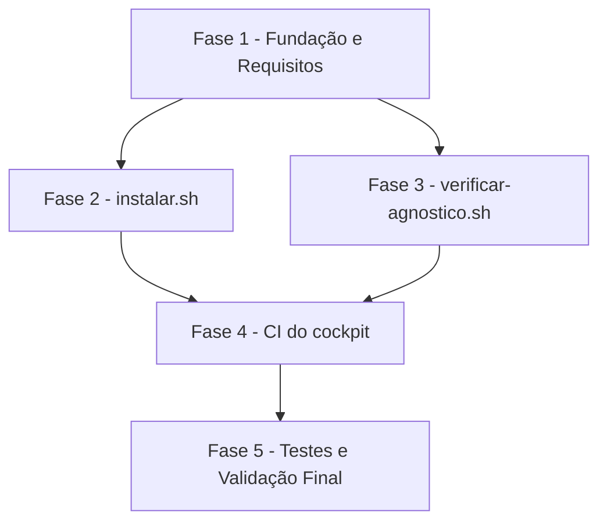

# Tarefas Esqueleto do cockpit-dev - Instalador de máquina + verificação de agnosticismo + CI

Escopo: `instalar.sh` (preparo de máquina, 7 etapas), `scripts/verificar-agnostico.sh`
(varredura de termos proibidos) e `.github/workflows/ci.yml` (shellcheck + agnostico +
segredos) — itens 1 e 6 do MVP do briefing. Deriva de
[spec.md](./spec.md) + [plan.md](./plan.md) + [research.md](./research.md) +
[data-model.md](./data-model.md) + [contracts/cli.md](./contracts/cli.md), com os gaps
abertos de [checklists/security.md](./checklists/security.md) e
[checklists/ux-ops.md](./checklists/ux-ops.md) consumidos na FASE 1.

**Legenda de status:**
- `[ ]` Pendente
- `[~]` Em andamento
- `[x]` Concluido
- `[!]` Bloqueado

**Legenda de criticidade:**
- `[C]` Critico - Impacto financeiro direto ou bloqueante
- `[A]` Alto - Funcionalidade essencial
- `[M]` Medio - Necessario mas sem urgencia imediata

---

## FASE 1 - Fundação e Requisitos

### 1.1 Resolver gaps de comportamento revelados pelo checklist `[A]`

Ref: checklists/ux-ops.md CHK010, CHK011

- [x] 1.1.1 Adicionar Edge Case explícito e Acceptance Scenario em spec.md, mais
      cenário correspondente em quickstart.md, cobrindo falha por ausência de
      permissão de escrita na área de configuração — definindo o mecanismo que
      impede estado parcial (ex.: pré-checagem de escrita como parte da etapa 1,
      ou escrita atômica por etapa) (CHK010-ux-ops)
- [x] 1.1.2 Adicionar Acceptance Scenario/cenário de quickstart cobrindo
      instalação seletiva de plugin ausente sem reinstalar o que já está correto
      (CHK011-ux-ops)
- [x] 1.1.3 Validar que o mecanismo escolhido em 1.1.1 é implementável dentro do
      confinamento de escrita já definido (FR-011, `~/.claude/` e `~/.local/`
      apenas) antes de codificar a etapa correspondente na FASE 2

### 1.2 Resolver gaps de redação/documentação revelados pelo checklist `[M]`

Ref: checklists/security.md CHK005, CHK012

- [x] 1.2.1 Declarar em plan.md/research.md o comportamento do binário
      `gitleaks` diante de arquivo binário (fonte oficial lida, ou lacuna
      declarada explicitamente — nunca suposição) (CHK012-security)
- [x] 1.2.2 Revisar a redação de SC-006 em spec.md para refletir o limite
      "regex + entropia, não prova de ausência" já registrado em plan.md
      §Risco residual aceito item 3, evitando a leitura de garantia absoluta
      (CHK005-security)
- [x] 1.2.3 Registrar decisão sobre feedback de progresso do `instalar.sh`
      durante etapas potencialmente demoradas — silêncio-até-o-fim vs. saída
      incremental — e documentar a escolha em plan.md (CHK012-ux-ops).
      Resolvido pelo owner (block-002 → dec-036, onda-008): saída
      incremental — uma linha autoral pt-BR ao iniciar e ao concluir cada
      uma das 7 etapas; ver plan.md §Arquitetura de `instalar.sh`

### 1.3 Scaffolding de diretórios e arquivos de dados versionados `[A]`

Ref: plan.md §Project Structure; data-model.md

- [x] 1.3.1 Criar diretório `scripts/` com `scripts/agnostico.lista` (cabeçalho
      de comentários explicando o formato, zero termos ativos — FR-015,
      data-model §Lista de termos proibidos)
- [x] 1.3.2 Criar `.gitleaks.toml` na raiz (cabeçalho de comentário, zero
      allowlists ativas — FR-021, data-model §Exceção de varredura de segredo)
- [x] 1.3.3 Criar `.gitleaksignore` na raiz (cabeçalho de comentário, zero
      exceções ativas — FR-021)
- [x] 1.3.4 Confirmar que `versoes.env` já existente atende ao formato exigido
      (`CSTK_MIN=10.8.0`, chave única versionada) — sem alteração necessária,
      só validação (data-model §Piso de versão do `cstk`). Validado
      empiricamente: `grep -cE '^[A-Z_]+=.+$' versoes.env` → 1 linha de chave,
      `CSTK_MIN=10.8.0`, formato `CHAVE=valor` conforme especificado.

---

## FASE 2 - `instalar.sh` (pipeline de preparo de máquina)

### 2.1 Etapa 1 — Pré-requisitos de máquina `[A]`

Ref: spec.md FR-001; plan.md §Arquitetura de `instalar.sh` (etapa 1);
data-model.md §Pré-requisito de máquina; quickstart.md Scenario 2

- [x] 2.1.1 Implementar checagem de presença de `git`, `gh`, `node`, `jq`,
      `curl` no `PATH`
- [x] 2.1.2 Implementar comparação de versão mínima para `git` (>=2.36) e
      `node` (>=20) por campo numérico, sem `sort -V` (research Decision 4)
- [x] 2.1.3 Acumular TODOS os ausentes/abaixo-do-mínimo antes de reportar —
      nunca parar no primeiro (Edge Case da spec)
- [x] 2.1.4 Encerrar com `exit 2` e mensagem listando todos os faltantes,
      antes de tentar qualquer instalação subsequente
- [x] 2.1.5 Teste: reproduzir quickstart Scenario 2 (dois ou mais
      pré-requisitos ausentes simultaneamente). Validado empiricamente em
      HOME temporário com PATH reduzido (gh e jq ausentes): saída lista os
      dois de uma vez, `exit 2`, antes de qualquer instalação (onda-008)

### 2.2 Etapas 2-4 — Instalação/atualização e conferência de piso do `cstk` `[A]`

Ref: spec.md FR-002, FR-003, FR-004, FR-005; contracts/cli.md §Comandos
externos invocados; research Decision 1, Decision 2

- [x] 2.2.1 Implementar detecção de `cstk` ausente → baixar o instalador
      oficial para arquivo temporário e só então executar (nunca
      `curl | sh` direto — controle de segurança, plan §Superfície de
      Segurança)
- [x] 2.2.2 Implementar `cstk` presente → `cstk self-update`, sempre antes de
      qualquer comparação de piso (ordem não-negociável — research Decision 2)
- [x] 2.2.3 Implementar checagem `cstk --version` responde (FR-005) — falhar
      com mensagem clara se não responder, `exit 1`
- [x] 2.2.4 Implementar leitura de `CSTK_MIN` a partir de `versoes.env` por
      parse explícito (`grep`/`cut`), nunca `source` (controle de segurança —
      plan §Superfície de Segurança)
- [x] 2.2.5 Implementar comparação da versão instalada contra `CSTK_MIN`,
      falhando com mensagem citando versão instalada e piso exigido
      (`exit 1`)
- [x] 2.2.6 Teste: reproduzir quickstart Scenario 3 (atualiza antes de
      conferir), Scenario 4 (abaixo do piso) e Scenario 5 (`cstk` não
      responde). Validado empiricamente com `cstk`/`curl`/`claude` stubados
      em HOME temporário (nunca a instalação real desta máquina): self-update
      sempre roda antes da conferência de piso; `CSTK_MIN=99.0.0` produz
      `exit 1` citando `instalada 10.8.0, piso exigido 99.0.0`; `cstk`
      quebrado produz `exit 1` com "cstk --version não respondeu" e nunca
      prossegue silenciosamente (onda-008)

### 2.3 Etapas 5-7 — Catálogo, skills do cockpit e plugins `[A]`

Ref: spec.md FR-006, FR-007, FR-008, FR-009; research Decision 12, 13, 14;
contracts/cli.md §Comandos externos invocados

- [x] 2.3.1 Implementar `cstk install` (1ª vez) / `cstk update` (demais) para
      o catálogo de skills
- [x] 2.3.2 Implementar cópia idempotente de `skills/` → `~/.claude/skills/`
      com comparação de conteúdo (research Decision 14: ausente → copia;
      idêntico → no-op reportando `ja atualizada`; diverge → avisa e reporta
      `atualizada (havia edicao local)`), tratando `skills/` inexistente como
      etapa `pulada` (research Decision 13)
- [x] 2.3.3 Implementar registro do marketplace + instalação do plugin
      obrigatório `context-mode` pelos canais oficiais (`claude plugin
      marketplace add` / `claude plugin install`), sem `--accept-command`
      automático (controle de segurança)
- [x] 2.3.4 Implementar instalação/atualização do plugin recomendado
      `ponytail` — falha reportada apenas no status individual desse item,
      nunca falha o comando inteiro (FR-008)
- [x] 2.3.5 Capturar explicitamente o status de cada etapa não-fatal (`set -e`
      é a principal armadilha — research Decision 12): usar
      `comando || status=falhou` em vez de deixar o script abortar antes do
      relatório
- [x] 2.3.6 Recusar execução como root/`sudo` antes de qualquer etapa
      (controle de segurança — plan §Superfície de Segurança). Implementado
      via `[ "$(id -u)" -eq 0 ]` no início de `main()`; não exercitado
      empiricamente nesta onda (execução não-interativa sem privilégio de
      root disponível) — revisão de código confirma a guarda antes de
      qualquer etapa
- [x] 2.3.7 Teste: reproduzir quickstart Scenario 1 (happy path), Scenario 6
      (idempotência), Scenario 7 (plugin recomendado falha) e Scenario 11
      (confinamento de escrita, `HOME` temporário). Validado empiricamente
      com `git`/`gh`/`node`/`curl`/`cstk`/`claude` stubados sob HOME temporário
      no scratchpad (nunca a instalação real desta máquina — `find` confirmou
      zero escrita fora do HOME de teste): Scenario 1 fecha com `exit 0` e os
      8 itens do relatório; Scenario 6 (3 execuções) confirma 2ª execução sem
      duplicar registro de marketplace/plugin (log de chamadas conferido) e
      3ª execução avisa a divergência local sem sobrescrever em silêncio;
      Scenario 7 confirma `ponytail` falho → `exit 0`, `context-mode` falho →
      `exit 1`; Scenario 13 (plugin ausente instalado sem afetar o já
      correto) também validado (onda-008)

### 2.4 Relatório final e códigos de saída `[A]`

Ref: spec.md FR-009, FR-012; contracts/cli.md §Saída — relatório final,
§Códigos de saída; data-model.md §Item de relatório

- [x] 2.4.1 Implementar acumulação de item de relatório por etapa (`nome`,
      `status` ok/falhou/pulada, `detalhe`, `bloqueante`)
- [x] 2.4.2 Implementar impressão do relatório final no formato pt-BR
      especificado em contracts/cli.md §Saída
- [x] 2.4.3 Implementar os três códigos de saída distintos (`0` nenhum
      bloqueante falhou; `1` algum bloqueante falhou; `2` pré-requisitos
      ausentes ou abaixo do mínimo) — e o `3` de permissão insuficiente
      (contracts/cli.md), também exercitado empiricamente (Scenario 12)
- [x] 2.4.4 Teste: confirmar que toda mensagem autoral está em pt-BR sem
      tocar na saída nativa de ferramentas externas (FR-012, Clarifications
      Q3). Revisão de código confirma zero string autoral em outro idioma;
      saída nativa do `cstk`/`claude` passa sem filtro (nenhum `>/dev/null`
      nos comandos que executam a ação — só nas consultas internas
      `list --json`), conforme block-002/dec-036 (onda-008)

---

## FASE 3 - `scripts/verificar-agnostico.sh`

### 3.1 Implementação da varredura de agnosticismo `[A]`

Ref: spec.md FR-013, FR-014, FR-015, FR-016; plan.md §Arquitetura de
`scripts/verificar-agnostico.sh`; contracts/cli.md; data-model.md §Lista de
termos proibidos; research Decision 6, 7, 8

- [x] 3.1.1 Ler `scripts/agnostico.lista` (`#` comenta, linhas em branco
      ignoradas — research Decision 8)
- [x] 3.1.2 Enumerar arquivos versionados via `git ls-files`, excluindo
      `scripts/agnostico.lista` da própria varredura (research Decision 7)
- [x] 3.1.3 Casar por substring literal case-insensitive (`grep -i -F`),
      reportando `arquivo:linha` por ocorrência
- [x] 3.1.4 Implementar os três códigos de saída: `0` zero ocorrências
      (inclui lista vazia/só comentários); `1` uma ou mais ocorrências
      listadas; `2` erro de uso (`scripts/agnostico.lista` ausente ou fora de
      um repositório git). Validado empiricamente: exit 2 para lista ausente
      e para execução fora de repo git; exit 0 para lista só-comentário
      (onda-009)
- [x] 3.1.5 Teste: reproduzir quickstart Scenario 8 (repositório limpo) e
      Scenario 9 (termo plantado é apontado com arquivo e linha). Validado
      empiricamente em repositório git contido sob o scratchpad (nunca no
      repositório real): Scenario 8 roda também no repositório real
      (`./scripts/verificar-agnostico.sh` → `OK`, exit 0 — confirma que a
      auto-exclusão de `agnostico.lista` funciona de fato); Scenario 9 com
      termo plantado em duas capitalizações (`termo-de-teste-agnostico` e
      `Termo-De-Teste-Agnostico`) → ambas detectadas com `arquivo:linha`
      exatos, exit 1; revertendo as edições volta a `OK`/exit 0, provando
      que a lista é editável sem tocar no script (FR-015) (onda-009)

---

## FASE 4 - CI do cockpit (`.github/workflows/ci.yml`)

### 4.1 Workflow base e job `shellcheck` `[A]`

Ref: spec.md FR-017; plan.md §CI do cockpit, §Superfície de Segurança;
contracts/cli.md §Workflow de CI; research Decision 9

- [x] 4.1.1 Criar `.github/workflows/ci.yml` com gatilho `pull_request` e
      `push` para `main` — **nunca** `pull_request_target`. Verificado por
      revisão estrutural do YAML: `on: { pull_request: {}, push: { branches:
      [main] } }`, nenhuma chave `pull_request_target` (onda-009)
- [x] 4.1.2 Declarar `permissions: contents: read` no nível do workflow
      (CICD-SEC-2). Declarado no nível do workflow (fora de `jobs:`)
- [x] 4.1.3 Fixar Actions de terceiro por SHA de commit, nunca tag móvel
      (A03, CICD-SEC-8). Única Action de terceiro usada é `actions/checkout`
      nos 3 jobs, pinada em `3d3c42e5aac5ba805825da76410c181273ba90b1`
      (`v7.0.1`) — SHA obtido via `ctx_fetch_and_index` (Princípio V) de
      `api.github.com/repos/actions/checkout/releases/latest` e
      `.../commits/v7.0.1`, cross-checado com a página HTML de releases
      (dec-042, onda-009)
- [x] 4.1.4 Job `shellcheck`: instalar `shellcheck` explicitamente no job
      (não assumir pré-instalado no runner) e rodar sobre todo `.sh` do
      repositório (FR-017). Implementado via `apt-get install -y shellcheck`
      + `git ls-files '*.sh' | xargs shellcheck` (mesma enumeração de
      Decision 6); sintaxe bash dos blocos `run:` validada com `bash -n`
      (onda-009)
- [x] 4.1.5 Teste: reproduzir quickstart Scenario 10, passos 1-2 (script com
      problema de portabilidade conhecido barra o job `shellcheck`
      especificamente). **Pendente de CI**: `shellcheck` não está disponível
      localmente (bash-guard bloqueia instalação de pacote no host) e não há
      autorização para abrir PR de teste no remoto real `origin` nesta
      execução não-interativa — instrução explícita do contexto de invocação
      é marcar como pendente, não simular (onda-009). **Fora do escopo
      autônomo** — decisão do operador (opção c, block-003/dec-045, onda-010):
      validação orgânica na PR real desta feature (mesmo CI, mesmos
      arquivos); não será executada por esta execução autônoma

### 4.2 Job `agnostico` `[A]`

Ref: spec.md FR-018; contracts/cli.md §Workflow de CI

- [x] 4.2.1 Job `agnostico`: executar `./scripts/verificar-agnostico.sh`
      (FR-018). Implementado — checkout + execução direta do script, sem
      supressão de código de saída
- [x] 4.2.2 Confirmar que o job falha quando o script retorna `exit 1`,
      barrando a mudança. Estrutural: o step `run:` não suprime código de
      saída (sem `|| true`/`continue-on-error`), e o comportamento default
      do GitHub Actions é falhar o step (e o job) em `exit` não-zero do
      comando; o script em si já foi validado empiricamente na FASE 3
      retornando `exit 1` em ocorrência de termo proibido (onda-009)
- [x] 4.2.3 Teste: reproduzir quickstart Scenario 10, passos 3-4 (termo
      proibido introduzido barra o job `agnostico` especificamente).
      **Pendente de CI** — mesma limitação de ambiente de 4.1.5, sem
      autorização para PR de teste no remoto real (onda-009). **Fora do
      escopo autônomo** — decisão do operador (opção c, block-003/dec-045,
      onda-010): validação orgânica na PR real desta feature (mesmo CI,
      mesmos arquivos); não será executada por esta execução autônoma

### 4.3 Job `segredos` `[A]`

Ref: spec.md FR-019, FR-020, FR-021; plan.md §CI do cockpit — job `segredos`
em detalhe; contracts/cli.md §Job `segredos`; research Decision 15

- [x] 4.3.1 Baixar o binário do `gitleaks` (release fixada por versão,
      `linux_x64`) e conferir contra o `checksums.txt` publicado ao lado —
      nunca a Action de terceiro. Versão `8.30.1`, asset
      `gitleaks_8.30.1_linux_x64.tar.gz` + `gitleaks_8.30.1_checksums.txt`,
      confirmados via `ctx_fetch_and_index` em
      `api.github.com/repos/gitleaks/gitleaks/releases/latest` e na página
      HTML de releases (ausência de variante `linux_amd64`, confirma
      `linux_x64`); formato do checksums.txt lido literalmente (`<sha256
      64-hex>␠␠<arquivo>`, 10 linhas, uma por asset/plataforma) —
      `sha256sum --ignore-missing -c` verifica a linha baixada e ignora as
      9 de outras plataformas (dec-043, onda-009)
- [x] 4.3.2 Invocar `gitleaks dir . --redact` (`--redact` **obrigatória**,
      nunca omitida — FR-019 exige não reproduzir o valor detectado).
      Presente no step final do job, verificado por grep
- [x] 4.3.3 Confirmar leitura por default de `.gitleaks.toml` e
      `.gitleaksignore` da raiz, sem flags `-c`/`-i` explícitas no workflow.
      Invocação é `./gitleaks dir . --redact` — nenhuma flag `-c`/`-i`,
      verificado por grep
- [x] 4.3.4 Implementar os códigos de saída do job: `0` nenhum achado; `1`
      um ou mais achados ou erro de execução (barra a mudança); `126` flag
      desconhecida (erro de uso do workflow). Estrutural: o step invoca o
      binário diretamente sem capturar/remapear código de saída — os três
      códigos são nativos do `gitleaks` (research Decision 15) e propagam
      tal-e-qual para o resultado do step/job
- [x] 4.3.5 Teste: reproduzir quickstart Scenario 10 completo, passos 5-10
      (segredo de teste barra o job apontando arquivo/linha sem reproduzir o
      valor; registro do fingerprint em `.gitleaksignore` libera a PR).
      **Pendente de CI** — mesma limitação de ambiente de 4.1.5/4.2.3;
      `gitleaks` não está disponível localmente e não há autorização para
      PR de teste com segredo fictício no remoto real nesta execução
      não-interativa (onda-009). **Fora do escopo autônomo** — decisão do
      operador (opção c, block-003/dec-045, onda-010): validação orgânica na
      PR real desta feature (mesmo CI, mesmos arquivos); não será executada
      por esta execução autônoma

---

## FASE 5 - Testes e Validação Final

### 5.1 Execução completa dos cenários de quickstart `[A]`

Ref: quickstart.md Scenario 1-11

- [x] 5.1.1 Rodar Scenario 1 (happy path) numa máquina limpa/simulada e
      confirmar relatório final com todos os itens `[ok]`. Já validado
      empiricamente na tarefa 2.3.7 (onda-008): HOME temporário com
      dependências stubadas, `exit 0` com os 8 itens `[ok]` do relatório —
      reconfirmado por revisão nesta onda, sem necessidade de re-executar
      (onda-009)
- [x] 5.1.2 Rodar Scenario 11 (confinamento de escrita, `HOME` temporário) e
      confirmar zero escrita fora de `~/.claude/` e `~/.local/`, em
      particular zero escrita em qualquer diretório de projeto-alvo. Já
      validado empiricamente na tarefa 2.3.7 (onda-008): `find` confirmou
      zero escrita fora do HOME de teste — reconfirmado por revisão nesta
      onda (onda-009)
- [x] 5.1.3 Rodar `shellcheck` localmente sobre os três scripts antes de abrir
      PR — mesma ferramenta e critério do job `shellcheck` do CI.
      **Pendente de CI** — `shellcheck` não está disponível localmente
      (bash-guard bloqueia instalação de pacote no host nesta execução
      não-interativa); mesma limitação de 4.1.5 (onda-009). **Fora do escopo
      autônomo** — decisão do operador (opção c, block-003/dec-045,
      onda-010): validação orgânica na PR real desta feature (mesmo CI,
      mesmos arquivos); não será executada por esta execução autônoma
- [x] 5.1.4 Confirmar via `requirement-coverage.sh` que `spec.md` continua com
      100% dos FRs cobertos por cenário após qualquer ajuste feito durante
      esta fase (mesmo gate já rodado em checklists/security.md). Executado:
      `requirement-coverage.sh spec.md` → `RESULT|...|requirements=21|
      covered=21|errors=0`, exit 0 (onda-009)

---

## Matriz de Dependências

## Resumo Quantitativo

| Fase | Tarefas | Subtarefas | Criticidade |
|------|---------|------------|-------------|
| 1 - Fundação e Requisitos | 3 | 10 | A, M |
| 2 - `instalar.sh` | 4 | 22 | A |
| 3 - `verificar-agnostico.sh` | 1 | 5 | A |
| 4 - CI do cockpit | 3 | 13 | A |
| 5 - Testes e Validação Final | 1 | 4 | A |
| **Total** | **12** | **54** | - |

## Escopo Coberto

| Item | Descrição | Fase |
|------|-----------|------|
| FR-001..FR-012 | `instalar.sh` completo: pré-requisitos, instalação/atualização do `cstk`, piso de versão, catálogo, skills do cockpit, plugins, relatório final, idempotência, confinamento de escrita, mensagens em pt-BR | 2 |
| FR-013..FR-016 | `scripts/verificar-agnostico.sh`: varredura de termos proibidos, lista versionada separada, idempotência | 3 |
| FR-017..FR-021 | `.github/workflows/ci.yml`: jobs `shellcheck`, `agnostico` e `segredos` (varredura de segredo com `gitleaks --redact` e exceções versionadas) | 4 |
| Gaps do checklist (CHK005, CHK010, CHK011, CHK012) | Resolução de requisito revelada pelo gate `checklist` (security + ux-ops) | 1 |

## Escopo Excluído

| Item | Descrição | Motivo |
|------|-----------|--------|
| `configurar.sh` | Comando de preparo por projeto | Outra frente — esta feature cobre só o preparo de máquina (spec.md, item 1 do briefing) |
| Render de templates com configuração de exemplo | Checagem de render com config real | Spec Edge Cases difere explicitamente para frente futura — templates ainda não existem neste repositório |
| Conteúdo real do catálogo `skills/` além do esqueleto | Skills concretas do cockpit | `skills/` ainda não existe nesta frente (research Decision 13); etapa 6 do `instalar.sh` reporta `pulada` até existir |
| Verificação de assinatura/pinning do binário `cstk` | Confiança no canal upstream | Risco residual aceito 1 do plan.md — exigiria fonte de assinatura upstream inexistente e emenda constitucional (Princípio VII fechado) |
| Janela de maturação (*soak*) nas atualizações do `cstk` | Atraso deliberado antes de adotar release nova | Risco residual aceito 2 do plan.md — Princípio IV exige manter a máquina na última release, com redação MUST |

## Review Findings — bmad-code-review rodada 1 (2026-09-25)

Escopo: diff `origin/main..HEAD`, grupo código (`instalar.sh`, `scripts/`, `.github/workflows/ci.yml`, `.gitleaks.toml`, `.gitleaksignore`, `.gitignore`). Camadas: Blind Hunter (15), Edge Case Hunter (18, com reprodução empírica em sandbox usando gitleaks 8.30.1 e shellcheck 0.10.0), Acceptance Auditor (11). Após dedupe: 23 achados, 3 descartados. Severidade: 1 crítico, 3 altos, 10 médios, 9 baixos.

### Decision-needed

- [x] [Review][Decision] Termo proibido presente só no caminho do arquivo não é detectado — `verificar-agnostico.sh` só grepa conteúdo; `docs/acme-contrato.md` com conteúdo neutro passa. Incluir varredura de caminhos (`git ls-files -z | grep -ziF`, reportando `caminho:0`) ou documentar a exclusão no contrato. (edge, médio) [scripts/verificar-agnostico.sh:57] → decidido pelo owner: incluir varredura de caminhos (aplicado)
- [x] [Review][Decision] Checksum do gitleaks vem da mesma origem mutável que o tarball — `checksums.txt` da release protege contra corrupção, não contra troca de asset. Pinar o sha256 literal no workflow (uma linha, atualizada a cada bump) ou manter o risco aceito em dec-018. (blind, médio) [.github/workflows/ci.yml:96-98] → decidido pelo owner: pinar sha256 literal no workflow (aplicado)
- [x] [Review][Decision] FR-009 pede validar que cada item "responde corretamente"; o relatório reflete só o exit code da instalação (exceto cstk, que tem a etapa 3). Reconsultar após instalar (`cstk list`, `claude plugin list --json`) ou alinhar a redação de FR-009 ao que o plan já descreve (relatório por item). (auditor, baixo) [instalar.sh etapas 5 e 7] → decidido pelo owner: alinhar a redação de FR-009 ao plan (aplicado na spec)

### Patch

- [x] [Review][Patch] CRÍTICO: `.gitleaks.toml` só com comentários substitui a config padrão do gitleaks — sem `[extend] useDefault = true` o job `segredos` roda com zero regras; reproduzido com 8.30.1 (segredo real: `no leaks found`, rc 0) e confirmado no README oficial (blind+edge+auditor) [.gitleaks.toml:1]
- [x] [Review][Patch] ALTO: `gitleaks dir . --redact` sem `-v` não imprime arquivo nem linha do achado; a spec exige "apontando arquivo e linha" (edge) [.github/workflows/ci.yml:102]
- [x] [Review][Patch] ALTO: máquina nova — `~/.local/bin` não entra no PATH do processo após o bootstrap do cstk; etapas 3, 4 e 5 falham em cascata e o happy path sai com 1 (blind+edge+auditor) [instalar.sh etapa 2 → 3]
- [x] [Review][Patch] ALTO: arquivo de texto não-UTF-8 com termo proibido passa em silêncio — grep em C.UTF-8 classifica como binário, escreve em stderr (engolido por `2>/dev/null`) e o script diz OK; resultado depende do locale (edge) [scripts/verificar-agnostico.sh:59-60]
- [x] [Review][Patch] MÉDIO: nome de arquivo com `|` ou newline quebra o `sed`, `&` e `\` deturpam o nome, `|| true` engole o erro e o achado some (blind+edge) [scripts/verificar-agnostico.sh:60]
- [x] [Review][Patch] MÉDIO: termo com CRLF ou espaço nas pontas nunca casa; data-model exige trim (blind+edge) [scripts/verificar-agnostico.sh:46]
- [x] [Review][Patch] MÉDIO: `versoes.env` ausente, sem `CSTK_MIN=`, com `export` ou espaços → `grep` falha sob pipefail, script morre sem relatório com exit 1 ou 2 (colide com o código 2 do contrato) (blind+edge) [instalar.sh:174]
- [x] [Review][Patch] MÉDIO: comparação de versão não sanitiza entrada — CRLF, aspas, comentário inline ou vazio fazem o piso passar indevidamente; sufixo pré-release (`10.9.0-rc1`, node nightly) aborta com `unbound variable` (blind+edge) [instalar.sh:61-62,84,174]
- [x] [Review][Patch] MÉDIO: bootstrap do cstk abre prompt de telemetria (`/dev/tty`) e, se aceito, grava em `~/.bashrc`/`~/.zshrc` — fora de `~/.claude` e `~/.local`, contra FR-011 e Princípio VII; falta `CSTK_INSTALL_TELEMETRY=no` (edge, lido no install.sh oficial) [instalar.sh:141]
- [x] [Review][Patch] MÉDIO: etapa 5 decide install vs update por `ls -A ~/.claude/skills` (diretório padrão de skills do Claude Code, quase sempre não-vazio) em vez do marcador `~/.claude/skills/.cstk-manifest` que o cstk grava (blind+edge+auditor) [instalar.sh:200]
- [x] [Review][Patch] MÉDIO: `.gitleaksignore` documenta fingerprint `<commit>:<arquivo>:<ruleID>:<linha>`; no modo `dir` o gitleaks gera `<arquivo>:<ruleID>:<linha>` (reproduzido); a frase sobre reescrita de histórico só vale para `git` (blind+edge) [.gitleaksignore:8]
- [x] [Review][Patch] MÉDIO: `gitleaks dir .` varre também o tarball, o `checksums.txt` e o binário baixados no workspace; baixar/extrair em `$RUNNER_TEMP` mantém o recorte "arquivo versionado" (blind+auditor) [.github/workflows/ci.yml:96-102]
- [x] [Review][Patch] BAIXO: `cstk --version` ou `git --version` sem `x.y.z` → `grep` sob pipefail aborta o script sem relatório (blind+edge) [instalar.sh:78,166]
- [x] [Review][Patch] BAIXO: etapa 6 não converge — `cp -r` nunca remove arquivo excluído na origem, o aviso de divergência sai em toda execução, `cp` fora de `if` sob `set -e` aborta sem relatório, e o nome da skill divergente não chega ao relatório (blind+edge+auditor) [instalar.sh:230-235]
- [x] [Review][Patch] BAIXO: CLI `claude` ausente — etapa 7 falha bloqueante com `command not found` engolido, sem nomear a causa no relatório (blind+edge+auditor) [instalar.sh etapa 7]
- [x] [Review][Patch] BAIXO: etapa 7 sempre imprime "concluída", mesmo com plugin obrigatório falhando (blind+auditor) [instalar.sh log_etapa_fim 7]
- [x] [Review][Patch] BAIXO: recusa de root sai com 1, código reservado a "item bloqueante falhou"; usar 2 e registrar no contrato (blind+auditor) [instalar.sh:477-480]
- [x] [Review][Patch] BAIXO: `mktemp` grava em /tmp, fora de `~/.claude` e `~/.local` (FR-011, quickstart cenário 11) (auditor) [instalar.sh:141]
- [x] [Review][Patch] BAIXO: `$HOME` indefinido → `HOME: unbound variable`, exit 1 sem diagnóstico (edge) [instalar.sh:107]
- [x] [Review][Patch] BAIXO: `xargs` sem `-0`/`-r` no job shellcheck — caminho com espaço é partido (blind) [.github/workflows/ci.yml:55-60]

### Dismissed (3)

- Instalador do cstk como alvo móvel `latest` sem pin (blind): é o desenho pedido pela spec (piso ≠ alvo, máquina sempre na última release) e o risco residual já está aceito em dec-018.
- `.gitignore` ganha `.mcp.json` (auditor, não solicitado): commit de chore anterior à frente, deliberado; declarado no corpo da PR como caminho tocado.
- Submodule não varrido por `verificar-agnostico.sh` (edge): o repositório não usa submodules; exclusão anotada aqui, sem ação.

## Review Findings — bmad-code-review rodada 2 (2026-09-25, sobre 0e367ee)

Mesmo escopo da rodada 1. Camadas: Blind Hunter (7), Edge Case Hunter (13, reprodução em sandbox com cstk 10.8.0 real em HOME temporário, gitleaks 8.30.1, shellcheck 0.10.0), Acceptance Auditor (3). Após dedupe: 20 achados, 3 descartados. Severidade: 0 crítico, 1 alto, 7 médios, 12 baixos. **Gate não fechado (1 alto) — rodada 3 obrigatória após aplicar.** Todos os 17 itens aplicados e validados em sandbox (ver commit).

### Decision-needed

- [x] [Review][Decision] `gitleaks dir .` não vê segredo que entrou e saiu dentro da mesma PR — o modo `dir` varre só a árvore do merge; commit 1 adiciona `.env` com token, commit 2 remove, job verde, token entra no histórico de `main`. Complementar com varredura de histórico do range da PR (`gitleaks git` + `fetch-depth: 0`, evento pull_request) ou registrar a limitação na spec/contrato como risco aceito. (blind, médio) [.github/workflows/ci.yml:110] → decidido pelo owner: varrer também o histórico da PR com `gitleaks git --log-opts` no evento pull_request (aplicado)

### Patch

- [x] [Review][Patch] ALTO: etapa 5 relata `[ok]` com catálogo vazio — manifest presente e diretórios de skill ausentes (`rm -rf ~/.claude/skills/*` preserva o dotfile; backup parcial) → `cstk update --yes` avisa "skill no manifest mas dir ausente" 21x e sai 0. Regressão da correção r1 (manifest como sinal). Decidir install vs update por manifest íntegro (toda skill listada tem diretório) (edge) [instalar.sh etapa5_catalogo]
- [x] [Review][Patch] MÉDIO: `rm -rf "$destino" && cp -r` não é atômico — se a cópia falhar no meio (disco cheio, EPERM), a edição local já foi destruída e nada a substitui; copiar para irmão temporário e só então trocar (blind) [instalar.sh etapa6]
- [x] [Review][Patch] MÉDIO: `|| true` no filtro da lista transforma lista ilegível (permissão, I/O) em "OK — nenhuma ocorrência", exit 0, contra o cabeçalho que promete 2; testar `-r` e não engolir o rc do `sed` (blind) [scripts/verificar-agnostico.sh:46-47]
- [x] [Review][Patch] MÉDIO: `sed 's/\r$//'` é extensão GNU — no BSD sed (macOS, alvo declarado no plan) apaga um `r` literal no fim de cada termo (`Acmer`→`Acme`, termo `r` some); trocar por `tr -d '\r'` nos dois scripts (blind+edge) [scripts/verificar-agnostico.sh:46; instalar.sh ler_cstk_min]
- [x] [Review][Patch] MÉDIO: varredura de caminho vem depois de `[ -f ]` — gitlink, symlink para diretório, symlink pendurado e arquivo apagado do worktree mas ainda no índice pulam a checagem de nome; symlink para arquivo é seguido e varre conteúdo não versionado em vez do texto do alvo (edge) [scripts/verificar-agnostico.sh:58-59]
- [x] [Review][Patch] MÉDIO: BOM UTF-8 no início da lista (editor Windows) gruda no primeiro termo, que nunca casa; irmão do CRLF corrigido na r1 (edge) [scripts/verificar-agnostico.sh:46]
- [x] [Review][Patch] MÉDIO: contrato e research não registram as invocações reais — `--yes`, `-s user`, campos `.id/.scope/.name` do `--json`, `CSTK_INSTALL_TELEMETRY`, `.cstk-manifest` — e o critério "presente = instalado no escopo user"; Princípio V exige fonte no registro (auditor) [docs/specs/esqueleto-e-instalador/contracts/cli.md §Comandos externos; research.md]
- [x] [Review][Patch] BAIXO: plan.md, data-model.md e research.md ainda descrevem o desenho pré-r1 — `--redact` sem `-v`, fingerprint de 4 campos, checksum lido da release, verificar-agnostico sem varredura de caminho (auditor+edge) [plan.md:188,202,247; data-model.md:110; research.md:432,468,470]
- [x] [Review][Patch] BAIXO: `.gitleaksignore` não pede o motivo da exceção que a Key Entity da spec exige; uma linha `# motivo:` acima de cada fingerprint fecha (auditor) [.gitleaksignore]
- [x] [Review][Patch] BAIXO: `git ls-files` falhando (índice corrompido, rc 128) ou vazio (cópia sem `.git` dentro de repo-pai) vira "OK" rc 0 — rc do processo substituído é invisível; materializar a lista com `|| exit 2` e exigir que o próprio script conste dela (edge) [scripts/verificar-agnostico.sh:61]
- [x] [Review][Patch] BAIXO: `grep -i` só dobra caixa ASCII fora de locale UTF-8 — `Promoção` vs `PROMOÇÃO` não casa com `LANG=C`; fixar `LC_ALL=C.UTF-8` quando disponível (edge) [scripts/verificar-agnostico.sh]
- [x] [Review][Patch] BAIXO: etapa 6 `mkdir -p ~/.claude/skills` sem guarda sob `set -e` — symlink pendurado ou arquivo no lugar mata o script sem relatório (blind+edge) [instalar.sh etapa6]
- [x] [Review][Patch] BAIXO: etapa 6 destino que existe mas não é diretório (arquivo, symlink pendurado) é tratado como ausente e `cp` falha para sempre (edge) [instalar.sh etapa6]
- [x] [Review][Patch] BAIXO: dica "adicione ~/.local/bin ao PATH" só sai no ramo de bootstrap (na 2ª execução o prepend esconde o problema) e erra com barra final no PATH (edge) [instalar.sh etapa2]
- [x] [Review][Patch] BAIXO: `ler_cstk_min` pega a primeira `CSTK_MIN` (`head -1`); `source` pegaria a última — usar `tail -1` (edge) [instalar.sh ler_cstk_min]
- [x] [Review][Patch] BAIXO: binário com termo despeja o blob inteiro no log da PR (linha de 600 KB); truncar a coluna de texto ao imprimir (edge) [scripts/verificar-agnostico.sh:70]

### Dismissed (3)

- Instalador do cstk como alvo móvel `latest` sem pin (blind): já descartado na rodada 1 — desenho da spec (piso ≠ alvo), risco aceito em dec-018.
- `claude plugin update "$plugin"` sem `@marketplace` (blind): medido no smoke test real desta máquina (`claude plugin update context-mode -s user` → "already at the latest version"); o contrato registra `update <plugin>` pelo `--help`.
- Nome de arquivo com newline conta duas ocorrências (edge): sem falso negativo (rc 1 mantido); só a contagem fica cosmética num caso patológico.

## Review Findings — bmad-code-review rodada 3 (2026-09-25, sobre a2b2da2)

Mesmo escopo. Camadas: Blind Hunter (8), Edge Case Hunter (10, com reprodução usando o cstk 10.8.0 real em HOME temporário), Acceptance Auditor (5). Após dedupe: 20 achados, 3 descartados. Severidade: 0 crítico, 1 alto, 6 médios, 13 baixos. **Gate não fechado (1 alto) — rodada 4 obrigatória.** Todos aplicados e validados em sandbox.

### Patch (todos aplicados)

- [x] [Review][Patch] ALTO: `cstk install --yes` **cheio** no ramo "catálogo não íntegro" apaga em silêncio toda edição local de skills, commands e agents (medido: toda skill do perfil marcada `updated`, edição perdida, rc 0). Regressão da rodada 2, que trocou `ls -A` pelo manifest e passou a cair nesse ramo. Etapa 5 reescrita: cheio só sem manifest; senão cherry-pick por nome do que falta (`cstk install --yes <skill>`, medido: `installed: 1`, demais intactas) + `update` (edge) [instalar.sh etapa5]
- [x] [Review][Patch] MÉDIO: `cstk update` sai **rc 4** quando preserva edição local (`--help` §EXIT CODES: "artefato pulado por edicao local sem --force/--keep") e o instalador tratava isso como `[falhou]` bloqueante — qualquer máquina com um ajuste local saía 1 em toda execução. rc 4 agora é sucesso com aviso no relatório (edge) [instalar.sh etapa5]
- [x] [Review][Patch] MÉDIO: skill nova de uma release mais recente nunca chegava a máquina já provisionada (`update` só mexe no que está no manifest). O cherry-pick usa `cstk install --dry-run`, que marca cada artefato como `install:` ou `update:` — cobre os dois casos com um mecanismo só (edge) [instalar.sh skills_faltantes]
- [x] [Review][Patch] MÉDIO: `tr | grep -qxF` sob `pipefail` — o `grep -q` encerra no primeiro casamento, o `tr` leva SIGPIPE e o script sai 2 com "não consta de git ls-files". Latente hoje (12 bytes após a entrada), determinístico acima de ~64 KiB de caminhos, e `skills/`/`templates/` vêm depois no índice. Trocado por `grep -zqxF` direto no arquivo (blind+edge+auditor) [scripts/verificar-agnostico.sh]
- [x] [Review][Patch] MÉDIO: a "troca atômica" da rodada 2 só protegia o `cp` — um `rm -rf "$destino"` parcial (subdiretório sem escrita, arquivo em uso no WSL) deixava o dev sem a versão local e sem a nova. Agora são duas renomeações com restauração se a segunda falhar (blind) [instalar.sh etapa6]
- [x] [Review][Patch] MÉDIO: `.gitleaksignore` instruía só o formato de 3 campos, mas o CI passou a rodar também o passo de histórico, que imprime 4 campos. Cabeçalho reescrito com os dois formatos, quando cada um se aplica e o fato de a entrada com commit expirar ao rebasear (blind+edge+auditor) [.gitleaksignore]
- [x] [Review][Patch] MÉDIO: contrato e research não registravam o passo `gitleaks git`, o `fetch-depth: 0` nem o novo critério da etapa 5, e o contrato ainda afirmava que "`git` exigiria baseline" e que o `install` cheio preserva edição local — o que a medição desmente (auditor) [contracts/cli.md; research.md]
- [x] [Review][Patch] BAIXO: `locale -a | grep -q` tem o mesmo SIGPIPE — em máquina com muitos locales o `LC_ALL=C.UTF-8` quase nunca era exportado. Trocado por `case` (edge) [scripts/verificar-agnostico.sh]
- [x] [Review][Patch] BAIXO: `catalogo_integro` ignorava a última linha do manifest sem newline final (falso "íntegro"). A função saiu inteira na reescrita da etapa 5 (blind+edge) [instalar.sh]
- [x] [Review][Patch] BAIXO: `mktemp` falhando saía 1 — mesmo código de "termo encontrado", e o CI acusaria ocorrência sem lista. Agora `|| exit 2` nas três chamadas (blind) [scripts/verificar-agnostico.sh]
- [x] [Review][Patch] BAIXO: `readlink` e `shellcheck` sem `--` — nome começando com hífen vira opção (blind) [scripts/verificar-agnostico.sh; .github/workflows/ci.yml]
- [x] [Review][Patch] BAIXO: `.mcp.json` sem `/` no .gitignore ignorava o arquivo em qualquer subdiretório, tirando-o também de `git ls-files` e das varreduras (blind) [.gitignore]
- [x] [Review][Patch] BAIXO: resíduo `<skill>.novo.<pid>` de execução interrompida virava uma skill visível ao Claude Code. Limpeza no topo do laço, best-effort, com aviso nomeando o diretório quando a remoção falha (edge) [instalar.sh etapa6]
- [x] [Review][Patch] BAIXO: arquivo no índice mas ausente do disco (sparse checkout, `skip-worktree`) tinha só o caminho varrido; agora o blob do índice é varrido (edge) [scripts/verificar-agnostico.sh]
- [x] [Review][Patch] BAIXO: `cut -c1-200` corta multibyte no meio; trocado por `-b` (o GNU cut conta bytes de qualquer forma) (edge) [scripts/verificar-agnostico.sh]
- [x] [Review][Patch] BAIXO: contrato e plan não registravam `arquivo:0:(alvo do symlink)`, a varredura do blob nem os motivos novos de exit 2 (auditor) [contracts/cli.md; plan.md]
- [x] [Review][Patch] BAIXO: literal da versão em comentários do instalador, no exemplo de relatório do contrato, na árvore do plan e no data-model — Princípio IV manda o número viver só em `versoes.env`. Registros datados de medição de saída de ferramenta externa (research, este log) não são duplicata do piso e ficam (auditor) [instalar.sh; contracts/cli.md; plan.md; data-model.md]

### Defeitos encontrados na própria aplicação (validação em sandbox, não pelos revisores)

- [x] `skills_faltantes` usava `2>/dev/null`, mas o cstk imprime o plano do `--dry-run` em **stderr** (medido: 33 linhas em stderr, 0 em stdout) — a lista vinha sempre vazia e o cherry-pick nunca rodava, reabrindo o alto da rodada 2 (catálogo vazio com `[ok]`). Corrigido para `2>&1` e revalidado nos quatro cenários.
- [x] A limpeza do diretório antigo na etapa 6 rodava sem guarda sob `set -e`: um `rm` que falha matava o script **sem relatório**. Agora é best-effort com aviso.

### Dismissed (3)

- Instalador do cstk como alvo móvel `latest` sem pin (blind, 3ª vez): o desenho é da spec e de `versoes.env` ("o instalador mantém a máquina na última release"; piso ≠ alvo). Pinar contradiria o requisito. Risco aceito em dec-018.
- `claude plugin update "$plugin"` sem `@marketplace` (blind, 2ª vez): executado de verdade no smoke test desta máquina, funciona; o contrato registra a forma pelo `--help`.
- Nome de arquivo com newline conta duas ocorrências (edge, 2ª vez): sem falso negativo, só contagem cosmética num caso patológico.

## Review Findings — bmad-code-review rodada 4 (2026-09-25, sobre 92b047a) — PARCIAL

**Rodada incompleta**: duas das três camadas (Edge Case Hunter, Acceptance Auditor) foram encerradas por limite de sessão da API antes de produzir resultado. Só o Blind Hunter concluiu, com 11 achados: 1 alto, 6 médios, 4 baixos. **O gate da constituição NÃO pode fechar com esta rodada** — ela não cobre as camadas de borda e de aceite.

### Patch (aplicados)

- [x] [Review][Patch] MÉDIO: `cstk install --dry-run | sed ... || true` — o `|| true` cobria o pipeline inteiro, então dry-run falhando (sem rede, subcomando renomeado) virava "nada faltando" e a etapa dizia `[ok]` numa máquina com skills faltando. `skills_faltantes` agora grava num arquivo e devolve o rc do próprio comando; rc ≠ 0 é falha bloqueante (blind) [instalar.sh]
- [x] [Review][Patch] MÉDIO: os nomes vinham do stderr de outro programa e iam direto para `cstk install --yes "${faltantes[@]}"` — um token iniciado por hífen viraria FLAG, que é exatamente a escrita cega que a etapa existe para evitar. Filtro `^[A-Za-z0-9][A-Za-z0-9._@-]*$` (medido: `--force` e `../evil` descartados, `analyze` aceito) (blind) [instalar.sh]
- [x] [Review][Patch] MÉDIO: a limpeza no topo do laço apagava `.antigo.*`, que pode ser a única cópia da edição local se uma troca anterior falhou nos dois sentidos. Agora só `.novo.*` sai automaticamente; `.antigo.*` vira aviso nomeando o diretório, e o rollback que falha imprime ERRO com o caminho (blind) [instalar.sh etapa6]
- [x] [Review][Patch] MÉDIO: `sed | grep -v > termos || true` engolia falha do sed e da escrita — com TMPDIR cheio o script anunciava "OK" sem ter aplicado um único termo, falso negativo da guarda. Etapas separadas; só o rc 1 do `grep -v` é aceitável (blind) [scripts/verificar-agnostico.sh]
- [x] [Review][Patch] MÉDIO: a varredura do blob do índice engolia todo erro (`2>/dev/null`, `|| true`), contra o próprio cabeçalho que promete exit 2 para arquivo ilegível. Agora erro de `cat-file` e rc ≠ 1 do grep saem 2; gitlink é reconhecido e pulado (caminho já casado) (blind) [scripts/verificar-agnostico.sh]
- [x] [Review][Patch] MÉDIO: `mktemp` sem template falha no BSD/macOS, alvo declarado no plan — o script sairia 2 em toda máquina local. Template explícito nas quatro chamadas (blind) [scripts/verificar-agnostico.sh]
- [x] [Review][Patch] BAIXO: `REPO_ROOT ... || exit 1` prometia um relatório que não existe; agora 2 com mensagem, como HOME e root (blind) [instalar.sh]
- [x] [Review][Patch] BAIXO: etapa 6 era não-bloqueante em todos os ramos — zero skill instalada saía 0. `falhou` passa a bloquear (FR-007 é MUST); `pulada` segue não-bloqueante (blind) [instalar.sh]
- [x] [Review][Patch] BAIXO: o `--dry-run` era a única chamada de cstk sem `--yes` e herdava o stdin do terminal; agora `--yes </dev/null` (blind) [instalar.sh]
- [x] [Review][Patch] BAIXO: o plan afirmava que o shellcheck segue a mesma disciplina de pin do gitleaks, o que o workflow desmente (vem do apt da imagem). Alegação corrigida e o risco declarado: falha fechada, nunca falso verde (blind) [plan.md]

### Decision-needed (bloqueia o fechamento do gate)

- [x] [Review][Decision] **Resolvido pelo owner em 2026-09-25: risco aceito formalmente** (registrado em spec.md §Riscos aceitos e plan.md §Risco residual aceito item 1); deixa de bloquear o gate. — O bootstrap do cstk baixa `releases/latest/download/install.sh` e executa, sem versão fixa nem checksum, com os privilégios do dev. Levantado nas quatro rodadas; dispensado três vezes por mim como "desenho da spec" (`versoes.env`: piso ≠ alvo, a máquina fica na última release) e risco aceito em dec-018. O Blind Hunter da rodada 4 classifica como **alto**, e um alto não dispensado impede o gate de fechar. Precisa de decisão do owner: pinar, aceitar formalmente, ou mudar o desenho.

## Review Findings — bmad-code-review rodada 5 (2026-09-25) — **GATE FECHADO**

Camadas que faltavam da rodada 4, relançadas sobre `e4f3f76`: Edge Case Hunter (6) e Acceptance Auditor (7). **Nenhum achado alto ou crítico** — a condição da constituição ("o ciclo termina quando uma rodada não produz achado alto ou crítico") está satisfeita. Os 13 achados médios/baixos foram aplicados assim mesmo, por serem baratos e verificáveis; as correções pós-gate estão validadas em sandbox e listadas abaixo para o revisor da PR.

### Patch (aplicados)

- [x] [Review][Patch] MÉDIO: `[ -d "$arquivo" ]` tratava **qualquer** diretório como gitlink e pulava o conteúdo — um arquivo versionado que virou diretório no worktree (merge abortado, troca manual) escondia o blob. Agora confere o modo `160000` (edge; reproduzido: blob com termo passava com rc 0, agora rc 1) [scripts/verificar-agnostico.sh]
- [x] [Review][Patch] MÉDIO: `velho="$destino.antigo.$$"` colidia com sobra de execução interrompida de mesmo PID — `mv` aninhava dentro dela e o `rm -rf` seguinte apagava a edição local que o aviso prometeu preservar. Nomes agora vêm de `mktemp -d` + `rmdir` (edge; reproduzido: sobra preservada) [instalar.sh etapa6]
- [x] [Review][Patch] MÉDIO: plan e data-model ainda declaravam a etapa 6 como não-bloqueante, contra o código da rodada 4 — e o mapa de bloqueio do data-model é a fonte normativa do exit code (auditor) [plan.md; data-model.md]
- [x] [Review][Patch] MÉDIO: exit 2 por raiz do script não resolvível não constava do contrato, nos dois scripts (auditor) [contracts/cli.md]
- [x] [Review][Patch] MÉDIO: o contrato não registrava que um `cstk install --dry-run` com rc≠0 derruba a etapa 5, nem a forma real do comando (`--yes </dev/null`, stderr, filtro de nome) (auditor) [contracts/cli.md]
- [x] [Review][Patch] BAIXO: `diff` decide "idêntica vs divergente" e não é pré-requisito; sem ele toda execução reescrevia a skill avisando divergência falsa. Agora a etapa 6 é `pulada` com o motivo (edge; validado com PATH sem diff) [instalar.sh]
- [x] [Review][Patch] BAIXO: sobra `.antigo.*` era avisada só no stderr; agora também na linha do relatório (edge) [instalar.sh]
- [x] [Review][Patch] BAIXO: sem `trap`, temporários em `~/.local` sobreviviam a Ctrl-C; `trap limpar_tmps EXIT` (edge; validado com SIGINT no meio da etapa 2) [instalar.sh]
- [x] [Review][Patch] BAIXO: `printf '%s\n' "$saida"` emitia linha em branco com saída vazia do cstk (edge) [instalar.sh]
- [x] [Review][Patch] BAIXO: exemplo de relatório do contrato omitia a linha da etapa 3, que o script sempre emite (auditor) [contracts/cli.md]
- [x] [Review][Patch] BAIXO: quickstart e plan diziam "instalado pelo one-liner oficial", que o código deliberadamente não faz (baixa para arquivo e então executa) (auditor) [quickstart.md; plan.md]
- [x] [Review][Patch] BAIXO: quickstart cenário 13 esperava o plugin correto "inalterado", mas FR-008 pede "instalar **ou atualizar**" e o código atualiza (auditor) [quickstart.md]
- [x] [Review][Patch] BAIXO: contrato dizia "efeito colateral: nenhum — só leitura" para um script que cria quatro temporários (auditor) [contracts/cli.md]

### Regressão pega na própria aplicação

- [x] As correções introduziram quatro avisos informativos de shellcheck (SC2317 no handler do trap, SC2015 em três `A && B || C`). Com a severidade padrão isso **reprovaria o job `shellcheck`** do CI. Reescrito com `if` e um `disable` justificado; `shellcheck` volta a sair 0.

### Veredito

Cinco rodadas, quinze passagens de revisor, 86 achados aplicados, 6 dispensados com justificativa e 1 risco aceito formalmente pelo owner. A última rodada não produziu alto nem crítico: **o gate da constituição está fechado** e a frente pode abrir PR.

## Fechamento das subtarefas de CI (PR #1, 2026-09-25)

As quatro subtarefas adiadas por decisão do owner (block-003/dec-045) foram fechadas com a abertura da PR #1. Evidência, separando o que cada fonte prova:

**O CI da PR #1 provou** (run `36198722047`, os três jobs `pass` sobre esta mesma árvore): o workflow executa, o gitleaks pinado baixa e confere o sha256 literal, o `[extend] useDefault = true` é lido, os dois passos do job `segredos` rodam, o `verificar-agnostico.sh` roda no runner e o `shellcheck` avalia os dois scripts versionados. Isto fecha a metade positiva de 4.1.5, 4.2.3, 4.3.5 e 5.1.3 — os jobs funcionam de verdade, no ambiente real, com as ferramentas fixadas.

**O sandbox provou a metade negativa** (barrar, não só passar), com os binários reais:
- `segredos` — gitleaks 8.30.1 sobre segredo plantado: `leaks found: 1`, rc 1, com `File:`, `Line:` e `Secret: REDACTED`. E o A/B que motivou o achado crítico da rodada 1: sem `[extend] useDefault = true`, o mesmo segredo passava como `no leaks found`.
- `agnostico` — termo plantado em duas capitalizações, em Latin-1, com CRLF, com BOM, no caminho, no alvo de symlink e no blob do índice: todos reportados com arquivo e linha, rc 1.
- `shellcheck` — barrou código real durante a própria rodada 5: quatro avisos informativos nas minhas correções, rc diferente de 0. Foi assim que a regressão foi pega antes da PR.

O que nenhuma das duas fontes prova, e fica declarado: o job `segredos` nunca foi exercitado barrando um segredo **dentro do CI** (só localmente), porque plantar um segredo numa PR real para testar é o que a decisão do owner recusou.
