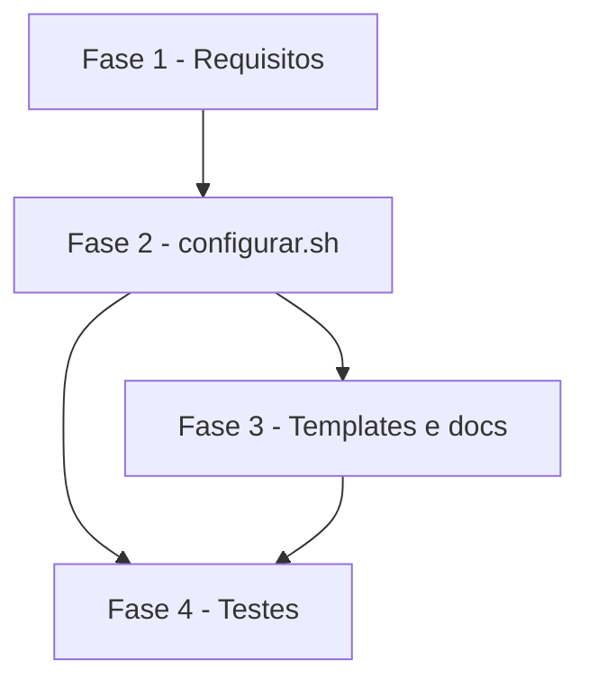

# Tarefas ciclo_dev - modo semente no configurar.sh

Escopo: implementar o modo semente (`*.semente.tmpl`) em `configurar.sh`, converter os 3 templates, ajustar contrato/ajuda e cobrir com o cenario 17 de teste (spec.md FR-001..FR-009, SC-001/SC-002).

**Legenda de status:**
- `[ ]` Pendente
- `[~]` Em andamento
- `[x]` Concluido
- `[!]` Bloqueado

**Legenda de criticidade:**
- `[C]` Critico - Impacto financeiro direto ou bloqueante
- `[A]` Alto - Funcionalidade essencial
- `[M]` Medio - Necessario mas sem urgencia imediata

---

## FASE 1 - Fechamento de requisitos (gaps do checklist)

### 1.1 Resolver CHK015 - placeholder sem valor em semente a gravar `[A]`

Ref: checklists/requirements.md CHK015; spec.md FR-004

- [x] 1.1.1 Confirmar no codigo de `configurar.sh` o exit e a mensagem atuais de "Placeholder sem valor" para template nao semente
- [x] 1.1.2 Registrar na spec.md (FR-004) e em contracts/cli.md que semente a gravar com placeholder sem valor termina com o mesmo exit 2 e a mesma mensagem
- [x] 1.1.3 Marcar CHK015 como `[x]` no checklist citando a secao atualizada

### 1.2 Resolver CHK016 - destino cujo diretorio-pai nao existe ou e arquivo `[A]`

Ref: checklists/requirements.md CHK016; spec.md FR-002, FR-005

- [x] 1.2.1 Verificar o comportamento atual de gravacao para nao semente quando o pai nao existe (criado) ou e arquivo (falha)
- [x] 1.2.2 Registrar na spec.md (Edge Cases) o comportamento esperado para semente nos dois casos, alinhado ao nao semente
- [x] 1.2.3 Acrescentar o caso ao quickstart.md (cenario 17) e marcar CHK016 como `[x]` no checklist

---

## FASE 2 - Implementacao em configurar.sh

### 2.1 Marcar sementes na preparacao dos templates `[A]`

Ref: spec.md FR-001, FR-002, FR-005; plan.md Design 1-3

- [x] 2.1.1 Em `preparar_templates()`, derivar destino por `case` (`*.semente.tmpl` sai inteiro) e preencher `SEMENTE[i]`
- [x] 2.1.2 Recusar destino vazio ou terminado em `/` e manter a checagem de reservado e duplicados (colisao `X.tmpl` x `X.semente.tmpl`)
- [x] 2.1.3 Criar `marcar_sementes()` (`PULAR[i]=1` se semente e `-e` ou `-L`) e chama-la em `main` apos `preparar_templates`
- [x] 2.1.4 Em `main`, pular `PULAR[i]=1` no laco `exigir_contido`
- [x] 2.1.5 Testar manualmente nome, colisao e destino diretorio/link quebrado

### 2.2 Pular sementes em aplicar_templates e relatorio `[A]`

Ref: spec.md FR-003, FR-004, FR-007, FR-009; plan.md Design 4

- [x] 2.2.1 Laco de render: `PULAR` faz `continue` sem render nem residual
- [x] 2.2.2 Laco de conflito: `PULAR` faz `continue` (sem prompt, ignora `--forcar`)
- [x] 2.2.3 Laco de gravacao: `PULAR` acumula em `mantidos` e segue
- [x] 2.2.4 Relatorio: linha `  mantido (semente): <rel>` e sufixo `, K mantido(s) (semente)` apenas com K > 0
- [x] 2.2.5 Confirmar que a saida sem sementes puladas e identica a atual (FR-009)

### 2.3 Manifesto preserva entrada de semente pulada `[A]`

Ref: spec.md FR-006; plan.md Design 5, Riscos

- [x] 2.3.1 Em `gravar_manifesto()`, para `PULAR[i]=1` reemitir o `manifesto_hash` anterior se nao vazio, senao nada
- [x] 2.3.2 Verificar que semente gravada recebe hash novo como os demais
- [x] 2.3.3 Verificar `--atualizar` com semente editada: exit 0 e linha do manifesto inalterada

### 2.4 Ajustar `uso()` e cabecalho `[M]`

Ref: spec.md FR-008; plan.md Design 6

- [x] 2.4.1 Atualizar a linha do `--forcar` em `uso()` ("exceto sementes, nunca sobrescritas")
- [x] 2.4.2 Atualizar o cabecalho de `configurar.sh` com a regra de semente
- [x] 2.4.3 Conferir `--ajuda` manualmente

---

## FASE 3 - Templates e documentacao

### 3.1 Converter os 3 templates em sementes `[A]`

Ref: spec.md FR-008; plan.md Templates

- [x] 3.1.1 `git mv` de `templates/CLAUDE.md.tmpl` para `templates/CLAUDE.md.semente.tmpl`
- [x] 3.1.2 `git mv` de `templates/docs/constitution.md.tmpl` e `templates/docs/project-context.md.tmpl` para `*.semente.tmpl`
- [x] 3.1.3 Trocar nos tres o paragrafo que manda usar `--forcar` por "gerado uma vez pelo configurador; depois disso e do projeto e nunca mais e alterado"
- [x] 3.1.4 Verificar que nenhum outro arquivo referencia os nomes antigos dos templates

### 3.2 Contrato e documentacao `[M]`

Ref: spec.md FR-008; plan.md Documentacao; contracts/cli.md

- [x] 3.2.1 Incorporar o delta de contracts/cli.md em `docs/specs/configurar/contracts/cli.md`
- [x] 3.2.2 Buscar em README, `.cockpit/LEIAME.md.tmpl` e usage mencoes de `--forcar` como recuperacao desses arquivos e corrigir se houver
- [x] 3.2.3 Remover a marca `[PROPOSTA]` do delta apos validar contra a implementacao

---

## FASE 4 - Testes e qualidade

### 4.1 Cenario 17 em testar-configurar.sh `[A]`

Ref: spec.md SC-001; quickstart.md casos 1-8

- [x] 4.1.1 Casos 1-3 (semente nova gravada, existente intacta, `--forcar` nao toca)
- [x] 4.1.2 Casos 4-5 (nao semente editada recusa sem citar semente; `--atualizar` apos editar constituicao)
- [x] 4.1.3 Casos 6-8 (colisao exit 1, residual so se gravada, destino diretorio/link quebrado)
- [x] 4.1.4 Casos derivados de CHK015/CHK016 (placeholder em semente a gravar; pai inexistente ou arquivo)

### 4.2 Regressao e gates `[A]`

Ref: spec.md FR-009, SC-001, SC-002; plan.md Teste

- [x] 4.2.1 Rodar `scripts/testar-configurar.sh` inteiro e confirmar cenarios 1-16 verdes sem alteracao
- [x] 4.2.2 Rodar shellcheck (cenario 11) e `verificar-agnostico.sh`
- [x] 4.2.3 Validar SC-002 reconfigurando projeto temporario com os 3 arquivos editados sem `--forcar`

---

## Matriz de Dependencias

## Resumo Quantitativo

| Fase | Tarefas | Subtarefas | Criticidade |
|------|---------|------------|-------------|
| 1 - Requisitos | 2 | 6 | A |
| 2 - configurar.sh | 4 | 16 | A |
| 3 - Templates e docs | 2 | 7 | A |
| 4 - Testes | 2 | 7 | A |
| **Total** | **10** | **36** | - |

## Escopo Coberto

| Item | Descricao | Fase |
|------|-----------|------|
| FR-001, FR-002, FR-005 | Marcacao, existencia e guardas de caminho | 2 |
| FR-003, FR-004, FR-007, FR-009 | Conflito, residual, relatorio, nao semente inalterado | 2 |
| FR-006 | Manifesto | 2 |
| FR-008 | Templates, ajuda e documentacao | 2, 3 |
| CHK015, CHK016 | Gaps do checklist | 1 |
| SC-001, SC-002 | Cenario 17 e regressao | 4 |

## Escopo Excluido

| Item | Descricao | Motivo |
|------|-----------|--------|
| CHK018 | Sem migracao de projetos pre-cockpit | Aceito pelo owner (dec-012) |
| CHK019 | Sem merge de semente existente | Aceito pelo owner (dec-012); fora de escopo da spec |
| Marcacao por lista/front-matter | Outras formas de marcar semente | Fora de escopo da spec |
| Tier de entrega | Nao informado nos args | Backlog completo gerado |

---

## FASE 5 - Convergência

> Fase gerada automaticamente pela skill `converge` (reconciliação
> spec-vs-código). Cada tarefa abaixo corresponde a um achado (`Gap`)
> entre o que `spec.md`/`plan.md`/`tasks.md` descreveram e o estado
> presente do código. Tarefas sem o prefixo `[Revisar]` são acionáveis
> (`missing`/`partial`/`contradicts`); tarefas com `[Revisar]` são item de
> revisão (`unrequested`, FR-013) — nunca "implementar", o código já
> existe. Append-only: esta fase nunca reescreve fases/tarefas anteriores
> do arquivo (FR-009).

### 5.1 Cabecalho de configurar.sh diverge de FR-006 sobre o manifesto `[A]`

Ref: 2.4 · tipo: `contradicts` · severidade: `MEDIUM`

O cabeçalho de `configurar.sh` (linha 11) diz que a semente pulada "não entra no manifesto". A spec (FR-006) e o código (`gravar_manifesto()`, ramo `PULAR[i]=1`) dizem outra coisa: a semente pulada não entra nem sai do manifesto, e a entrada anterior é reemitida. O comentário omite a preservação e induz o leitor a achar que a entrada é removida.

- [x] 5.1.1 Corrigir o cabeçalho de `configurar.sh` conforme FR-006 (ex.: "não entra nem sai do manifesto; entrada anterior é mantida"), sem mudar código

<!-- converge-key: 7da4ca7d60fe -->
