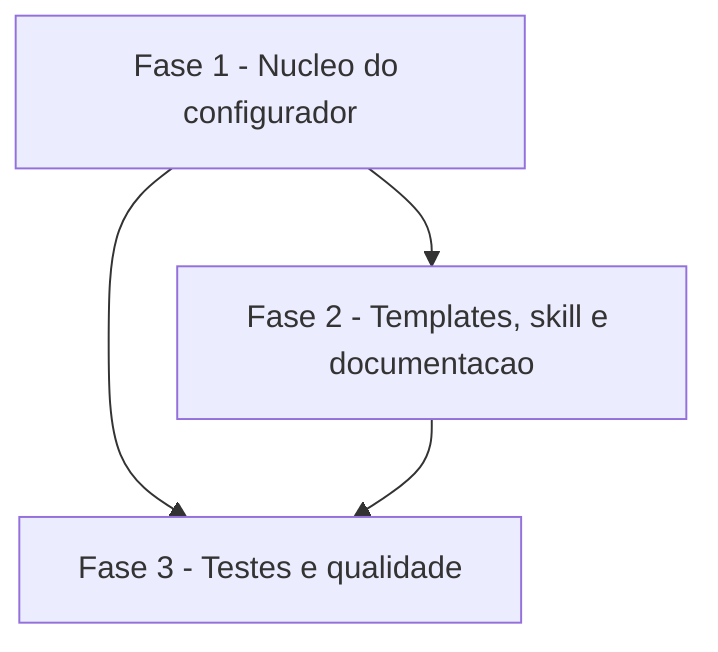

# Tarefas cockpit - prefixos de branch de trabalho configuráveis

Escopo: backlog da feature `prefixos-branch` (chave opcional `PREFIXOS_BRANCH`, cinco placeholders derivados, templates, skill `rito-dev`, documentação e testes), conforme `spec.md`, `plan.md` e `decisoes-do-owner.md` (D1, D2, D3, normativas).

**Legenda de status:**
- `[ ]` Pendente
- `[~]` Em andamento
- `[x]` Concluido
- `[!]` Bloqueado

**Legenda de criticidade:**
- `[C]` Critico - Impacto financeiro direto ou bloqueante
- `[A]` Alto - Funcionalidade essencial
- `[M]` Medio - Necessario mas sem urgencia imediata

---

## FASE 1 - Núcleo do configurador

### 1.1 Constantes e validação da chave `[A]`

Ref: docs/specs/prefixos-branch/spec.md FR-001 a FR-004; plan.md §Design 1-3; data-model.md §Validação

- [ ] 1.1.1 Incluir `PREFIXOS_BRANCH` no fim de `CHAVES_ORDEM` e em `CHAVES_OPCIONAIS`; atualizar o comentário sobre as opcionais; criar `PREFIXOS_PADRAO` e `DERIVADAS`
- [ ] 1.1.2 Implementar o ramo `PREFIXOS_BRANCH)` em `validar_chave`: 0 itens válido, cinco exatos, recusa de `/`, `-` inicial, `@{`, controle e `git check-ref-format --branch "
/x"`, e de repetição, com mensagens que citam a chave
- [ ] 1.1.3 Em `validar_todos`, tratar valor só de espaços como chave não declarada também para `PREFIXOS_BRANCH`
- [ ] 1.1.4 Garantir que valor inválido termine em exit 1 antes de qualquer escrita (sem `cockpit.config` parcial)

### 1.2 Pergunta interativa `[A]`

Ref: docs/specs/prefixos-branch/spec.md FR-005; contracts/cli.md

- [ ] 1.2.1 Implementar o ramo `PREFIXOS_BRANCH)` em `perguntar_chave` com o texto do contrato, dica do padrão montada de `PREFIXOS_PADRAO` e `-` para vazio
- [ ] 1.2.2 Confirmar que `gravar_config` grava a chave como as demais opcionais e não grava nada quando vazia
- [ ] 1.2.3 Conferir que a pergunta se repete com mensagem citando a chave em caso de valor inválido

### 1.3 Placeholders derivados e render `[A]`

Ref: docs/specs/prefixos-branch/spec.md FR-006, FR-007; plan.md §Design 5-6

- [ ] 1.3.1 Criar `derivar_prefixos`: cinco valores da chave ou do padrão, `setar` por posição em `DERIVADAS` (`PREFIXO_FEATURE`, `PREFIXO_FIX`, `PREFIXO_CHORE`, `PREFIXO_DOCS`, `PREFIXO_HOTFIX`)
- [ ] 1.3.2 Chamar `derivar_prefixos` em `main` logo depois de `validar_todos`
- [ ] 1.3.3 Em `renderizar`, definir os placeholders a partir de `$CHAVES_ORDEM $DERIVADAS`
- [ ] 1.3.4 Verificar que os placeholders não são perguntados nem gravados e que o `--atualizar` sem a chave não pergunta nem falha
- [ ] 1.3.5 Rodar `shellcheck -x configurar.sh` e corrigir findings

---

## FASE 2 - Templates, skill e documentação

### 2.1 Templates `[A]`

Ref: docs/specs/prefixos-branch/spec.md FR-008, FR-009; plan.md §Templates

- [ ] 2.1.1 Em `templates/docs/CICLO-GIT.md.tmpl` (l.12-13), trocar cada `<tipo>/<slug>` por `{{PREFIXO_<TIPO>}}/<slug>`, sem mudar nenhum outro byte
- [ ] 2.1.2 Em `templates/docs/rito-dev.md.tmpl` (l.34-35), aplicar a mesma troca
- [ ] 2.1.3 Conferir que nenhum template usa `PREFIXOS_BRANCH` diretamente e que o render não deixa `{{` residual

### 2.2 Skill `rito-dev` `[A]`

Ref: docs/specs/prefixos-branch/spec.md FR-010; plan.md §Skill

- [ ] 2.2.1 Acrescentar `PREFIXOS_BRANCH` (opcional, Fase 1, com o padrão) à tabela de chaves consumidas de `skills/rito-dev/SKILL.md`
- [ ] 2.2.2 Reescrever a Fase 1 (l.73-77) nomeando os prefixos pelo tipo, lidos da chave na hora, PARANDO com valor malformado
- [ ] 2.2.3 Ajustar a linha de `BRANCH_PRODUCAO` para citar a base do prefixo de hotfix
- [ ] 2.2.4 Conferir prosa em português do Brasil acentuado e ausência de literal `feature/<slug>` na Fase 1

### 2.3 Exemplo de config e contratos `[M]`

Ref: docs/specs/prefixos-branch/spec.md FR-011; plan.md §Configuração e documentação

- [ ] 2.3.1 Acrescentar ao fim de `cockpit.config.example` a seção com `PREFIXOS_BRANCH=''`, ordem, padrão e exemplo em comentário
- [ ] 2.3.2 Acrescentar a seção "Prefixos de branch (`PREFIXOS_BRANCH`)" em `docs/specs/configurar/contracts/cli.md`, apontando para o contrato desta feature
- [ ] 2.3.3 Acrescentar a chave às tabelas de campos e de validação de `docs/specs/configurar/data-model.md`

---

## FASE 3 - Testes e qualidade

### 3.1 Cenário 20 "prefixos de branch" `[A]`

Ref: docs/specs/prefixos-branch/spec.md FR-012, SC-001 a SC-005; quickstart.md 1 a 7

- [ ] 3.1.1 Cobrir chave ausente com render byte a byte igual (quickstart 1) e `--atualizar` sem pergunta (quickstart 6)
- [ ] 3.1.2 Cobrir chave válida refletida nos dois documentos, sem prefixo padrão substituído, e gravação sem linha `PREFIXO_` (quickstart 2 e 3)
- [ ] 3.1.3 Cobrir só espaços como ausente (quickstart 4)
- [ ] 3.1.4 Cobrir os valores inválidos com exit 1 citando a chave e sem `cockpit.config` criado (quickstart 5)
- [ ] 3.1.5 Cobrir o modo interativo: dica exibida, repetição da pergunta e gravação do segundo valor (quickstart 7)

### 3.2 Ajustes dos cenários 14 e 15 `[A]`

Ref: docs/specs/prefixos-branch/plan.md §Testes; decisoes-do-owner.md §Restrições

- [ ] 3.2.1 Cenário 14: passar a mínima para 20 respostas (a de 19 falha) e somar a resposta nova nas entradas do config incompleto e da reentrada de identidade
- [ ] 3.2.2 Cenário 15: acrescentar `! grep -rq 'PREFIXOS_BRANCH'` nos templates
- [ ] 3.2.3 Rodar a suíte inteira, o shellcheck de `configurar.sh` e `scripts/testar-configurar.sh` e o cenário 11 (`verificar-agnostico.sh`)

### 3.3 Verificação final `[M]`

Ref: docs/specs/prefixos-branch/quickstart.md 8 a 10

- [ ] 3.3.1 Conferir a regra do cenário 15 e o render do exemplo sem `{{` residual (quickstart 8)
- [ ] 3.3.2 Conferir a skill `rito-dev` por `grep` (quickstart 9)
- [ ] 3.3.3 Registrar na PR a comparação manual de render contra `origin/main` (`diff -r --exclude=.git` vazio)

---

## Matriz de Dependencias

## Resumo Quantitativo

| Fase | Tarefas | Subtarefas | Criticidade |
|------|---------|------------|-------------|
| 1 - Núcleo do configurador | 3 | 12 | A |
| 2 - Templates, skill e documentação | 3 | 10 | A/M |
| 3 - Testes e qualidade | 3 | 11 | A/M |
| **Total** | **9** | **33** | - |

## Escopo Coberto

| Item | Descricao | Fase |
|------|-----------|------|
| FR-001 a FR-004 | Aceitar a chave e recusar valores inválidos | 1 |
| FR-005 | Pergunta interativa opcional | 1 |
| FR-006, FR-007 | Padrão quando ausente e placeholders derivados | 1 |
| FR-008, FR-009 | Templates com placeholders e render idêntico sem a chave | 2 |
| FR-010 | Fase 1 da skill `rito-dev` | 2 |
| FR-011 | `cockpit.config.example` e contratos da feature `configurar` | 2 |
| FR-012, FR-013 | Cenário 20, ajustes 14 e 15, shellcheck, agnosticismo | 3 |

Tier de entrega usado na geração deste backlog: não informado nos `args`; backlog completo (feature de script local, sem fase de infraestrutura de produção).

## Escopo Excluido

| Item | Descricao | Motivo |
|------|-----------|--------|
| EX-001 | Exemplos `fix/…` e `feat/…` de `skills/parallel-work/SKILL.md` | Ilustração, não regra (decisoes-do-owner.md §Fora de escopo) |
| EX-002 | Tipos de branch além dos cinco e renomear branches existentes | Fora de escopo (decisoes-do-owner.md) |
| EX-003 | `hotfix/<slug>` em `templates/docs/constitution.md.semente.tmpl` l.18 | Fora de D3; candidato a issue de acompanhamento (research, Riscos aceitos) |
