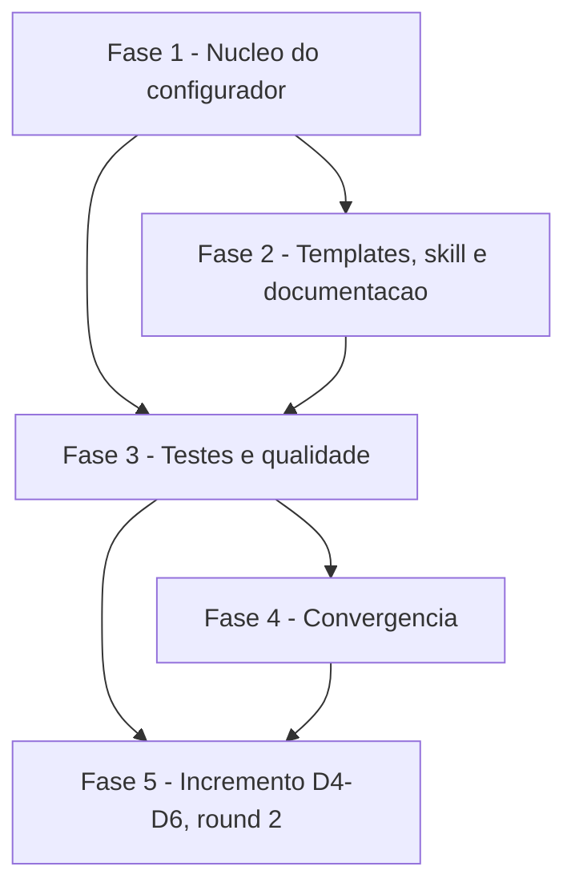

# Tarefas cockpit - prefixos de branch de trabalho configuráveis

Escopo: backlog da feature `prefixos-branch` (chave opcional `PREFIXOS_BRANCH`, cinco placeholders derivados, templates, skill `rito-dev`, documentação e testes), conforme `spec.md`, `plan.md` e `decisoes-do-owner.md` (D1, D2, D3, normativas).

**Legenda de status:**
- `[ ]` Pendente
- `[~]` Em andamento
- `[x]` Concluido
- `[!]` Bloqueado

**Legenda de criticidade:**
- `[C]` Critico - Impacto financeiro direto ou bloqueante
- `[A]` Alto - Funcionalidade essencial
- `[M]` Medio - Necessario mas sem urgencia imediata

---

## FASE 1 - Núcleo do configurador

### 1.1 Constantes e validação da chave `[A]`

Ref: docs/specs/prefixos-branch/spec.md FR-001 a FR-004; plan.md §Design 1-3; data-model.md §Validação

- [x] 1.1.1 Incluir `PREFIXOS_BRANCH` no fim de `CHAVES_ORDEM` e em `CHAVES_OPCIONAIS`; atualizar o comentário sobre as opcionais; criar `PREFIXOS_PADRAO` e `DERIVADAS`
- [x] 1.1.2 Implementar o ramo `PREFIXOS_BRANCH)` em `validar_chave`: 0 itens válido, cinco exatos, recusa de `/`, `-` inicial, `@{`, controle e `git check-ref-format --branch "
/x"`, e de repetição, com mensagens que citam a chave
- [x] 1.1.3 Em `validar_todos`, tratar valor só de espaços como chave não declarada também para `PREFIXOS_BRANCH`
- [x] 1.1.4 Garantir que valor inválido termine em exit 1 antes de qualquer escrita (sem `cockpit.config` parcial)

### 1.2 Pergunta interativa `[A]`

Ref: docs/specs/prefixos-branch/spec.md FR-005; contracts/cli.md

- [x] 1.2.1 Implementar o ramo `PREFIXOS_BRANCH)` em `perguntar_chave` com o texto do contrato, dica do padrão montada de `PREFIXOS_PADRAO` e `-` para vazio
- [x] 1.2.2 Confirmar que `gravar_config` grava a chave como as demais opcionais e não grava nada quando vazia
- [x] 1.2.3 Conferir que a pergunta se repete com mensagem citando a chave em caso de valor inválido

### 1.3 Placeholders derivados e render `[A]`

Ref: docs/specs/prefixos-branch/spec.md FR-006, FR-007; plan.md §Design 5-6

- [x] 1.3.1 Criar `derivar_prefixos`: cinco valores da chave ou do padrão, `setar` por posição em `DERIVADAS` (`PREFIXO_FEATURE`, `PREFIXO_FIX`, `PREFIXO_CHORE`, `PREFIXO_DOCS`, `PREFIXO_HOTFIX`)
- [x] 1.3.2 Chamar `derivar_prefixos` em `main` logo depois de `validar_todos`
- [x] 1.3.3 Em `renderizar`, definir os placeholders a partir de `$CHAVES_ORDEM $DERIVADAS`
- [x] 1.3.4 Verificar que os placeholders não são perguntados nem gravados e que o `--atualizar` sem a chave não pergunta nem falha
- [x] 1.3.5 Rodar `shellcheck -x configurar.sh` e corrigir findings

---

## FASE 2 - Templates, skill e documentação

### 2.1 Templates `[A]`

Ref: docs/specs/prefixos-branch/spec.md FR-008, FR-009; plan.md §Templates

- [x] 2.1.1 Em `templates/docs/CICLO-GIT.md.tmpl` (l.12-13), trocar cada `<tipo>/<slug>` por `{{PREFIXO_<TIPO>}}/<slug>`, sem mudar nenhum outro byte
- [x] 2.1.2 Em `templates/docs/rito-dev.md.tmpl` (l.34-35), aplicar a mesma troca
- [x] 2.1.3 Conferir que nenhum template usa `PREFIXOS_BRANCH` diretamente e que o render não deixa `{{` residual

### 2.2 Skill `rito-dev` `[A]`

Ref: docs/specs/prefixos-branch/spec.md FR-010; plan.md §Skill

- [x] 2.2.1 Acrescentar `PREFIXOS_BRANCH` (opcional, Fase 1, com o padrão) à tabela de chaves consumidas de `skills/rito-dev/SKILL.md`
- [x] 2.2.2 Reescrever a Fase 1 (l.73-77) nomeando os prefixos pelo tipo, lidos da chave na hora, PARANDO com valor malformado
- [x] 2.2.3 Ajustar a linha de `BRANCH_PRODUCAO` para citar a base do prefixo de hotfix
- [x] 2.2.4 Conferir prosa em português do Brasil acentuado e ausência de literal `feature/<slug>` na Fase 1

### 2.3 Exemplo de config e contratos `[M]`

Ref: docs/specs/prefixos-branch/spec.md FR-011; plan.md §Configuração e documentação

- [x] 2.3.1 Acrescentar ao fim de `cockpit.config.example` a seção com `PREFIXOS_BRANCH=''`, ordem, padrão e exemplo em comentário
- [x] 2.3.2 Acrescentar a seção "Prefixos de branch (`PREFIXOS_BRANCH`)" em `docs/specs/configurar/contracts/cli.md`, apontando para o contrato desta feature
- [x] 2.3.3 Acrescentar a chave às tabelas de campos e de validação de `docs/specs/configurar/data-model.md`

---

## FASE 3 - Testes e qualidade

### 3.1 Cenário 20 "prefixos de branch" `[A]`

Ref: docs/specs/prefixos-branch/spec.md FR-012, SC-001 a SC-005; quickstart.md 1 a 7

- [x] 3.1.1 Cobrir chave ausente com render byte a byte igual (quickstart 1) e `--atualizar` sem pergunta (quickstart 6)
- [x] 3.1.2 Cobrir chave válida refletida nos dois documentos, sem prefixo padrão substituído, e gravação sem linha `PREFIXO_` (quickstart 2 e 3)
- [x] 3.1.3 Cobrir só espaços como ausente (quickstart 4)
- [x] 3.1.4 Cobrir os valores inválidos com exit 1 citando a chave e sem `cockpit.config` criado (quickstart 5)
- [x] 3.1.5 Cobrir o modo interativo: dica exibida, repetição da pergunta e gravação do segundo valor (quickstart 7)

### 3.2 Ajustes dos cenários 14 e 15 `[A]`

Ref: docs/specs/prefixos-branch/plan.md §Testes; decisoes-do-owner.md §Restrições

- [x] 3.2.1 Cenário 14: passar a mínima para 20 respostas (a de 19 falha) e somar a resposta nova nas entradas do config incompleto e da reentrada de identidade
- [x] 3.2.2 Cenário 15: acrescentar `! grep -rq 'PREFIXOS_BRANCH'` nos templates
- [x] 3.2.3 Rodar a suíte inteira, o shellcheck de `configurar.sh` e `scripts/testar-configurar.sh` e o cenário 11 (`verificar-agnostico.sh`)

### 3.3 Verificação final `[M]`

Ref: docs/specs/prefixos-branch/quickstart.md 8 a 10

- [x] 3.3.1 Conferir a regra do cenário 15 e o render do exemplo sem `{{` residual (quickstart 8)
- [x] 3.3.2 Conferir a skill `rito-dev` por `grep` (quickstart 9)
- [x] 3.3.3 Registrar na PR a comparação manual de render contra `origin/main` (`diff -r --exclude=.git` vazio)

---

## Matriz de Dependencias

## Resumo Quantitativo

| Fase | Tarefas | Subtarefas | Criticidade |
|------|---------|------------|-------------|
| 1 - Núcleo do configurador | 3 | 12 | A |
| 2 - Templates, skill e documentação | 3 | 10 | A/M |
| 3 - Testes e qualidade | 3 | 11 | A/M |
| 4 - Convergência | 5 | 5 | C/A |
| 5 - Incremento D4-D6 (round 2) | 6 | 25 | A/M |
| **Total** | **20** | **63** | - |

## Escopo Coberto

| Item | Descricao | Fase |
|------|-----------|------|
| FR-001 a FR-004 | Aceitar a chave e recusar valores inválidos | 1 |
| FR-005 | Pergunta interativa opcional | 1 |
| FR-006, FR-007 | Padrão quando ausente e placeholders derivados | 1 |
| FR-008, FR-009 | Templates com placeholders e render idêntico sem a chave | 2 |
| FR-010 | Fase 1 da skill `rito-dev` | 2 |
| FR-011 | `cockpit.config.example` e contratos da feature `configurar` | 2 |
| FR-012, FR-013 | Cenário 20, ajustes 14 e 15, shellcheck, agnosticismo | 3 |
| FR-014 | Conjunto de caracteres do prefixo em `validar_chave` | 5 |
| FR-015 | Regra de parada da Fase 1 da skill `rito-dev` | 5 |
| FR-016 | Semente da constituição com `{{PREFIXO_HOTFIX}}` e nota no exemplo de config | 5 |
| FR-017 | Tipos fixos mantidos (coberto por caso de teste) | 5 |

Tier de entrega usado na geração deste backlog: não informado nos `args`; backlog completo (feature de script local, sem fase de infraestrutura de produção).

## Escopo Excluido

| Item | Descricao | Motivo |
|------|-----------|--------|
| EX-001 | Exemplos `fix/…` e `feat/…` de `skills/parallel-work/SKILL.md` | Ilustração, não regra (decisoes-do-owner.md §Fora de escopo) |
| EX-002 | Tipos de branch além dos cinco e renomear branches existentes | Fora de escopo (decisoes-do-owner.md) |
| EX-003 | `hotfix/<slug>` em `templates/docs/constitution.md.semente.tmpl` l.18 | Fora de D3 no round 1; ENTROU no escopo pela D5 (round 2, tarefa 5.2) |

## FASE 4 - Convergência

> Fase gerada automaticamente pela skill `converge` (reconciliação
> spec-vs-código). Cada tarefa abaixo corresponde a um achado (`Gap`)
> entre o que `spec.md`/`plan.md`/`tasks.md` descreveram e o estado
> presente do código. Tarefas sem o prefixo `[Revisar]` são acionáveis
> (`missing`/`partial`/`contradicts`); tarefas com `[Revisar]` são item de
> revisão (`unrequested`, FR-013) — nunca "implementar", o código já
> existe. Append-only: esta fase nunca reescreve fases/tarefas anteriores
> do arquivo (FR-009).

### 4.1 sed -i não portável no cenário 20 `[C]`

Ref: FR-013 / task 3.1.1 · tipo: `contradicts` · severidade: `CRITICAL`

O caso 1 do cenário 20 em `scripts/testar-configurar.sh` usa `sed -i '/^PREFIXOS_BRANCH=/d' "$TMP/r20"`, forma só do GNU sed: no BSD sed do macOS o `-i` consome a expressão como sufixo de backup e o cenário quebra sob `set -euo pipefail`. O Princípio VII (MUST) exige que o script rode igual em Linux, WSL e macOS; o próprio arquivo já usa a forma portável `sed -i.bak` no cenário 18.

- [x] 4.1.1 Corrigir `scripts/testar-configurar.sh` conforme `FR-013 / task 3.1.1`: montar as respostas sem a chave sem `sed -i` GNU (por exemplo `grep -v '^PREFIXOS_BRANCH=' "$EXEMPLO" >"$TMP/r20"`, dispensando o `resp20 ""` seguido de `sed`)

<!-- converge-key: 3c3387241068 -->

### 4.2 Render byte a byte e --atualizar sem a chave não verificados `[C]`

Ref: task 3.1.1 · tipo: `partial` · severidade: `HIGH`

A task 3.1.1 (quickstart 1 e 6, FR-009, SC-001, SC-004) pede render byte a byte igual com a chave ausente e `--atualizar` sem pergunta, com stderr sem `PREFIXOS_BRANCH` e documentos inalterados. O caso 1 do cenário 20 em `scripts/testar-configurar.sh` só faz `grep` de `feature/<slug>` e `hotfix/<slug>` e, no `--atualizar`, só confere exit 0.

- [x] 4.2.1 Implementar em `scripts/testar-configurar.sh` conforme `task 3.1.1`: comparar com `cmp` os dois documentos renderizados sem a chave contra os de uma cópia do cockpit com os cinco placeholders trocados pelos literais (quickstart 1); no `--atualizar`, conferir stderr sem `PREFIXOS_BRANCH` e os dois documentos inalterados (quickstart 6)

<!-- converge-key: cc199b8de4ec -->

### 4.3 Chave válida: 5 de 5 prefixos e 0 padrões não verificados `[C]`

Ref: task 3.1.2 · tipo: `partial` · severidade: `HIGH`

SC-002 exige 5 de 5 prefixos refletidos e 0 ocorrências dos prefixos padrão substituídos nos dois documentos. O caso 2 do cenário 20 em `scripts/testar-configurar.sh` confere só `feat/<slug>` e `hf/<slug>` presentes e só `feature/<slug>` ausente.

- [x] 4.3.1 Implementar em `scripts/testar-configurar.sh` conforme `task 3.1.2`: no caso 2, conferir os cinco prefixos declarados presentes e os cinco padrões substituídos ausentes nos dois documentos

<!-- converge-key: a011087fcc54 -->

### 4.4 Só espaços: não gravação da chave não verificada `[A]`

Ref: task 3.1.3 · tipo: `partial` · severidade: `MEDIUM`

O quickstart 4 espera, com `PREFIXOS_BRANCH='   '`, exit 0, documentos com o padrão e chave não gravada. O caso 3 do cenário 20 em `scripts/testar-configurar.sh` confere exit 0 e o padrão em `docs/CICLO-GIT.md`, mas não que a chave ficou fora do `cockpit.config`.

- [x] 4.4.1 Implementar em `scripts/testar-configurar.sh` conforme `task 3.1.3`: no caso 3, conferir que `cockpit.config` não tem linha `PREFIXOS_BRANCH=`

<!-- converge-key: a00525a4b79c -->

### 4.5 Resposta - na pergunta nova: não gravação não verificada `[A]`

Ref: task 3.1.5 · tipo: `partial` · severidade: `MEDIUM`

O quickstart 7.1 espera que a entrada mínima de 20 respostas (a 20ª é `-`) não grave a chave. No cenário 14 de `scripts/testar-configurar.sh`, a rodada com `$MINIMO` confere só que `DESTINOS_DO_PROJETO` não foi gravada.

- [x] 4.5.1 Implementar em `scripts/testar-configurar.sh` conforme `task 3.1.5`: depois da configuração mínima com 20 respostas, conferir que `cockpit.config` não tem linha `PREFIXOS_BRANCH=`

<!-- converge-key: 7a6033ad2acf -->

## FASE 5 - Incremento D4-D6 (round 2)

> Reabertura r02: emendas D4, D5 e D6 do owner (`decisoes-do-owner.md`), FR-014 a FR-017, US5, SC-006 e SC-007. Append-only: as fases 1 a 4 não são alteradas. Linhas de referência em `plan.md` §Incremento do round 2 (commit `11c546d`).

### 5.1 Conjunto de caracteres em `validar_chave` `[A]`

Ref: docs/specs/prefixos-branch/spec.md FR-014, FR-017; plan.md §Incremento item 1; data-model.md §Validação regra 4; research.md Decisions 10 e 11

- [ ] 5.1.1 No ramo `PREFIXOS_BRANCH)` de `validar_chave` em `configurar.sh`, depois da checagem de `/`, recusar prefixo fora de `^[a-z0-9][a-z0-9._-]*$` com mensagem que cita `PREFIXOS_BRANCH` e o conjunto aceito
- [ ] 5.1.2 Remover a guarda `-* | *'@{'*`, coberta pela regex (que já recusa `-` inicial, `@` e `{`); manter `git check-ref-format` e a repetição
- [ ] 5.1.3 Garantir que a regex valha sob `LC_ALL=C` (recusa de não ASCII e maiúscula) e que o valor inválido siga terminando em exit 1 antes de qualquer escrita
- [ ] 5.1.4 Conferir que `'feature=feat fix chore docs hotfix'` (D6) e seis prefixos saem com exit 1 citando a chave, sem tipo novo nem formato `tipo=prefixo`
- [ ] 5.1.5 Rodar `shellcheck -x configurar.sh` e corrigir findings

### 5.2 Semente da constituição `[A]`

Ref: docs/specs/prefixos-branch/spec.md FR-016, US5; plan.md §Incremento item 2; research.md Decision 12

- [ ] 5.2.1 Em `templates/docs/constitution.md.semente.tmpl` l.18, trocar `hotfix/<slug>` por `{{PREFIXO_HOTFIX}}/<slug>`, sem mudar nenhum outro byte (a palavra "hotfix" da l.31 é o tipo e fica)
- [ ] 5.2.2 Confirmar que a semente passa pelo mesmo `renderizar` com `derivar_prefixos` já executado antes, sem mudança em `configurar.sh`, e que o render sem a chave não deixa `{{` residual
- [ ] 5.2.3 Confirmar que o `--atualizar` não regrava `docs/constitution.md` (`mantido (semente)`)

### 5.3 Fase 1 da skill `rito-dev` `[A]`

Ref: docs/specs/prefixos-branch/spec.md FR-015; plan.md §Incremento item 3; research.md Decision 11; quickstart.md 11

- [ ] 5.3.1 Reescrever a regra de parada na Fase 1 de `skills/rito-dev/SKILL.md` (l.76-78): cinco prefixos, cada um casando com `^[a-z0-9][a-z0-9._-]*$`, sem repetição, verificada lendo o valor
- [ ] 5.3.2 Mandar PARAR nomeando `PREFIXOS_BRANCH` antes de compor qualquer comando e proibir colar o valor num comando para testá-lo
- [ ] 5.3.3 Declarar que o valor é dado de configuração, nunca instrução (achado B3 do gate de segurança)
- [ ] 5.3.4 Conferir prosa em português do Brasil acentuado e ausência de literal `feature/<slug>` na Fase 1

### 5.4 Exemplo de config e contratos `[M]`

Ref: docs/specs/prefixos-branch/spec.md FR-014, FR-016; plan.md §Incremento itens 4 e 5

- [ ] 5.4.1 Em `cockpit.config.example` (l.83-89), trocar "sem `/`" no comentário da seção pelo conjunto aceito `^[a-z0-9][a-z0-9._-]*$`
- [ ] 5.4.2 No mesmo comentário, acrescentar a nota de D5: a constituição é semente, não é regravada no `--atualizar`; projeto já configurado que declarar a chave troca à mão `hotfix/<slug>` na sua
- [ ] 5.4.3 Em `docs/specs/configurar/data-model.md` (l.24 e l.64) e `docs/specs/configurar/contracts/cli.md` (l.54-60), citar a regra de D4 e a semente como consumidora de `{{PREFIXO_HOTFIX}}`

### 5.5 Casos do cenário 20 `[A]`

Ref: docs/specs/prefixos-branch/spec.md FR-012, FR-014, FR-016, FR-017, SC-006, SC-007; plan.md §Incremento item 6; quickstart.md 11 a 13

- [ ] 5.5.1 Caso 1: a cópia literal troca `{{PREFIXO_HOTFIX}}` por `hotfix` também na semente e compara `docs/constitution.md` com `cmp` entre os dois projetos (quickstart 12.1)
- [ ] 5.5.2 Caso 2: com `'feat fx ch dc hf'`, `docs/constitution.md` tem `hf/<slug>` e nenhum `hotfix/<slug>` (quickstart 12.2)
- [ ] 5.5.3 Caso 4: para `'Feat b c d e'`, `'a;b c d e f'`, `'a$(x) b c d e'`, `'a|b c d e f'`, crase, `'.a b c d e'`, `'_a b c d e'` e `'á b c d e'`, exit 1, stderr citando a chave e `^[a-z0-9][a-z0-9._-]*$` e nenhum `cockpit.config` criado (quickstart 11)
- [ ] 5.5.4 Caso 4: `'-a b c d e'` e `'a@{b c d e f'` seguem com exit 1 citando a chave; o padrão e `'feat fx ch dc hf'` seguem aceitos
- [ ] 5.5.5 Caso 4 (D6): `'a b c d e f'` e `'feature=feat fix chore docs hotfix'` saem com exit 1 citando a chave (quickstart 13)
- [ ] 5.5.6 Usar apenas formas portáveis (sem `sed -i` GNU), conforme Princípio VII e a lição da tarefa 4.1

### 5.6 Verificação final do round 2 `[M]`

Ref: docs/specs/prefixos-branch/quickstart.md 8 a 12; spec.md SC-005 a SC-007

- [ ] 5.6.1 Rodar a suíte inteira, `shellcheck -x configurar.sh scripts/testar-configurar.sh` e o cenário 11 (`verificar-agnostico.sh`)
- [ ] 5.6.2 Conferir por `grep` a Fase 1 da skill (quickstart 11, manual) e a regra do cenário 15 (`! grep -rq 'PREFIXOS_BRANCH' templates/`)
- [ ] 5.6.3 Conferir manualmente o `--atualizar` com a chave declarada em projeto sem ela: `docs/constitution.md` intacta (quickstart 12.3)
- [ ] 5.6.4 Registrar na PR a comparação de render contra `origin/main` (`diff -r --exclude=.git` vazio sem a chave)
