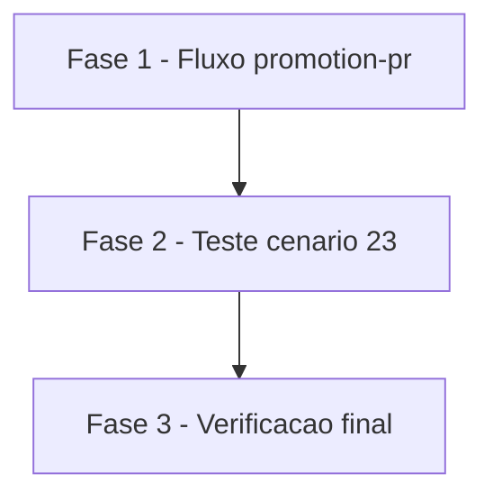

# Tarefas promotion-pr-arvores - PR de promoção decidido pelo conteúdo das árvores

Escopo: guarda por árvores no passo do `promotion-pr`, documentação do efeito do tipo de merge no cabeçalho (D2) e cenário 23 de `scripts/testar-configurar.sh`. Tier de entrega: não se aplica (template de CI, sem infra de produção).

**Legenda de status:**
- `[ ]` Pendente
- `[~]` Em andamento
- `[x]` Concluido
- `[!]` Bloqueado

**Legenda de criticidade:**
- `[C]` Critico - Impacto financeiro direto ou bloqueante
- `[A]` Alto - Funcionalidade essencial
- `[M]` Medio - Necessario mas sem urgencia imediata

---

## FASE 1 - Fluxo promotion-pr

### 1.1 Bloco de decisão por árvores no passo `run:` `[A]`

Ref: docs/specs/promotion-pr-arvores/plan.md §Design item 2; spec.md FR-001, FR-002, FR-003, FR-004, FR-005, FR-007, FR-008; research.md Decision 1, 3, 4

- [x] 1.1.1 Inserir em `templates/.github/workflows/promotion-pr.yml.tmpl`, entre o `fi` da contagem zero e `corpo="$(mktemp)"`, a leitura de `gh api "repos/$REPO/commits/heads/$PRODUCAO" --jq '.commit.tree.sha'` e o equivalente para `$INTEGRACAO`
- [x] 1.1.2 Validar que ambos os valores são hexadecimais não vazios; senão, mensagem em stderr `Não consegui ler as árvores de $PRODUCAO e $INTEGRACAO: nada promovido.` e `exit 1` antes de qualquer `gh pr`
- [x] 1.1.3 Com SHAs iguais, imprimir `Produção e integração têm o mesmo conteúdo: nada a promover.` e `exit 0`; com SHAs diferentes, seguir o caminho de hoje sem alterar corpo, `gh pr list`, `edit` nem `create`
- [x] 1.1.4 Conferir que `on:`, `permissions:`, `env:` e o ramo de branch única seguem inalterados (git diff restrito ao bloco novo e ao cabeçalho)
- [x] 1.1.5 Rodar o cenário 16 existente (actionlint e shellcheck sobre o fluxo renderizado) e confirmar zero findings

### 1.2 Cabeçalho documenta o efeito do tipo de merge (D2) `[M]`

Ref: decisoes-do-owner.md D2; spec.md FR-006, FR-011, US3; research.md Decision 8

- [x] 1.2.1 Acrescentar ao comentário de cabeçalho do template duas linhas em pt-BR acentuado: a promoção recomendada é por merge commit (como na Fase 9 do `rito-dev`)
- [x] 1.2.2 Registrar no mesmo comentário que, com squash, o fluxo compara o conteúdo das duas pontas e não reabre o PR quando já é igual
- [x] 1.2.3 Confirmar que o comentário não nomeia projeto real (Princípio I) e que `grep -q 'merge commit'` encontra o texto

---

## FASE 2 - Teste (cenário 23)

### 2.1 Cenário 23 em `scripts/testar-configurar.sh` `[A]`

Ref: decisoes-do-owner.md §Restrições; spec.md FR-009, SC-001, SC-002, SC-003; quickstart.md casos 1 a 6; plan.md §`scripts/testar-configurar.sh`

- [x] 2.1.1 Inserir o bloco `# --- 23 ---` com `cenario "23: promotion-pr decide pelas árvores"` logo antes do bloco do cenário 11, no padrão do cenário 16, reusando `$TMP/promocao.sh`
- [x] 2.1.2 Criar `gh` falso próprio no `PATH`, respondendo por `case "$*"` (contagem à frente, árvores, PR aberto, falha simulada) e registrando cada chamada num log em `$TMP`
- [x] 2.1.3 Casos 1 e 2: árvores iguais com `ahead_by` positivo, sem PR e com PR aberto; esperar exit 0, saída com `nada a promover`, log sem `pr create` e sem `pr edit`
- [x] 2.1.4 Casos 3 e 4: árvores diferentes, sem PR (exatamente um `pr create`) e com PR aberto (`pr edit 7`, sem `pr create`)
- [x] 2.1.5 Caso 5: leitura de árvore falhando (exit 1) e devolvendo `null`; esperar exit diferente de 0 e log sem `pr create`/`pr edit`
- [x] 2.1.6 Caso 6: `grep -q 'merge commit'` no template (US3)
- [x] 2.1.7 Rodar `scripts/testar-configurar.sh` inteiro (inclui shellcheck e `verificar-agnostico.sh` do cenário 11) e confirmar `OK: todos os cenários passaram.`

---

## FASE 3 - Verificação final

### 3.1 Conferência de aderência e escopo `[M]`

Ref: spec.md FR-007, FR-008, FR-010, FR-011, SC-004; decisoes-do-owner.md §Fora de escopo

- [x] 3.1.1 Verificar que nenhuma dependência, permissão, gatilho ou tipo de merge foi alterado e que a Fase 9 do `rito-dev` ficou intocada
- [x] 3.1.2 Verificar que a prosa nova está em pt-BR acentuado e que as citações da API apontam para a research com link da documentação oficial
- [x] 3.1.3 Confirmar o tratamento de CHK016: PR já aberto com árvores iguais apenas não é tocado; fechar PR está fora do escopo (nenhum código para isso)

---

## Matriz de Dependencias

## Resumo Quantitativo

| Fase | Tarefas | Subtarefas | Criticidade |
|------|---------|------------|-------------|
| 1 - Fluxo promotion-pr | 2 | 8 | A |
| 2 - Teste (cenário 23) | 1 | 7 | A |
| 3 - Verificação final | 1 | 3 | M |
| **Total** | **4** | **18** | - |

## Escopo Coberto

| Item | Descricao | Fase |
|------|-----------|------|
| FR-001..FR-005, FR-007, FR-008 | Guarda por árvores no passo do fluxo | 1 |
| FR-006 | Cabeçalho com merge commit e efeito do squash | 1 |
| FR-009 | Cenário 23 com `gh` falso | 2 |
| FR-010, FR-011 | Fonte oficial e pt-BR | 3 |
| CHK016 | Leitura de D1: não tocar PR aberto | 3 |

## Escopo Excluido

| Item | Descricao | Motivo |
|------|-----------|--------|
| Tipo de merge | Mudar o merge da promoção ou a Fase 9 do `rito-dev` | Fora de escopo pelo owner (D1/D2) |
| Fechar PR | Fechar PR aberto quando árvores iguais | Fora de escopo (Decision 6, CHK016) |
| Gatilhos/permissões | Alterações além de ler as duas árvores | Fora de escopo pelo owner |
