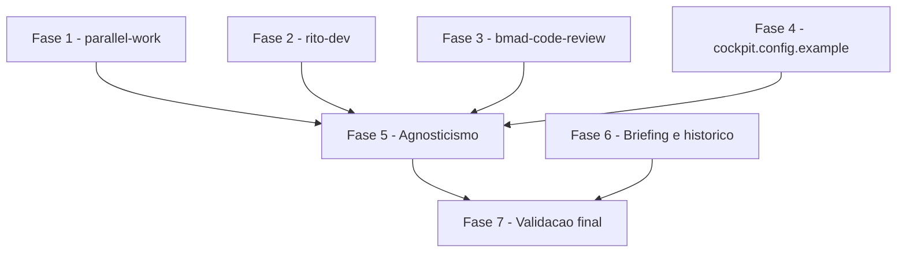

# Tarefas Skills do cockpit - Skills do cockpit + alinhamento do briefing

Escopo: entregar as tres skills do cockpit (`parallel-work`, `rito-dev`,
`bmad-code-review`), o exemplo de configuracao, o registro de dependencias
de terceiros, a cobertura do verificador de agnosticismo (incluindo os
proprios artefatos SDD desta feature) e o alinhamento do briefing/historico
(US4). Decomposicao da tabela de 11 fases de [plan.md](./plan.md) +
[research.md](./research.md) + [data-model.md](./data-model.md) +
[spec.md](./spec.md) FR-001..FR-014, com os gaps de
[checklists/requirements.md](./checklists/requirements.md) (CHK012/CHK018
ja resolvidos por dec-029/dec-031; CHK014 consumido na FASE 7).

**Legenda de status:**
- `[ ]` Pendente
- `[~]` Em andamento
- `[x]` Concluido
- `[!]` Bloqueado

**Legenda de criticidade:**
- `[C]` Critico - Impacto financeiro direto ou bloqueante
- `[A]` Alto - Funcionalidade essencial
- `[M]` Medio - Necessario mas sem urgencia imediata

---

## FASE 1 - Skill `parallel-work` (copia agnostica)

### 1.1 Copiar skill `parallel-work` para o cockpit `[A]`

Ref: spec.md FR-001/FR-002, data-model.md §Entity Skill do cockpit,
research.md Decision 9

- [x] 1.1.1 Criar `skills/parallel-work/` e copiar `SKILL.md` de `~/.claude/skills/parallel-work/SKILL.md`
- [x] 1.1.2 Copiar `driver.mjs` de `~/.claude/skills/parallel-work/driver.mjs`
- [x] 1.1.3 Corrigir as 2 referencias de path apontadas em research.md Decision 9
- [x] 1.1.4 Teste: grep dos literais reais do projeto de origem (dec-031) sobre `skills/parallel-work/` -> 0 ocorrencias (quickstart Scenario 5)

---

## FASE 2 - Skill `rito-dev` (conteudo novo, 11 fases agnosticas)

### 2.1 Estrutura base da skill `rito-dev` `[A]`

Ref: spec.md FR-003/FR-004/FR-014, data-model.md §Entity Arquivo de
configuracao

- [x] 2.1.1 Criar `skills/rito-dev/SKILL.md` com cabecalho no formato de skill reconhecido pelo Claude Code e secao "## Fases"
- [x] 2.1.2 Documentar leitura de `cockpit.config` em runtime (FR-004), incluindo o tratamento de chave obrigatoria ausente (a skill MUST nomear a chave e nunca seguir com valor presumido — Edge Case da spec.md, quickstart Scenario 2)
- [x] 2.1.3 Teste: preencher `cockpit.config` fictício e confirmar que a skill cita os parametros lidos do arquivo, nunca um literal fixo (quickstart Scenario 1)

### 2.2 Etapa preparatoria + Fase 1 (Branch) `[A]`

Ref: plan.md §Design das 11 fases (linhas 122-125), research.md Decision 3

- [x] 2.2.1 Redigir a etapa preparatoria usando `REPO_REMOTO`/`BRANCH_INTEGRACAO` (`gh api repos/<REPO_REMOTO>/...`)
- [x] 2.2.2 Redigir a Fase 1 (Branch) com prefixos de branch (`feature/`, `fix/` etc.) e `--base origin/<BRANCH_INTEGRACAO>`
- [x] 2.2.3 Teste: grep dos literais reais do projeto de origem (dec-031) sobre esta secao -> 0 ocorrencias

### 2.3 Fase 2 (Desenvolver) + Fase 3 (Commit) `[A]`

Ref: plan.md linhas 126-127, research.md Decision 6

- [x] 2.3.1 Redigir a Fase 2 generalizando para "consulte a convencao de dominio do proprio projeto-alvo, se houver" (descartando o checklist de dominio especifico de infraestrutura de terceiro da fonte)
- [x] 2.3.2 Redigir a Fase 3 (Commit) com Conventional Commits PT-BR mantido fixo (Principio VI do cockpit)
- [x] 2.3.3 Teste: grep dos literais reais do projeto de origem (dec-031) sobre esta secao -> 0 ocorrencias

### 2.4 Fase 4 (Abrir PR) + Fase 5 (CI) + Fase 6 (Review) `[A]`

Ref: plan.md linhas 128-130, research.md Decision 4

- [x] 2.4.1 Redigir a Fase 4 com pergunta generica de reviewer (sem handle real) + tratamento `hotfix`/`BRANCH_PRODUCAO`
- [x] 2.4.2 Redigir a Fase 5 (CI) com texto generico sobre integracoes nao cobertas pelo typecheck do CI
- [x] 2.4.3 Redigir a Fase 6 (Review, ponto de parada) com o formato do gate (pontos de alteracao + recomendacao + comando pronto)
- [x] 2.4.4 Teste: grep dos literais reais do projeto de origem (dec-031) sobre esta secao -> 0 ocorrencias

### 2.5 Fase 7 (Merge) + Fase 8 (Smoke integracao) `[A]`

Ref: plan.md linhas 131-132, research.md Decision 5

- [x] 2.5.1 Redigir a Fase 7 com texto generico condicional a deploy automatico (`CMD_DEPLOY_INTEGRACAO`), sem nome/numero de workflow real
- [x] 2.5.2 Redigir a Fase 8 com `gh run list` filtrado por branch (sem nome de workflow fixo), `URL_AMBIENTE_INTEGRACAO` opcional
- [x] 2.5.3 Teste: grep dos literais reais do projeto de origem (dec-031) sobre esta secao -> 0 ocorrencias

### 2.6 Fase 9 (Promocao) + Fase 10 (Smoke producao) + Fase 11 (Encerramento) `[A]`

Ref: plan.md linhas 133-135, research.md Decisions 5/6

- [x] 2.6.1 Redigir a Fase 9 com texto condicional a PR draft `<BRANCH_INTEGRACAO>`→`<BRANCH_PRODUCAO>`, incluindo o caso `BRANCH_INTEGRACAO == BRANCH_PRODUCAO` como no-op explicito (Principio I — modelo unico)
- [x] 2.6.2 Redigir a Fase 10 com a regra "rollback anotado antes" (processo, sem `project ref` de infraestrutura de terceiro)
- [x] 2.6.3 Redigir a Fase 11 (Encerramento) com o procedimento de worktree/branch usando `<branch>`/`<caminho-da-worktree>`
- [x] 2.6.4 Teste: rodar quickstart Scenario 2 (chave obrigatoria faltando) e confirmar que a skill nomeia a chave ausente sem seguir adiante

---

## FASE 3 - Skill `bmad-code-review` + proveniencia

### 3.1 Copiar skill `bmad-code-review` sem mudanca de comportamento `[A]`

Ref: spec.md FR-007, research.md Decision 7, checklists/requirements.md CHK008

- [x] 3.1.1 Copiar `SKILL.md`, `customize.toml`, `steps/*.md` de `~/.claude/skills/bmad-code-review/`
- [x] 3.1.2 Confirmar diff vazio contra a fonte (criterio objetivo do FR-007/CHK008, nao julgamento subjetivo)
- [x] 3.1.3 Teste: `diff -r` contra a fonte confirma zero mudanca de comportamento

### 3.2 `THIRD-PARTY-NOTICES.md` `[A]`

Ref: spec.md FR-008, research.md Decision 8, checklists/requirements.md CHK009

- [x] 3.2.1 Reconferir a licenca MIT + nota de marca registrada contra o arquivo `LICENSE` oficial de `bmad-code-org/BMAD-METHOD` no momento da escrita (nunca copiado de memoria — CHK009)
- [x] 3.2.2 Criar `THIRD-PARTY-NOTICES.md` na raiz com nome do projeto de origem, repositorio, licenca verbatim e skill copiada (data-model.md §Entity Registro de dependencias de terceiros)
- [x] 3.2.3 Teste: comparar o texto colado, byte a byte, contra o `LICENSE` oficial (quickstart Scenario 4)

---

## FASE 4 - `cockpit.config.example`

### 4.1 Criar o arquivo de exemplo de configuracao `[A]`

Ref: spec.md FR-005/FR-006, data-model.md §Entity Arquivo de configuracao

- [x] 4.1.1 Criar `cockpit.config.example` na raiz no formato `CHAVE=valor`, com as 10 chaves obrigatorias + 2 opcionais (data-model.md)
- [x] 4.1.2 Preencher so com valores ficticios genericos (`minha-org/meu-projeto`, `staging`, `main`)
- [x] 4.1.3 Teste: grep dos literais reais do projeto de origem (dec-031) sobre o arquivo -> 0 ocorrencias

---

## FASE 5 - Agnosticismo do repositorio (inclui artefatos SDD desta feature)

### 5.1 Cobertura do `verificar-agnostico.sh` sobre os arquivos novos `[A]`

Ref: spec.md FR-009/FR-010/SC-002, checklists/requirements.md CHK017

- [x] 5.1.1 Rodar `scripts/verificar-agnostico.sh` sobre o repositorio completo incluindo `skills/`, `cockpit.config.example`, `THIRD-PARTY-NOTICES.md`
- [x] 5.1.2 Teste: confirmar 0 ocorrencias proibidas (quickstart Scenario 5)

### 5.2 Popular `AGNOSTICO_TERMOS` com os literais reais do projeto de origem `[A]`

Ref: dec-029 (resposta do owner, opcao-a), dec-031 (aplicacao),
checklists/requirements.md CHK012/CHK018 — literais reais nunca sao
escritos neste backlog, so descritos por categoria.

- [x] 5.2.1 Popular `AGNOSTICO_TERMOS` localmente (arquivo ignorado pelo git ou variavel de sessao) com os literais reais do projeto de origem: organizacao/repositorio, handle de reviewer, URL de ambiente de staging, identificador de projeto de infraestrutura, nome e numero de workflow de CI — nunca versionar este valor
- [x] 5.2.2 Rodar `scripts/verificar-agnostico.sh` com `AGNOSTICO_TERMOS` populada, cobrindo TAMBEM os artefatos SDD desta feature (`spec.md`, `plan.md`, `research.md`, `data-model.md`, `checklists/`, este `tasks.md`) — confirmar 0 ocorrencias
- [x] 5.2.3 Se o repositorio tiver CI, documentar `AGNOSTICO_TERMOS` como secret de CI, sem versionar o valor
- [x] 5.2.4 Teste: reproduzir o grep manual dos 8 literais reais (mesmo conjunto usado em dec-031) sobre `docs/specs/skills-do-cockpit/` -> 0 ocorrencias, confirmando que a correcao aplicada nas ondas 5/6 se sustenta sob o gate real

---

## FASE 6 - Alinhamento do briefing e historico (US4)

### 6.1 Alinhar item 1 do MVP em `docs/briefing.md` ao Principio IV (emenda 1.1.0) `[M]`

Ref: spec.md FR-012, checklists/requirements.md CHK004

- [x] 6.1.1 Reescrever o item 1 do MVP para "verifica e imprime; nunca instala/atualiza terceiro por conta propria"
- [x] 6.1.2 Remover a frase remanescente do texto anterior ("instala o `cstk` pelo one-liner oficial quando falta e o atualiza... `cstk self-update`")
- [x] 6.1.3 Teste: ler o item 1 lado a lado com o Principio IV e confirmar o mesmo comportamento (quickstart Scenario 6)

### 6.2 Registrar a excecao de merge da PR #1 `[M]`

Ref: spec.md FR-013, plan.md §Structure Decision (linhas 103-113)

- [x] 6.2.1 Anexar a secao "## Nota pos-merge" a `docs/specs/esqueleto-e-instalador/plan.md` registrando que a PR #1 foi mesclada por merge commit como excecao aceita explicitamente pelo owner
- [x] 6.2.2 Confirmar que a regra de merge por squash do Fluxo de Trabalho nao foi alterada na constitution
- [x] 6.2.3 Teste: localizar o registro dentro de `docs/` sem rodar `git log` (quickstart Scenario 7)

---

## FASE 7 - Validacao final e fechamento de gaps de requisito

### 7.1 Fechar CHK014 (Edge Case sem Acceptance Scenario numerado) `[M]`

Ref: checklists/requirements.md CHK014

- [x] 7.1.1 Acrescentar um Acceptance Scenario explicito em spec.md US1 para o Edge Case "chave obrigatoria faltando no `cockpit.config`"
- [x] 7.1.2 Marcar CHK014 como resolvido em `checklists/requirements.md`, citando o novo Acceptance Scenario
- [x] 7.1.3 Teste: confirmar que o novo Acceptance Scenario aparece coberto ao re-rodar o gate `requirement-coverage.sh` — `RESULT|.../spec.md|requirements=14|covered=14|errors=0`

### 7.2 Rodar os 7 cenarios de `quickstart.md` de ponta a ponta `[M]`

Ref: quickstart.md Scenarios 1-7

- [x] 7.2.1 Executar os Scenarios 1-7 manualmente apos as FASEs 1-6 concluidas
- [x] 7.2.2 Registrar o resultado de cada cenario (pass/fail) — qualquer fail reabre a fase correspondente

  | # | Cenario | Resultado | Evidencia |
  |---|---------|-----------|-----------|
  | 1 | Rito-dev le parametros de dois projetos-alvo (US1) | pass | Fixtures ficticios A (`BRANCH_INTEGRACAO=staging`, `REPO_REMOTO=org-fake-a/repo-fake-a`) e B (`BRANCH_INTEGRACAO=BRANCH_PRODUCAO=main`, `REPO_REMOTO=org-fake-b/repo-fake-b`) lidos pelo mesmo mecanismo grep-based de `instalar.sh:ler_cstk_min` — valores distintos, sem vazamento cruzado, caso integracao==producao tratado sem erro |
  | 2 | `cockpit.config` com chave obrigatoria faltando (Edge Case) | pass | Fixture sem `CMD_BUILD`: grep confirma ausencia (`grep -c` = 0); SKILL.md skills/rito-dev linhas 12-15 instrui nomear a chave e parar, nunca inferir `npm run build` |
  | 3 | Instalacao copia as tres skills (SC-001) | pass | Funcao real `etapa6_skills_cockpit` de `instalar.sh` (sourced, nao reimplementada) rodada contra `$HOME` ficticio limpo: `[ok] Skills do cockpit (3 instalada(s)...)`, sem reportar "diretorio skills/ ainda nao existe" |
  | 4 | Proveniencia de `bmad-code-review` auditavel (US3) | pass | `THIRD-PARTY-NOTICES.md` cita BMAD-METHOD, `bmad-code-org/BMAD-METHOD`, MIT, texto LICENSE integral com TRADEMARK NOTICE. Re-fetch ao vivo da fonte oficial fora do escopo de ferramentas desta sessao (bash-guard bloqueia URL fora de whitelist; sem WebFetch/ctx_fetch_and_index no toolset do orquestrador) — CHK009 permanece aberto para essa reverificacao pontual, nao bloqueia este cenario |
  | 5 | Agnosticismo do repositorio (SC-002) | pass | `scripts/verificar-agnostico.sh` (sem args, repo inteiro): `Agnosticismo: OK — nenhuma ocorrencia de termo proibido.` exit=0 |
  | 6 | Briefing e constitution nao divergem (SC-004) | pass | briefing.md item 1 do MVP vs constitution.md Principio IV (linhas ~100-123): mesmo comportamento (verifica+imprime, nunca instala/atualiza terceiro); grep pela frase antiga ("instala o `cstk`... o atualiza... `cstk self-update`") = 0 ocorrencias |
  | 7 | Registro da excecao de merge da PR #1 navegavel (SC-005) | pass | `docs/specs/esqueleto-e-instalador/plan.md` §Nota pos-merge — achado via grep dentro de `docs/`, sem `git log`; cita aceite explicito do owner e que a regra de squash nao mudou |

- [x] 7.2.3 Teste: confirmar SC-001..SC-005 atendidos (checagem objetiva de cada Success Criterion de spec.md) — SC-001↔Cenario 3, SC-002↔Cenario 5, SC-003↔Cenarios 1+2, SC-004↔Cenario 6, SC-005↔Cenario 7 — todos pass, nenhum fail, nenhuma fase reaberta

---

## Matriz de Dependencias

## Resumo Quantitativo

| Fase | Tarefas | Subtarefas | Criticidade |
|------|---------|------------|-------------|
| 1 - `parallel-work` | 1 | 4 | A |
| 2 - `rito-dev` | 6 | 20 | A |
| 3 - `bmad-code-review` | 2 | 6 | A |
| 4 - `cockpit.config.example` | 1 | 3 | A |
| 5 - Agnosticismo | 2 | 6 | A |
| 6 - Briefing e historico | 2 | 6 | M |
| 7 - Validacao final | 2 | 5 | M |
| **Total** | **16** | **50** | - |

## Escopo Coberto

| Item | Descricao | Fase |
|------|-----------|------|
| FR-001/FR-002 | Skill `parallel-work` copiada, agnostica | 1 |
| FR-003/FR-004/FR-005/FR-014 | Skill `rito-dev` com as 11 fases, lendo `cockpit.config` | 2 |
| FR-007 | Skill `bmad-code-review` copiada sem mudanca de comportamento | 3 |
| FR-008 | `THIRD-PARTY-NOTICES.md` com licenca verbatim | 3 |
| FR-006 | `cockpit.config.example` com valores ficticios | 4 |
| FR-009/FR-010/SC-002 | Agnosticismo do repositorio, incluindo artefatos SDD | 5 |
| dec-029/dec-031 (CHK012/CHK018) | `AGNOSTICO_TERMOS` populada + gate rodado sobre SDD | 5 |
| FR-012 | Item 1 do briefing alinhado ao Principio IV | 6 |
| FR-013 | Registro navegavel da excecao de merge da PR #1 | 6 |
| CHK014 | Acceptance Scenario para chave obrigatoria faltando | 7 |
| SC-001..SC-005 | Validacao final via os 7 cenarios de quickstart.md | 7 |

## Escopo Excluido

| Item | Descricao | Motivo |
|------|-----------|--------|
| Configurador automatico de `cockpit.config` | Ferramenta que gera o arquivo perguntando ao owner | Pos-MVP do briefing, fora desta feature (spec.md US1) |
| Atualizacao automatica de `bmad-code-review` | Sincronizar a copia com mudancas na skill de origem | Fora do escopo — copia estatica; Principio IV da constitution (spec.md Edge Cases) |
| `docs/rito-dev-nav.md` / `docs/skills/CICLO-GIT.md` | Documentos-irmaos mais extensos da fonte | Fora do escopo desta feature (plan.md linhas 137-140; research.md Decision 10; FR-001 lista so as tres `SKILL.md`) |
| Parametrizacao de infraestrutura especifica de um provedor (ex.: `project ref`) | Gate de infraestrutura de banco de dados da fonte | Nenhuma user story exige verificacao de infraestrutura; a constitution do cockpit nao assume nenhum provedor como dependencia (research.md Decision 6) |

## FASE 8 - Convergência

> Fase gerada automaticamente pela skill `converge` (reconciliação
> spec-vs-código). Cada tarefa abaixo corresponde a um achado (`Gap`)
> entre o que `spec.md`/`plan.md`/`tasks.md` descreveram e o estado
> presente do código. Tarefas sem o prefixo `[Revisar]` são acionáveis
> (`missing`/`partial`/`contradicts`); tarefas com `[Revisar]` são item de
> revisão (`unrequested`, FR-013) — nunca "implementar", o código já
> existe. Append-only: esta fase nunca reescreve fases/tarefas anteriores
> do arquivo (FR-009).

### 8.1 `skills/parallel-work/SKILL.md` assume topologia de branches (staging/main) sem derivar de `cockpit.config` `[A]`

Ref: FR-002 (US2, P2) / task 1.1 · tipo: `contradicts` · severidade: `MEDIUM`

A Acceptance Scenario 2 de `spec.md` US2 espera que "nenhum nome de
projeto, organização ou **branch real** apareça como literal — só como
parâmetro". `skills/parallel-work/SKILL.md` (description do frontmatter,
linha 16 e linha 44) hardcoda um **fallback de comportamento**: quando o
dev invoca a skill sem `--base` explícito, ela instrui usar
`origin/staging` (feature/fix/chore/docs) ou `origin/main` (hotfix) como
default — uma suposição de topologia de branches (sempre existe uma
integração chamada "staging", distinta de "main") que não vem de
`cockpit.config` (`BRANCH_INTEGRACAO`/`BRANCH_PRODUCAO`), ao contrário de
`skills/rito-dev/SKILL.md`, que deriva esses mesmos dois valores do
arquivo de configuração do projeto-alvo (FR-004) antes de invocar
`/parallel-work --base origin/<BRANCH_INTEGRACAO>`. Evidência concreta:
este mesmo repositório (o cockpit) só tem `origin/main` — não existe
`origin/staging` — então o fallback documentado na própria skill não bate
com a topologia do projeto onde ela vive. Não é violação literal do
Princípio I (NON-NEGOTIABLE) — `staging`/`main` são os nomes fictícios
genéricos que a própria constitution recomenda como exemplo (§Princípio I)
— mas é uma divergência de agnosticismo funcional: o fallback deveria
exigir `--base` explícito (delegando a derivação a quem chama, como
`rito-dev` já faz) em vez de embutir uma convenção de nomes de branch como
comportamento padrão.

- [x] 8.1.1 Revisar `skills/parallel-work/SKILL.md` (frontmatter `description`,
      linhas ~16 e ~44): decidir entre (a) remover o fallback e exigir
      `--base` sempre explícito, (b) documentar que o fallback é só
      ilustrativo e nunca executado sem confirmação, ou (c) aceitar o
      risco explicitamente (owner) por ser exemplo, não literal de projeto
      real — decisão do owner, fora do escopo desta feature corrigir
      sozinho

      **Resolvido (owner, block-004/dec-048/dec-049): opção (a).** Removido
      o fallback fixo `origin/staging` (feature/fix/chore/docs) / `origin/main`
      (hotfix) do frontmatter `description`, do bloco `> A única coisa...`
      (linha ~16) e do bloco "Em frente de código..." (linhas ~43-44) de
      `skills/parallel-work/SKILL.md`; a skill agora instrui recusar e pedir
      `--base` explícito ao chamador, derivado de `BRANCH_INTEGRACAO`/
      `BRANCH_PRODUCAO` em `cockpit.config` (como `rito-dev` já faz).
      Exemplos (linhas ~113, ~128, ~142) trocados para o placeholder
      `--base origin/<branch-de-integracao>`. `driver.mjs` não tinha default
      de topologia embutido (`base = opts.get('--base') || 'HEAD'`, genérico)
      — só o comentário de ~linha 261 citava `origin/staging` como exemplo
      ilustrativo do bug de parsing corrigido; generalizado para
      `--base=origin/<ref>`. `skills/rito-dev/SKILL.md` já deriva
      `BRANCH_INTEGRACAO`/`BRANCH_PRODUCAO` de `cockpit.config` e chama
      `/parallel-work --base origin/<BRANCH_INTEGRACAO ou BRANCH_PRODUCAO em
      hotfix>` — permanece coerente, sem alteração necessária.
      Evidência: `grep -n "origin/staging\|origin/main"
      skills/parallel-work/SKILL.md skills/parallel-work/driver.mjs` → sem
      ocorrências; `bash scripts/verificar-agnostico.sh` → "Agnosticismo:
      OK — nenhuma ocorrência de termo proibido." (exit 0).

<!-- converge-key: f8044779ede0 -->
