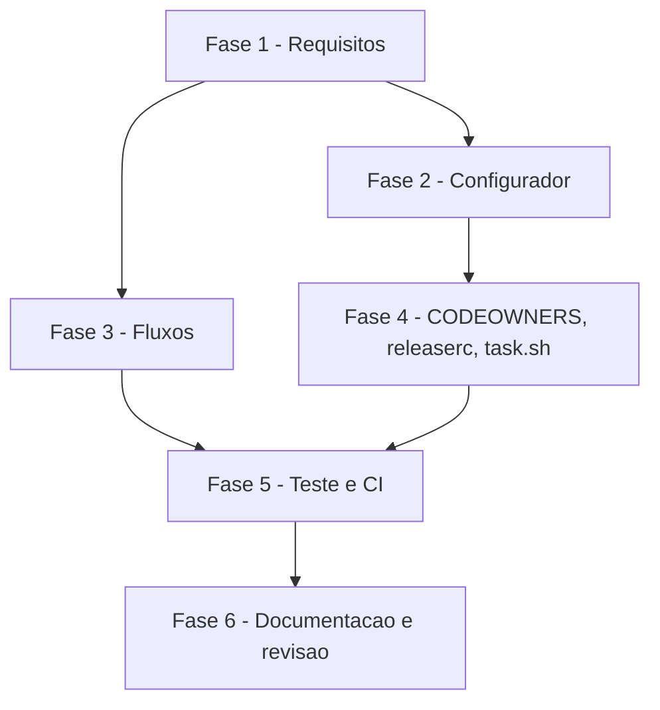

# Tarefas cockpit - templates-automacao

Escopo: nove templates de automação sob `templates/` (seis fluxos do GitHub Actions, `CODEOWNERS`, `.releaserc.json`, `.claude/scripts/task.sh`), a chave `DONOS_CODEOWNERS` e a validação de `BOARD` no `configurar.sh` (FR-015) e o cenário de teste do render. Ref: [spec.md](./spec.md), [plan.md](./plan.md), [contracts/automacao.md](./contracts/automacao.md).

**Legenda de status:**
- `[ ]` Pendente
- `[~]` Em andamento
- `[x]` Concluido
- `[!]` Bloqueado

**Legenda de criticidade:**
- `[C]` Critico - Impacto financeiro direto ou bloqueante
- `[A]` Alto - Funcionalidade essencial
- `[M]` Medio - Necessario mas sem urgencia imediata

---

## FASE 1 - Fechamento de requisitos (gaps do checklist)

### 1.1 Garantia do gate de dono na spec `[C]`

Ref: checklists/security.md CHK012, CHK017; plan.md §Superfície S1; dec-025

- [x] 1.1.1 Acrescentar à spec (US2 e FR-007) que a garantia de aprovação de dono é a regra nativa da branch (aprovações obrigatórias + "Require review from Code Owners", F8) e que o fluxo é verificação extra
- [x] 1.1.2 Definir na spec e no quickstart que cada dono de `DONOS_CODEOWNERS` precisa de permissão de escrita no repositório (F8), com o efeito de um dono sem ela
- [x] 1.1.3 Marcar CHK012 e CHK017 como `[x]` citando as seções novas

### 1.2 Lacunas de contrato `[A]`

Ref: checklists/api.md CHK013, CHK016; research Decision 3, 7, 9, 12

- [x] 1.2.1 Definir no contrato a mensagem e o código de saída de `task.sh move` quando o status não existe no board ou o item não está no projeto
- [x] 1.2.2 Fixar a versão de `semantic-release`, `@commitlint/cli` e `@commitlint/config-conventional` a partir da fonte oficial (via `ctx_fetch_and_index`, link registrado no research)
- [x] 1.2.3 Resolver os SHAs de `actions/checkout` e `actions/setup-node` e os detalhes de CLI/filtro pendentes (research Decision 3 e 7), com link no research
- [x] 1.2.4 Marcar CHK013 e CHK016 como `[x]` citando as seções novas

### 1.3 Aceite de risco residual `[M]`

Ref: checklists/security.md CHK010; plan.md §Superfície S3

- [x] 1.3.1 Obter do dono do produto a decisão sobre o `npx semantic-release@<pin>` sem lockfile num job com `contents: write`
- [x] 1.3.2 Registrar a decisão no plan.md (S3) e marcar CHK010
- [x] 1.3.3 Se recusado, abrir alternativa (lockfile gerado no job ou action fixada) no research (N/A: risco aceito, dec-031)

---

## FASE 2 - Configurador (FR-015)

### 2.1 Chave `DONOS_CODEOWNERS` `[A]`

Ref: spec.md FR-015; plan.md §Mudança no configurar.sh; data-model.md

- [x] 2.1.1 Incluir `DONOS_CODEOWNERS` em `CHAVES_ORDEM` logo após `IDENTIDADES`
- [x] 2.1.2 Validar em `validar_chave`: um ou mais `@usuario` (letras, dígitos, hífen); recusar vazio, item sem `@` e item com `/` com a mensagem de times
- [x] 2.1.3 Adicionar a pergunta em `perguntar_chave` e o exemplo `'@maria-exemplo @jose-exemplo'` em `cockpit.config.example`
- [x] 2.1.4 Testar em `scripts/testar-configurar.sh`: aceitação, recusa de `@org/time`, e config antiga sem a chave em `--atualizar` não interativo (quickstart Cenário 5)

### 2.2 Validação de `BOARD` `[A]`

Ref: spec.md FR-013, FR-015; quickstart Cenário 6

- [x] 2.2.1 Validar `BOARD` como vazio ou `dono/número` (número inteiro positivo sem zero à esquerda)
- [x] 2.2.2 Atualizar o comentário de `BOARD` em `cockpit.config.example` para `dono/número`
- [x] 2.2.3 Testar: `org-exemplo/7` aceito; `x y` e `org/0` recusados

---

## FASE 3 - Fluxos do GitHub Actions

### 3.1 `ci` e `commitlint` `[A]`

Ref: spec.md FR-004, FR-005, FR-006, FR-020; research Decision 1, 10, 11; contracts §ci, §commitlint

- [x] 3.1.1 Criar `templates/.github/workflows/ci.yml.tmpl`: `pull_request` e `push` nas duas branches, `contents: read`, checkout com `persist-credentials: false`, setup-node, `Instalar dependências` por `case`, `Typecheck`, `Lint`, `Build` em `run: |` literal
- [x] 3.1.2 Criar `templates/.github/workflows/commitlint.yml.tmpl`: título via `env`, commits `base.sha..head.sha`, `--extends @commitlint/config-conventional`
- [x] 3.1.3 Citar a forma oficial de instalação de pnpm, yarn e bun (fonte com link) no research
- [x] 3.1.4 Testar render com caracteres especiais em `CMD_LINT` (quickstart Cenário 4) e `actionlint` sem finding

### 3.2 `require-codeowner-approval` `[C]`

Ref: spec.md FR-007; research Decision 5, F14; contracts §require-codeowner-approval; dec-025

- [x] 3.2.1 Criar o template com `pull_request` e `pull_request_review`, `contents: read` e `pull-requests: read`, job `aprovacao-de-dono`
- [x] 3.2.2 Ler `.github/CODEOWNERS` da base via API; falhar com mensagem acionável se ausente
- [x] 3.2.3 Avaliar o último review de cada `user.login` sem diferenciar maiúsculas e falhar listando os donos
- [x] 3.2.4 Comentário no template dizendo que o check é forjável por conteúdo do PR e que a garantia é a regra nativa (F8, F14)
- [x] 3.2.5 Testar render e `actionlint`; conferir que nenhum `${{ github.event.* }}` aparece em `run:`

### 3.3 `promotion-pr` `[A]`

Ref: spec.md FR-008; research Decision 4, 7, 8; contracts §promotion-pr

- [x] 3.3.1 Criar o template: `push` na integração, `contents: read` e `pull-requests: write`, token `TOKEN_AUTOMACAO` ou `github.token`
- [x] 3.3.2 Comparar as branches no shell e sair 0 com a mensagem de no-op quando iguais
- [x] 3.3.3 Atualizar o PR aberto `produção ← integração` ou criá-lo com o título do contrato
- [x] 3.3.4 Testar o passo com branches iguais sem chamar `gh` (quickstart Cenário 3)

### 3.4 `audit-merge-vermelho` `[A]`

Ref: spec.md FR-009; research Decision 6; plan.md S5, S6

- [x] 3.4.1 Criar o template: `pull_request_target` `closed`, job só com `merged == true`, sem checkout, permissões do contrato
- [x] 3.4.2 Montar o corpo em arquivo e usar `gh issue create --body-file`; não duplicar issue do mesmo PR
- [x] 3.4.3 Testar render e `actionlint`

### 3.5 `release` `[A]`

Ref: spec.md FR-010; research Decision 4, 9; contracts §release

- [x] 3.5.1 Criar o template: `push` na produção, workflow `contents: read`, job `contents: write`, `issues: write`, `pull-requests: write`, `fetch-depth: 0`, Node 22
- [x] 3.5.2 Rodar `npx semantic-release@<pin>` com a versão fixada em 1.2.2 e token `TOKEN_AUTOMACAO` ou `github.token`
- [x] 3.5.3 Testar render e `actionlint`

---

## FASE 4 - `CODEOWNERS`, `.releaserc.json` e `task.sh`

### 4.1 `CODEOWNERS` e `.releaserc.json` `[A]`

Ref: spec.md FR-011, FR-012; contracts §CODEOWNERS, §.releaserc.json

- [x] 4.1.1 Criar `templates/.github/CODEOWNERS.tmpl` com comentário em pt-BR e `* {{DONOS_CODEOWNERS}}`
- [x] 4.1.2 Criar `templates/.releaserc.json.tmpl` com `branches` = produção e os três plugins
- [x] 4.1.3 Testar: `python3 -m json.tool` passa e `CODEOWNERS` tem os dois donos do exemplo

### 4.2 `task.sh` `[A]`

Ref: spec.md FR-013, FR-014; research Decision 12; contracts §task.sh

- [x] 4.2.1 Criar `templates/.claude/scripts/task.sh.tmpl` (bash, `set -euo pipefail`, modo `100755` no git) com `--help`, `discover`, `list`, `move`
- [x] 4.2.2 Implementar os códigos de saída 2, 3 e 4 e o erro de `move` definido em 1.2.1
- [x] 4.2.3 Testar: `shellcheck` sem finding, bit de execução, `BOARD=''` sai 3, `PATH` sem `gh` sai 4

---

## FASE 5 - Teste do render e CI do cockpit

### 5.1 Cenário de render completo `[A]`

Ref: spec.md FR-017, FR-019, SC-001, SC-002, SC-004; research Decision 13; quickstart Cenários 1–2

- [x] 5.1.1 Adicionar cenário em `scripts/testar-configurar.sh` que renderiza `templates/` com `cockpit.config.example`
- [x] 5.1.2 Checar 9 arquivos, 0 `{{CHAVE}}` residual e cada `${{ … }}` idêntico ao template
- [x] 5.1.3 Checar a segunda execução (`--atualizar`) sem mudança de hash nem de modo
- [x] 5.1.4 Incluir `actionlint` fixado e `shellcheck` no job `configurar` do `.github/workflows/ci.yml` do cockpit

### 5.2 Agnosticismo e idioma `[A]`

Ref: spec.md FR-016, FR-018, SC-003

- [x] 5.2.1 Rodar `scripts/verificar-agnostico.sh` e zerar ocorrências
- [x] 5.2.2 Revisar diacríticos das mensagens e comentários dos templates
- [x] 5.2.3 Rodar o teste completo e registrar a saída na task — saída: "OK: todos os cenários passaram." (cenários 1-16; actionlint 1.7.12 e shellcheck 0.11.0: 0 findings nos renders r1 e r2)

---

## FASE 6 - Documentação e revisão

### 6.1 Setup obrigatório e revisão `[A]`

Ref: quickstart.md §Validação manual; dec-025; constitution Princípio II

- [x] 6.1.1 Conferir que o quickstart traz como obrigatório a regra nativa da branch (aprovações + Code Owners) e o segredo `TOKEN_AUTOMACAO` opcional
- [x] 6.1.2 Rodar `bmad-code-review` sobre o diff e aplicar os achados
- [x] 6.1.3 Validar os links e blocos dos artefatos (`validate-docs-rendered`)

---

## Matriz de Dependencias

## Resumo Quantitativo

| Fase | Tarefas | Subtarefas | Criticidade |
|------|---------|------------|-------------|
| 1 - Requisitos | 3 | 10 | C, A, M |
| 2 - Configurador | 2 | 7 | A |
| 3 - Fluxos | 5 | 19 | C, A |
| 4 - CODEOWNERS, releaserc, task.sh | 2 | 6 | A |
| 5 - Teste e CI | 2 | 7 | A |
| 6 - Documentacao e revisao | 1 | 3 | A |
| **Total** | **15** | **52** | - |

## Escopo Coberto

| Item | Descricao | Fase |
|------|-----------|------|
| FR-001..FR-014, FR-016..FR-020 | Templates, render e testes | 3, 4, 5 |
| FR-015 | `DONOS_CODEOWNERS` e validação de `BOARD` | 2 |
| CHK010, CHK012, CHK013, CHK016, CHK017 | Itens abertos dos checklists | 1 |
| dec-025 | Regra nativa como setup obrigatório | 1, 3, 6 |

## Escopo Excluido

| Item | Descricao | Motivo |
|------|-----------|--------|
| Release do cockpit | Tag do próprio cockpit | Manual, fora da feature (spec §Clarifications) |
| Configurar a proteção de branch no GitHub | Aplicar a regra nativa no repositório real | Ação do dono do projeto-alvo; o cockpit só documenta |
| Mudança no motor `renderizar()` | Qualquer alteração no motor | Proibida por FR-002 |

## FASE 7 - Convergência

> Fase gerada automaticamente pela skill `converge` (reconciliação
> spec-vs-código). Cada tarefa abaixo corresponde a um achado (`Gap`)
> entre o que `spec.md`/`plan.md`/`tasks.md` descreveram e o estado
> presente do código. Tarefas sem o prefixo `[Revisar]` são acionáveis
> (`missing`/`partial`/`contradicts`); tarefas com `[Revisar]` são item de
> revisão (`unrequested`, FR-013) — nunca "implementar", o código já
> existe. Append-only: esta fase nunca reescreve fases/tarefas anteriores
> do arquivo (FR-009).

### 7.1 Template do task.sh ignorado pelo git `[A]`

Ref: FR-001 · tipo: `contradicts` · severidade: `MEDIUM`

FR-001 exige entregar `templates/.claude/scripts/task.sh.tmpl`. O arquivo existe na árvore de trabalho,
mas o padrão `.claude/` (sem âncora) de `.gitignore` também casa com `templates/.claude/`
(`git check-ignore -v` aponta `.gitignore:4:.claude/`). O template nunca entra no commit: some da PR,
o cenário 16 de `scripts/testar-configurar.sh` falha no CI por arquivo faltante e o verificador de
agnosticismo (que só varre arquivos rastreados) não o examina.

- [x] 7.1.1 Corrigir `.gitignore` conforme `FR-001`: ancorar o padrão na raiz (`/.claude/`) para que `templates/.claude/scripts/task.sh.tmpl` passe a ser rastreado; confirmar com `git check-ignore` (sem saída) e `git status` listando o template

<!-- converge-key: fa982463da23 -->
