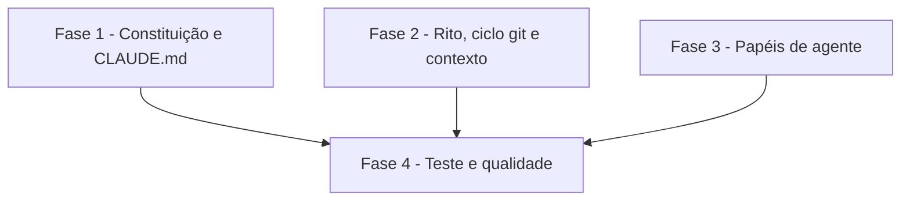

# Tarefas cockpit - templates-governanca

Escopo: nove templates `.tmpl` sob `templates/` renderizados pelo `configurar.sh` existente, mais um cenário de teste em `scripts/testar-configurar.sh`. Sem mudança no motor (FR-002).

**Legenda de status:**
- `[ ]` Pendente
- `[~]` Em andamento
- `[x]` Concluido
- `[!]` Bloqueado

**Legenda de criticidade:**
- `[C]` Critico - Impacto financeiro direto ou bloqueante
- `[A]` Alto - Funcionalidade essencial
- `[M]` Medio - Necessario mas sem urgencia imediata

---

## FASE 1 - Constituição e CLAUDE.md

### 1.1 Template da constituição `[A]`

Ref: docs/specs/templates-governanca/spec.md FR-004, FR-005, FR-012; contracts/templates.md

- [x] 1.1.1 Criar `templates/docs/constitution.md.tmpl` com títulos II, II-bis, III, IV, IV-bis, V, VI, VII, VIII nessa ordem
- [x] 1.1.2 Princípio III exibe `{{PRINCIPIO_III}}` e as duas consequências (ligado e desligado)
- [x] 1.1.3 Princípio IV-bis traz `{{IDENTIDADES}}` em bloco `text` com legenda do formato `nome:email;nome:email`
- [x] 1.1.4 Adicionar seção `## Princípios próprios do projeto` vazia; sem `{{URL_AMBIENTE_*}}`
- [x] 1.1.5 Rodar `configurar.sh` com `cockpit.config.example` e conferir render sem placeholder residual

### 1.2 Template do CLAUDE.md `[A]`

Ref: spec.md FR-007; contracts/templates.md

- [x] 1.2.1 Criar `templates/CLAUDE.md.tmpl` apontando para constituição, rito, ciclo git, contexto e `docs/agentes/`
- [x] 1.2.2 Declarar que o agente para no gate de review
- [x] 1.2.3 Incluir linha "Board de acompanhamento (se houver): {{BOARD}}"
- [x] 1.2.4 Verificar com `scripts/verificar-agnostico.sh` que não há valor de projeto

---

## FASE 2 - Rito, ciclo git e contexto

### 2.1 Template do rito `[A]`

Ref: spec.md FR-006; skill `rito-dev`

- [x] 2.1.1 Criar `templates/docs/rito-dev.md.tmpl` com etapa preparatória e `## Fase 1` a `## Fase 11`
- [x] 2.1.2 Incluir gates gerais: nunca `git add -A`, nunca push direto em `{{BRANCH_INTEGRACAO}}`/`{{BRANCH_PRODUCAO}}`, parada no review
- [x] 2.1.3 Fase 9 documentada como no-op quando as duas branches coincidem
- [x] 2.1.4 Renderizar e conferir as 11 fases e ausência de residual

### 2.2 Template do ciclo git `[A]`

Ref: spec.md FR-008

- [x] 2.2.1 Criar `templates/docs/CICLO-GIT.md.tmpl` com modelo de branches, Conventional Commits em português, squash em feature e merge commit em promoção
- [x] 2.2.2 Incluir `{{IDENTIDADES}}` em bloco `text` e a regra "cada autor com a própria identidade"
- [x] 2.2.3 Renderizar e conferir ausência de residual

### 2.3 Template do contexto do projeto `[M]`

Ref: spec.md FR-010

- [x] 2.3.1 Criar `templates/docs/project-context.md.tmpl` com parâmetros do ciclo em bloco `text` (padrão do `LEIAME.md.tmpl`)
- [x] 2.3.2 Adicionar seções guiadas: Arquitetura, Convenções de domínio, Áreas sensíveis
- [x] 2.3.3 Renderizar e conferir ausência de residual

---

## FASE 3 - Papéis de agente

### 3.1 Quatro papéis de agente `[M]`

Ref: spec.md FR-009

- [x] 3.1.1 Criar `templates/docs/agentes/guardiao.md.tmpl` com Responsabilidade, Entradas, Saídas e Limites
- [x] 3.1.2 Criar `implementador.md.tmpl` (usa `/feature-00c`) com as quatro seções
- [x] 3.1.3 Criar `revisor.md.tmpl` (nunca aprova nem mergeia) com as quatro seções
- [x] 3.1.4 Criar `triador.md.tmpl` com as quatro seções
- [x] 3.1.5 Renderizar os quatro e conferir ausência de residual

---

## FASE 4 - Teste e qualidade

### 4.1 Cenário de teste dos templates reais `[A]`

Ref: spec.md FR-013, FR-014, FR-003, SC-003; research Decision 6

- [x] 4.1.1 Adicionar cenário em `scripts/testar-configurar.sh` que renderiza os templates reais com `cockpit.config.example`
- [x] 4.1.2 Falhar em arquivo faltante, placeholder `{{...}}` residual e chave opcional `URL_AMBIENTE_*`
- [x] 4.1.3 Falhar se faltar princípio (II a VIII) na constituição ou fase (1 a 11) no rito
- [x] 4.1.4 Falhar se a segunda execução alterar algum arquivo (hash)
- [x] 4.1.5 Rodar `scripts/testar-configurar.sh` e `scripts/verificar-agnostico.sh` até verdes

### 4.2 Fechamento e sinalização ao owner `[M]`

Ref: plan.md "Decisões e pendências"; checklists/requirements.md CHK021, CHK022

- [x] 4.2.1 Sinalizar na PR o desvio da Clarification Q3 (formato real de IDENTIDADES)
- [x] 4.2.2 Sinalizar CHK021 e CHK022 como validações humanas pendentes
- [x] 4.2.3 Conferir prosa em pt-BR com diacríticos nos nove templates (FR-012)

---

## Matriz de Dependencias

## Resumo Quantitativo

| Fase | Tarefas | Subtarefas | Criticidade |
|------|---------|------------|-------------|
| 1 - Constituição e CLAUDE.md | 2 | 9 | A |
| 2 - Rito, ciclo git e contexto | 3 | 10 | A |
| 3 - Papéis de agente | 1 | 5 | M |
| 4 - Teste e qualidade | 2 | 8 | A |
| **Total** | **8** | **32** | - |

## Escopo Coberto

| Item | Descricao | Fase |
|------|-----------|------|
| FR-001..FR-005 | Constituição e CLAUDE.md | 1 |
| FR-006..FR-008, FR-010 | Rito, ciclo git, contexto | 2 |
| FR-009 | Papéis de agente | 3 |
| FR-011..FR-014 | Agnosticismo, idioma, teste, idempotência | 4 |
| Tier | Tier de entrega: nao citado nos args; backlog completo | - |

## Escopo Excluido

| Item | Descricao | Motivo |
|------|-----------|--------|
| FR-002 | Mudança no `configurar.sh` | Motor já cobre o necessário |
| URLs opcionais | Chaves `URL_AMBIENTE_*` nos templates | Proibidas por FR-003 |
